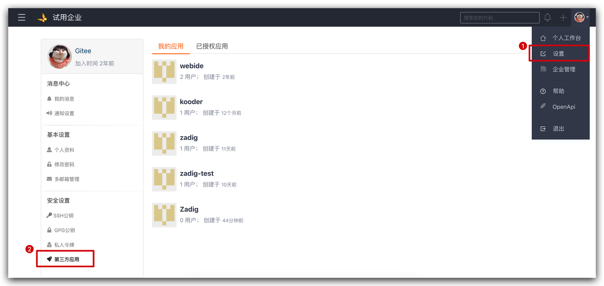
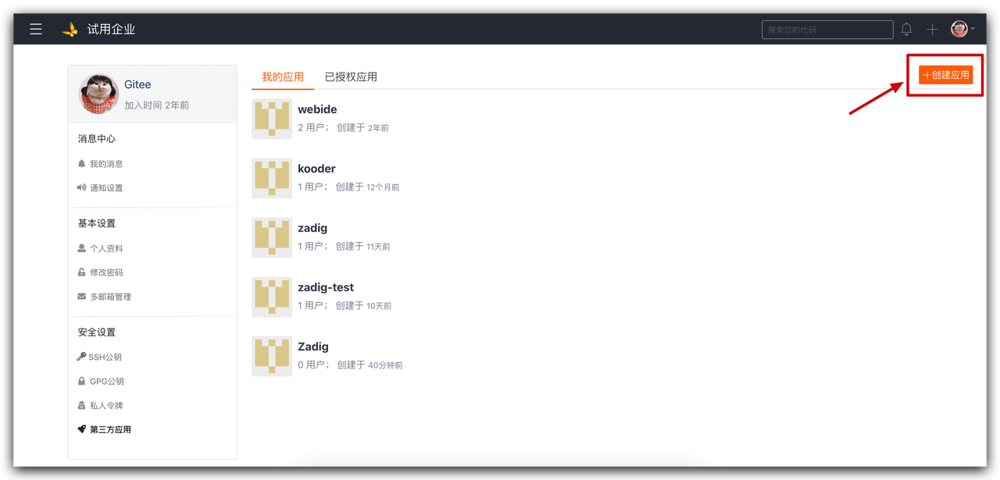
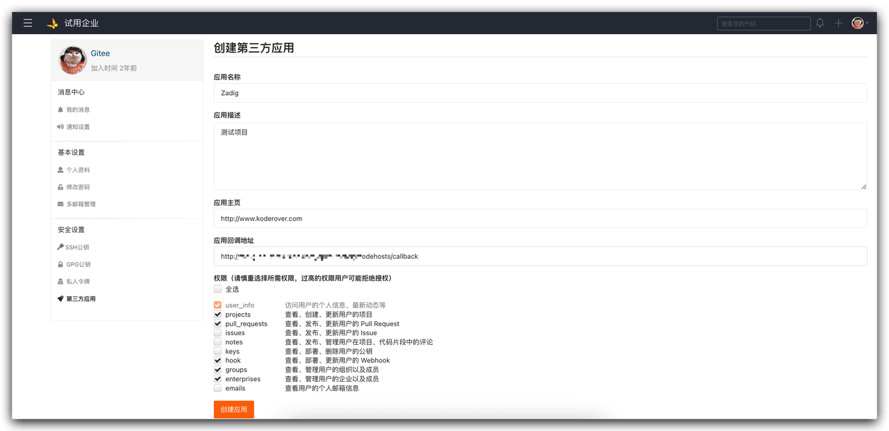
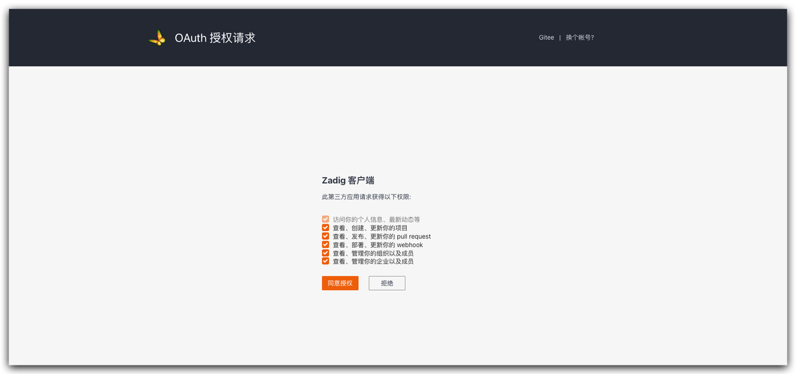

本文主要介绍在 ZadigX 上如何集成 Gitee 私有部署代码源。 

目前系统采用 OAuth2 的方式与 Gitee 私有部署进行代码的授权认证，如需集成 Gitee，可以按照以下流程配置：

- Gitee 管理员新建第三方应用
- 配置第三方应用，填写基本信息以及回调地址
- 获取第三方应用的 `Client ID`、`Client Secret` 信息
- 配置 Gitee 集成，将获取到的 `Client ID`、`Client Secret` 信息填写到 ZadigX 系统
- 跳转到 Gitee 进行认证授权

### 步骤 1：新建 Gitee 第三方应用

点击 Gitee 账号头像 -> 设置 -> 安全设置 -> 第三方应用 -> 创建应用来新建应用程序。

### 步骤 2：配置 Gitee 第三方应用

填写以下内容后点击创建：

- `应用名称`：ZadigX，也可以填写可识别的任一名称。
- `应用主页`：http://[koderover.yours.com]
- `应用回调地址`： `http://[koderover.yours.com]/api/directory/codehosts/callback`
- `上传 LOGO`： 上传符合格式和大小的图片
- `权限`： 勾选 `projects`、`pull_requests`、`hook`、`groups`、`enterprises`

:::tip 注意
应用主页、回调地址请输入完整的 http 地址（例如 `http://koderover.yours.com` ）
应用主页及回调地址中 `koderover.yours.com` 需要替换为 ZadigX 系统部署的实际地址
:::

### 步骤 3：获取 Client ID、Client Secret 信息

应用创建成功后，可获取该应用对应的 `Client ID` 和 `Client Secret` 信息。

### 步骤 4：将配置填入 ZadigX 系统

切换到 ZadigX 系统，管理员依次点击`系统设置` -> `系统集成` -> `代码源` -> 点击添加按钮。

依次填入如下已知信息：

- `代码源`：此处选择 `Gitee (私有部署)`
- `代码源标识`：自定义，方便在 ZadigX 系统中快速识别出该代码源，该信息在整个系统内唯一
- `Client ID`：步骤 3 应用创建成功返回的 Client ID
- `Client Secret`：步骤 3 生成的 Client Secret

信息确认无误后点击 `前往授权`，耐心等待，此时系统会跳转到 Gitee 进行授权。

点击 `同意授权` 后，跳转到 ZadigX 系统，至此 Gitee 私有部署集成完毕。
