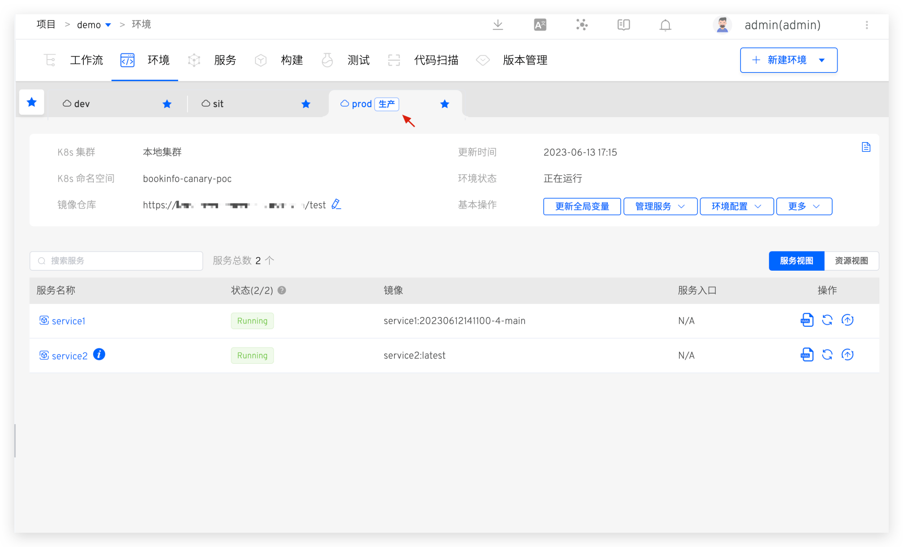
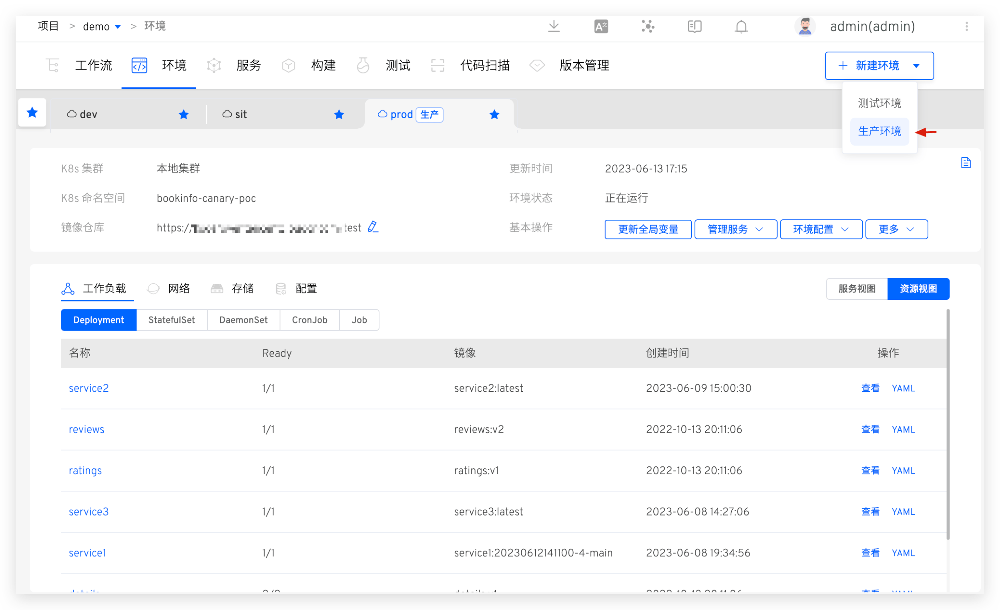
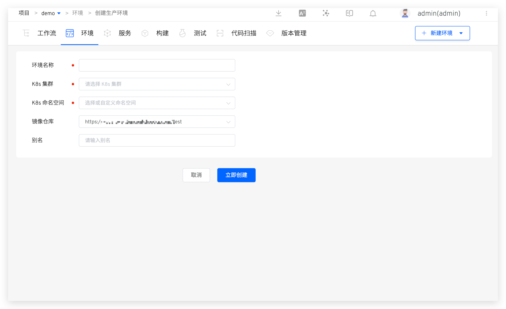

本文主要介绍 K8s YAML 项目中的生产环境相关操作。

## 查看环境

环境创建完成后，点击不同的环境 Tab 即可切换到该环境的详情页面，生产环境右上角会有`生产`标识。更多信息请参考测试环境中的描述：[查看环境](/ZadigX%20v1.8.0/project/env/k8s/#查看环境)。

## 新建环境

在项目中，点击`新建环境`按钮，选择生产环境后进入创建环境页面。

参数说明：
- `环境名称`：要创建的环境的名称，比如：`env-shanghai-ap1`、`env-shanghai-ap2`。
- `K8s 集群`：选择创建环境时所使用的集群资源，其中`本地集群`指 ZadigX 系统所在的集群。关于集群的集成可参考[集群管理](/ZadigX%20v1.8.0/pages/cluster_manage/)。
- `K8s 命名空间`：选择环境所使用的 K8s 命名空间，后续服务将会被部署在该命名空间中，此处不可选择已经被 ZadigX 中其他环境使用的命名空间。
- `镜像仓库`：指定环境创建后所使用的镜像仓库，使用工作流构建部署服务，以及修改服务镜像，均会使用此处指定的镜像仓库。关于镜像仓库的集成可参考[镜像仓库管理](/ZadigX%20v1.8.0/settings/image-registry/#添加镜像仓库)。
- `别名`：为环境设置别名，用于在环境列表页中显示，非必填，可根据自身需要设置。

## 更新全局变量

对环境中的全局变量进行更新，具体操作参考测试环境中的描述：[更新全局变量](/ZadigX%20v1.8.0/project/env/k8s/#更新全局变量)。

## 管理服务

对环境中的服务进行管理，具体操作参考测试环境中的描述：[管理服务](/ZadigX%20v1.8.0/project/env/k8s/#管理服务)。

## 环境配置管理

对环境中的 Ingress、ConfigMap、Secret、PVC 配置进行管理，具体操作参考测试环境中的描述：[环境配置管理](/ZadigX%20v1.8.0/project/env/k8s/#环境配置管理)。

## 设置别名

点击`基本操作` -> `更多` -> `设置别名`按钮并输入新的名称后即可为环境设置别名并在 Tab 中展示。

## 睡眠与唤醒

参考文档：[睡眠与唤醒](/ZadigX%20v1.8.0/project/env/k8s/#睡眠与唤醒)。

## 删除环境

点击`基本操作` -> `更多` -> `删除环境`按钮并输入环境名即可删除环境。

::: tip
1. 鉴于生产服务的严肃性，在 ZadigX 中删除生产环境只是将环境记录删除，Kubernetes 集群中相关服务资源并不会删除。
2. 如果需要删除集群中的资源，请在确保没有影响后手动操作。
:::
