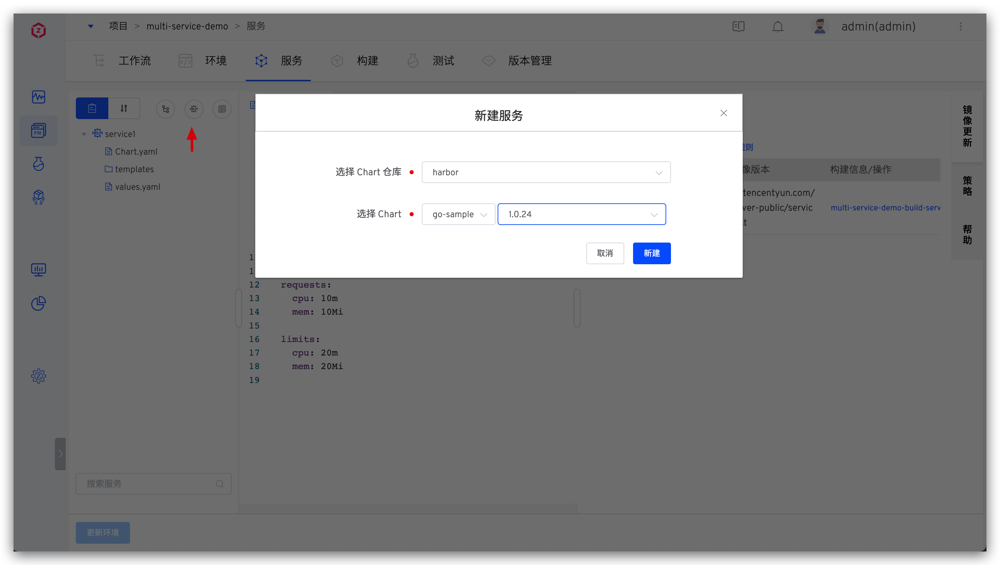
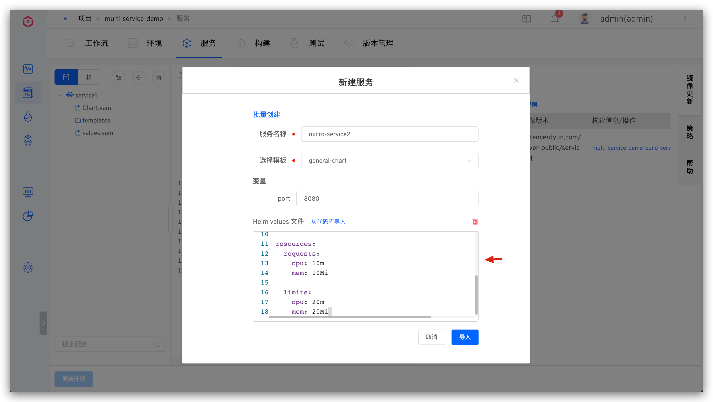
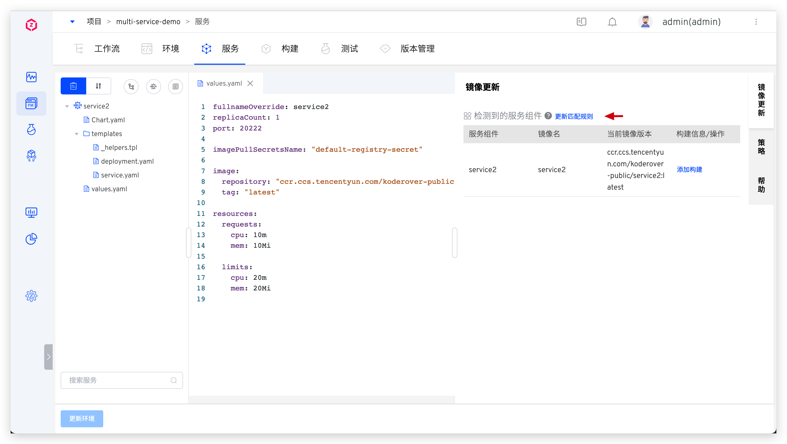
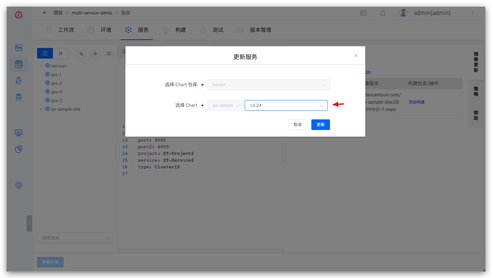
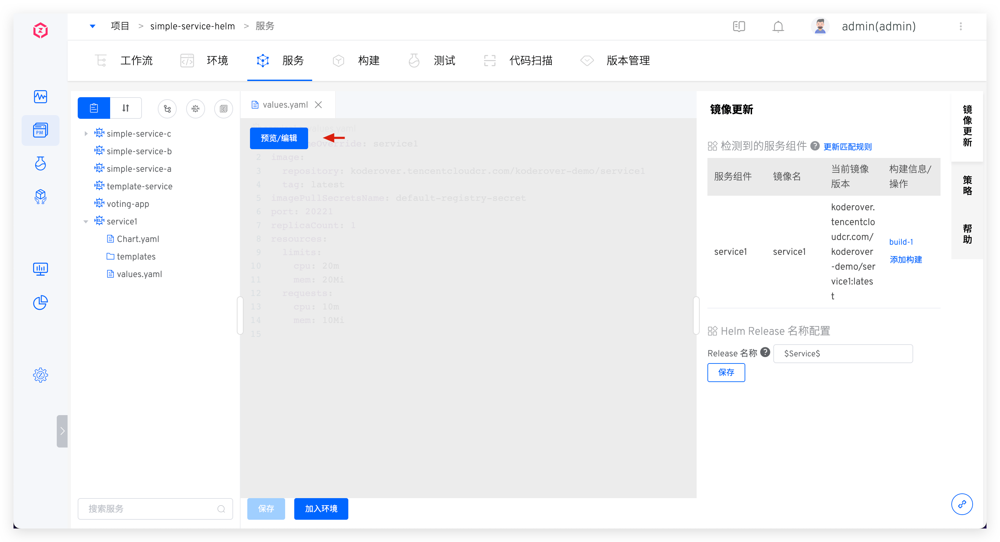

本文介绍 K8s Helm Chart 项目中的服务相关操作。[Helm](https://helm.sh/) 是 Kubernetes 应用的包管理工具，使用 Helm Chart 可定义、安装和升级复杂的 Kubernetes 应用。

## 新建服务

支持从代码库同步、从 Chart 仓库同步、使用模板新建三种方式创建 K8s Helm Chart 服务。

- `从代码库同步`：从代码库中同步服务的 Helm Chart 配置，支持的代码源请参考文档：[代码源信息](/ZadigX%20v1.8.0/settings/codehost/overview/#功能兼容列表)。
- `从 Chart 仓库同步`：从 Chart 仓库中同步服务的 Helm Chart 配置。
- `使用模板新建`：使用 ZadigX 平台中的服务 Helm Chart 模板来创建服务，支持一次创建一个服务，也支持批量创建服务。

### 从代码库同步服务
点击从代码库同步 -> 填写代码库及服务配置在代码库中的目录 -> 点击加载，即可从代码库同步服务。同步成功后，当代码库中对应目录的文件有变更时，会通过 Webhook 的方式自动更新此处的服务配置。

::: tip
1. 需要在系统中集成代码源，可参考：[代码源集成](/ZadigX%20v1.8.0/settings/codehost/overview/)
2. 支持的代码源请参考文档：[代码源信息](/ZadigX%20v1.8.0/settings/codehost/overview/#功能兼容列表)
:::

以 [service2](https://github.com/koderover/zadig/tree/main/examples/multi-service-demo/full-charts/service2) 服务为例，服务的 Helm Chart 配置目录结构为：

``` shell
├── zadig/examples/multi-service-demo/full-charts/service2
│   ├── Chart.yaml
│   ├── templates
│   │   ├── _helpers.tpl
│   │   ├── deployment.yaml
│   │   └── service.yaml
│   └── values.yaml
```

从代码库同步该服务：


同步后效果：


### 从 Chart 仓库同步服务
::: tip 前提
需要先集成 Helm Chart 仓库，参考：[集成 Helm Chart 仓库](/ZadigX%20v1.8.0/settings/helm/)。
:::

点击从 Chart 仓库同步，选择 Chart 仓库及 Chart，新建即可。


### 使用模板新建单个服务
::: tip 前提
需要先在系统模板库里创建 Helm Chart 模板，请参考 [Helm Chart 模板管理](/ZadigX%20v1.8.0/template/helm_chart/)
:::

- 点击使用模板新建 -> 填写服务名称并选择模板 -> 按需填写配置后，导入即可。
  - 变量配置可使用模板中的默认值，也可以在新建时重新赋值
  - 开启`自动同步`后，当在模板库中对使用的模板操作`应用到服务`时，该服务配置将自动基于模板内容同步


- 在`高级设置`中，系统还支持用新的 values.yaml 覆盖模板中的 values.yaml 内容，包括手动输入和从指定代码库导入两种途径来覆盖。



### 使用模板批量新建服务
::: tip
Helm Chart 模板的 values.yaml 文件中不能使用自定义变量
:::

使用 [multi-service-demo](https://github.com/koderover/zadig/tree/main/examples/multi-service-demo) 案例来说明如何使用模板批量新建服务，必要目录说明如下：

``` shell
zadig/examples/multi-service-demo
├── base-chart # Helm Chart 模板
│   ├── Chart.yaml
│   ├── templates
│   │   ├── _helpers.tpl
│   │   ├── deployment.yaml
│   │   └── service.yaml
│   └── values.yaml # 不支持使用自定义变量
└── values # 分别对应 3 个服务的 values 文件
    ├── service1.yaml
    ├── service2.yaml
    └── service3.yaml
```

点击使用模板新建 -> 点击`批量创建` -> 选择 Helm Chart 模板 -> 选择要导入服务的 values 文件，导入即可。


导入后，效果如下图所示。一份 values 文件会被定义成一个服务，values 文件名即为服务名。服务批量创建完毕后，点击`更新环境`即可将服务快速应用于环境中。


## 服务版本回滚

参考文档 [服务版本回滚](/ZadigX%20v1.8.0/project/service/k8s/#服务版本回滚)。
## 服务组件

参考文档：[服务组件](/ZadigX%20v1.8.0/project/service/module/#k8s-helm-chart-项目)。



## 自定义 Helm Release 名称

系统默认会使用服务名作为部署的 Helm Release 名称，可在服务右侧的`Helm Release 名称配置`中按需修改。系统支持通过常量和以下变量组合来配置：

- `$Product$`：项目名称
- `$Service$`：服务名称
- `$Namespace$`：环境所在的命名空间
- `$EnvName$`：环境名称

当修改服务的 Helm Release 名称配置后，系统会自动重新部署环境中的服务，生成新的 Helm Release。


## 服务编排
> ZadigX 系统支持对多个服务的部署顺序进行编排管理，同一启动顺序组的服务在部署时会并行执行，不同启动顺序组的服务会按照组顺序执行，适用于多个服务的启动顺序有先后依赖关系的场景。

点击`服务编排`图标，按需对服务启动顺序进行拖拽组合。


## 更新服务

### 更新从代码库同步的服务

从代码库同步服务的 Chart 配置后，会自动创建 Webhook。当对应代码库中有变更时，会自动同步服务的 Chart 配置到 ZadigX 中。也可以点击服务右侧的同步按钮，点击`加载`主动同步更新。


### 更新从 Chart 仓库同步的服务

点击服务右侧的同步按钮，按需修改 Chart 版本号，点击`更新`即可。



### 更新使用模板新建的服务

当模板内容有变化时，点击服务右侧的同步按钮 -> 点击`导入`即可同步模板中最新内容，在导入之前也可以在`高级设置`中修改 Helm values 文件内容。


如果该服务未开启自动同步，也可以直接编辑服务 values.yaml 的内容。



## 删除服务

点击服务右侧的删除按钮即可将服务配置删除。若需要将服务从环境中也删除，点击`更新环境`并选择要更新的环境即可。


## 策略配置
在策略中设置部署服务的超时时间以及交付物命名规则。细节可阅读：[策略配置](/ZadigX%20v1.8.0/project/service/k8s/#策略配置)。


## Helm Chart 样例

[koderover/zadig](https://github.com/koderover/zadig/tree/main) 库中提供了 Helm Chart 样例，点击[链接](https://github.com/koderover/zadig/tree/main/examples/multi-service-demo/full-charts/service1)查看详情。

