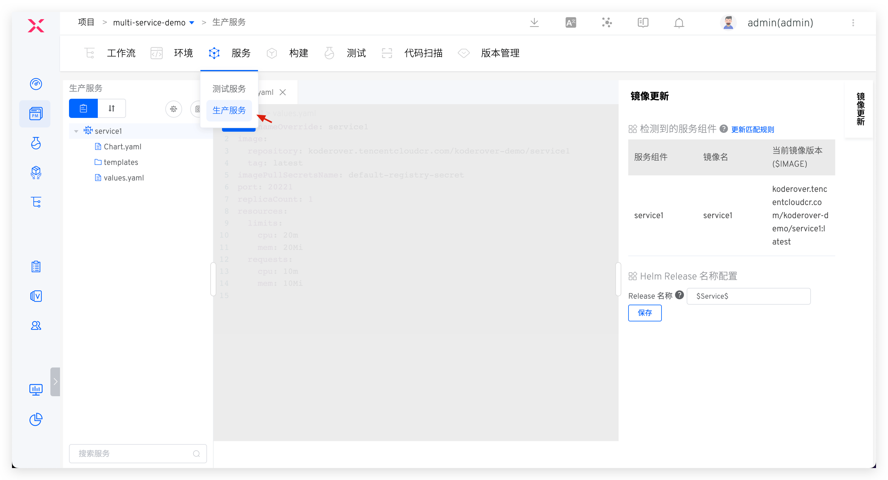

## 新建

进入 K8s Helm Chart 项目，点击 `服务` - `生产服务`，进入服务管理页面，目前支持`从 Chart 仓库同步`、`使用模板新建`两种方式来创建服务。

### 从 Chart 仓库同步

具体操作和测试服务一样，可参考文档：[从 Chart 仓库同步服务](/ZadigX%20v1.8.0/project/service/helm/chart/#从-chart-仓库同步服务)。

### 使用模板新建

具体操作和测试服务一样，可参考文档：[使用模板创建服务](/ZadigX%20v1.8.0/project/service/helm/chart/#使用模板新建单个服务)。

## 服务版本回滚

参考文档：[服务版本回滚](/Zadig%20v2.0.0/project/service/versions/)。

## 服务组件

参考文档：[服务组件](/ZadigX%20v1.8.0/project/service/module/#k8s-helm-chart-项目)。

## 服务编排

参考文档： [服务编排](/ZadigX%20v1.8.0/project/service/helm/chart/#服务编排)。
