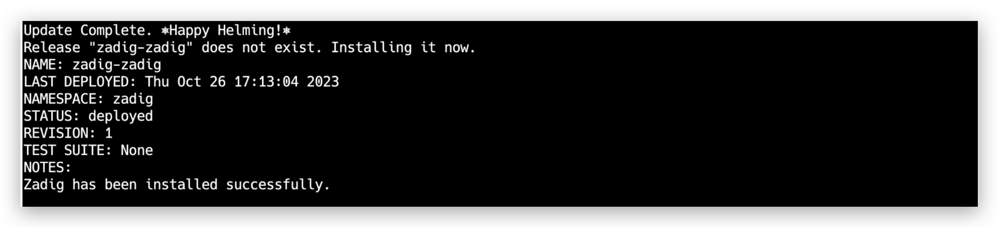

本文主要介绍如何在本地安装 Zadig。适合初次接触 Kubernetes 和 Zadig 并想快速体验的用户。

::: danger
本地安装不支持版本升级和高可用配置，不可用于正式使用
:::

## 使用 Shell 脚本安装与卸载

### 步骤 1：准备 Kubernetes 集群

使用 minikube、KinD 等工具在本地拉起一套 K8s 集群。

::: tip
- 本地 K8s 集群版本 v1.16~v1.26。
- 推荐配置：8C16G （Zadig 本身消耗 4C8G，可支撑两条工作流任务的并发执行）
:::

相关工具安装参考如下：

- [安装 minikube](https://minikube.sigs.k8s.io/docs/start/)
- [安装 docker-desktop](https://www.docker.com/products/docker-desktop/)
- 更多工具请参考其官方安装文档

### 步骤 2：执行安装脚本

在本地集群中执行以下脚本：

> 如果安装 Zadig 后要集成外部系统，请确保安装的 Zadig 系统有公网 IP， 以保证其可访问。

``` bash
export IP=<本机 IP 地址>
export PORT=< 30000 - 32767 任一端口>
curl -SsL https://download.koderover.com/install?type=quickstart | bash
```


### 步骤 3：访问系统

::: tip
如果使用的是 KinD 拉起的集群，由于其自身特性，需要打通本机端口到 K8s 集群 NodePort 服务的通路，参考命令如下：

``` bash
kubectl -n zadig port-forward svc/gateway-proxy 32000:80
```
:::

通过 IP:PORT 访问系统，首次登录系统需注册系统管理员。


::: tip
专业版许可证获取和配置参考文档：[许可证](/dev/enterprise-mgr/#许可证)
:::

### Zadig 卸载

设置 NAMESPACE 环境变量后使用脚本来一键卸载当前安装的 Zadig 系统，命令如下：

```bash
export NAMESPACE=zadig
curl -SsL https://github.com/koderover/zadig/releases/download/v2.1.0/uninstall.sh | bash
```

也可以执行官方最新版卸载脚本：
```bash
export NAMESPACE=zadig
curl -SsL https://download.koderover.com/install?type=uninstall | bash
```

## 使用 Sealos 安装与卸载

### 步骤 1：准备 Linux 机器

::: warning
为了避免安装时产生冲突或者其他未知错误导致安装失败，建议你的操作系统保持干净的状态，不安装任何可能产生冲突的软件。
:::

#### 硬件要求

|  操作系统                                               |  最低要求                         |
| ------------------------------------------------------ | ---------------------------------|
| **Ubuntu** 18.04+                       | CPU: 4 核  内存: 8 GB  硬盘: 50 GB |

更详细的安装要求，请参考 [Sealos 安装先决条件](https://docs.sealos.io/zh-Hans/docs/lifecycle-management/quick-start/)

#### 网络要求
- 服务器可以访问外网

#### 其他要求
- 需要以 Root 用户安装，不建议用 `sudo`
- 确保服务器防火墙配置开放 30000 - 32767 的端口段，用于外部访问
::: tip
- 如果是以 SSH 方式登入机器，为防止脚本等待安装时间过长导致 SSH 连接断开，建议在客户端本地`~/.ssh/config`中添加一行 `ServerAliveInterval 60`
:::

### 步骤 2：安装 Sealos 

::: tip 提示
若您已经安装 Sealos，可跳过此步骤，请确认使用 v4.3.0 或更高版本。
:::

```bash
wget https://github.com/labring/sealos/releases/download/v4.3.0/sealos_4.3.0_linux_amd64.tar.gz
tar -zxvf sealos_4.3.0_linux_amd64.tar.gz sealos && chmod +x sealos && mv sealos /usr/bin
```

### 步骤 3：安装 Kubernetes 以及 Zadig 

```bash
# 服务器 IP 地址，用于访问 Zadig 系统
export IP=<node external ip>
export PORT=<30000~32767 任一端口>                                                         

sealos run labring/kubernetes:v1.24.0 labring/helm:v3.12.0 labring/calico:v3.24.1 labring/openebs:v3.4.0
sealos run --env IP=${IP} --env PORT=${PORT} labring/zadig:2.1.0
```


安装过程预计持续 20 分钟左右，受硬件配置和网络情况影响，不同环境下的时间可能不同，
当看到如图的输出时，说明安装已经完成。

### 步骤 4：验证安装结果

可以通过命令查看服务启动状态：

```bash
kubectl -n zadig get po
```
### 步骤 5：访问系统


在安装结果输出中，你可以获得系统的访问地址。

::: tip
许可证获取和配置参考文档：[许可证](/dev/enterprise-mgr/#许可证)
:::

### 卸载

支持一键卸载当前安装的 Kubernetes 以及 Zadig 系统，只需执行以下即可：

```bash
sealos reset
```