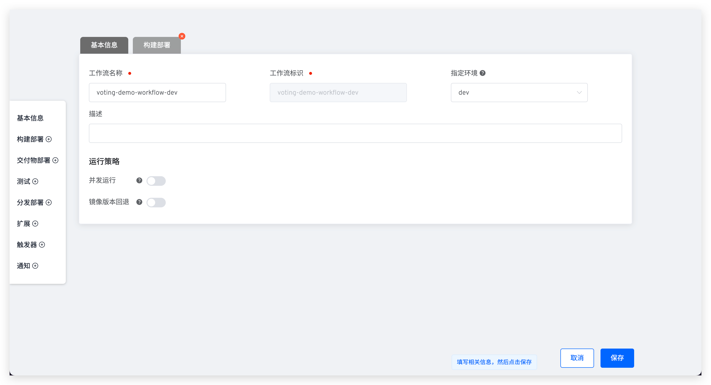
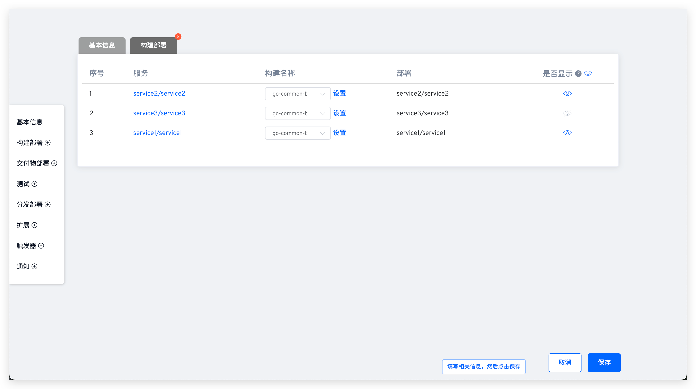
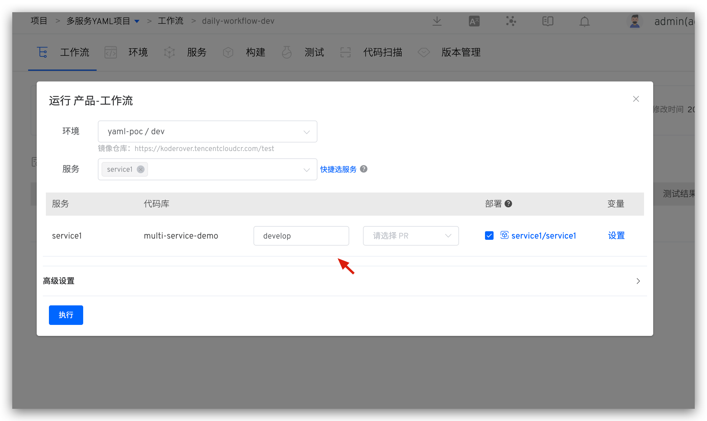
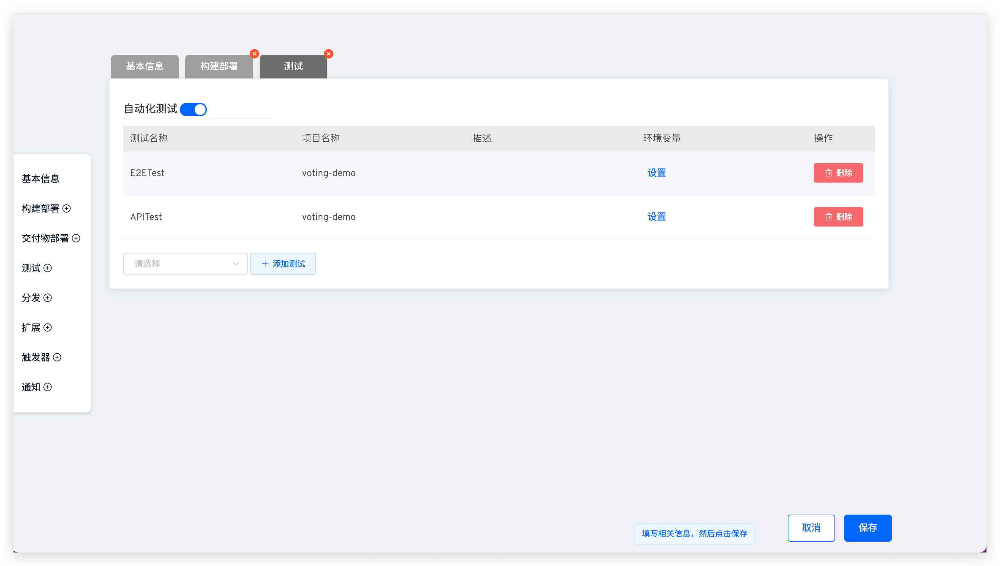
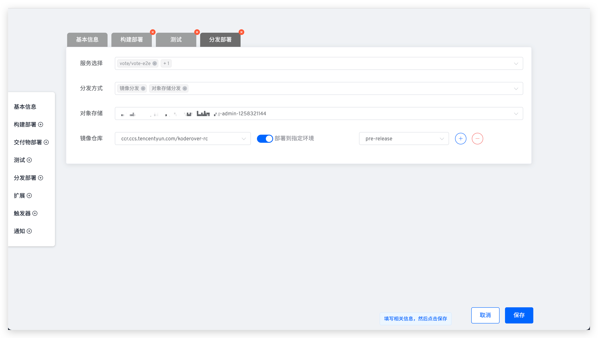
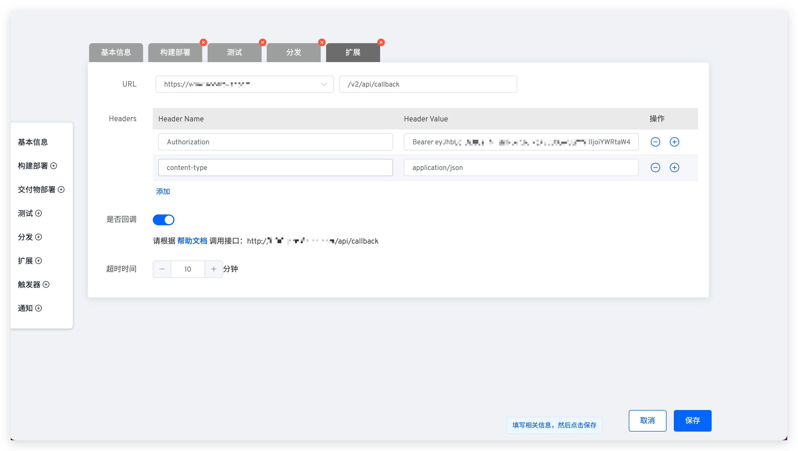
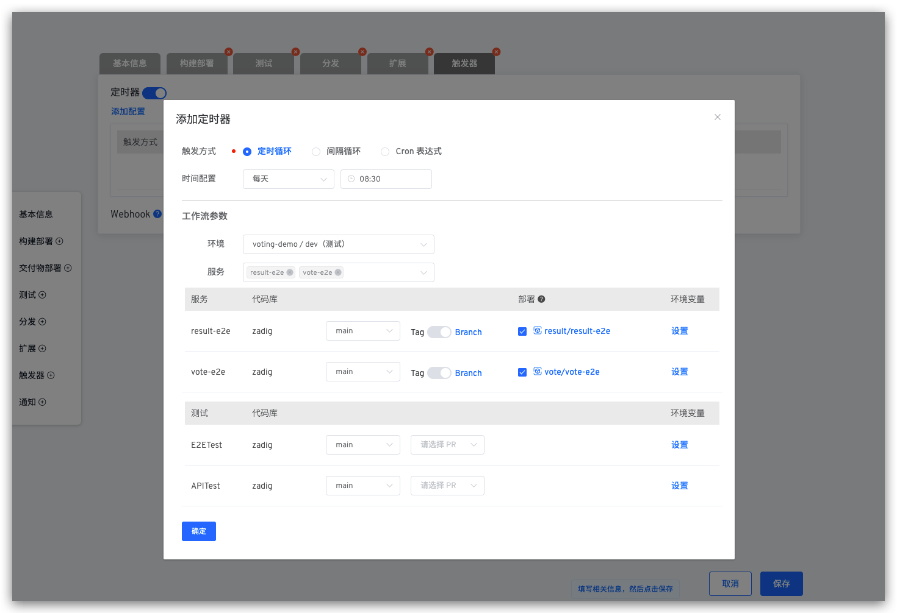
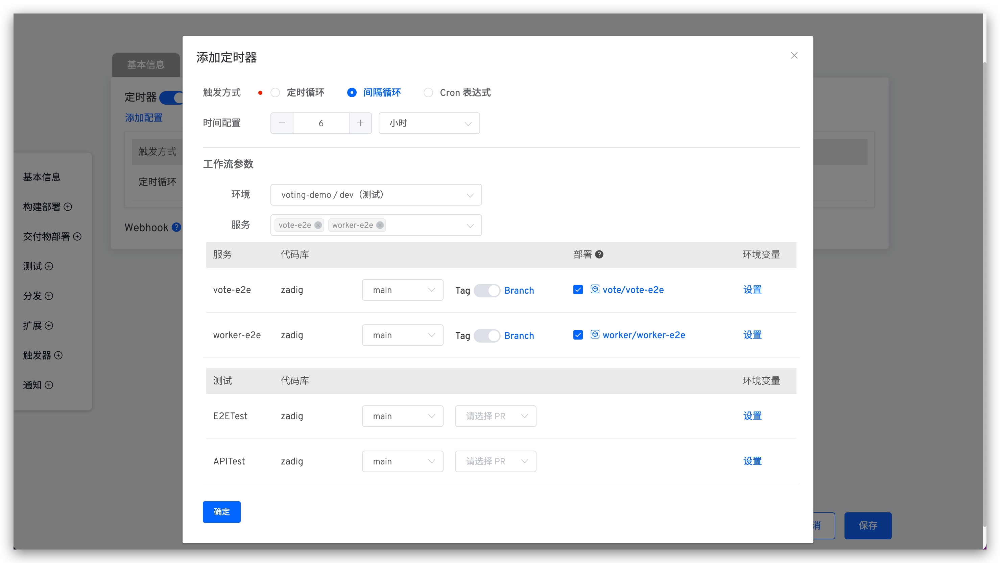
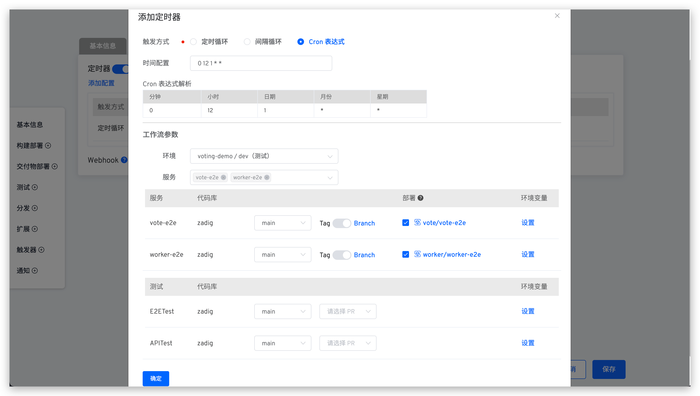
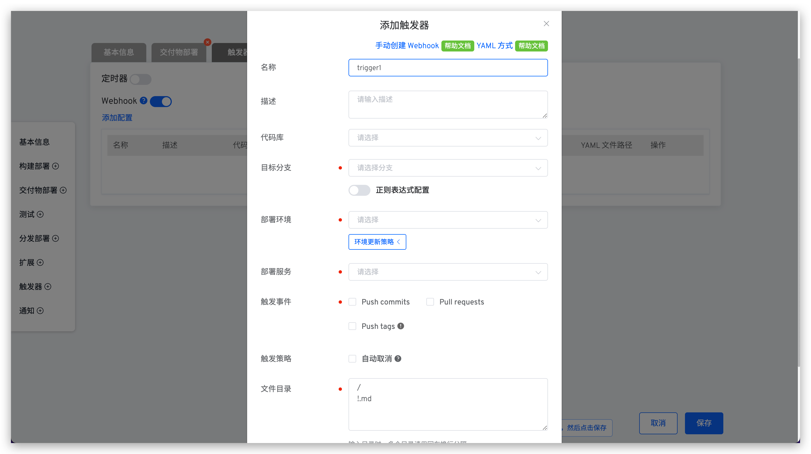

本文主要介绍 Zadig 的工作流的配置。

## 配置工作流

工作流支持多种策略组合，完成从`构建`->`部署`->`测试`->`分发`全流程的自动化编排，快速验证快速反馈，保证代码的质量。

### 基本信息

> 包括工作流名称、工作流标识、部署环境和描述等基础信息以及运行策略信息。



#### 基础信息

- `工作流名称`：支持中文、大小写字母、数字及特殊字符，在所属项目中唯一，可修改。
- `工作流标识`：支持大小写字母、数字及中划线，全局唯一，不支持修改。
- `指定环境`：工作流部署更新的集成环境，编辑工作流时可更改。
- `描述`：描述该工作流的详细信息，在工作留详情页展示。

#### 运行策略
- `并发运行`：参考文档 [工作流任务并发运行](/dev/workflow/parallel/)。
- `镜像版本回退` <sup style='color: red'>新</sup>： 开启后，设置回退策略。当工作流任务运行状态和测试结果满足回退策略的设定时，被更新服务的镜像会回退到工作流任务执行前的版本。回退策略说明如下：
  - `任务执行完成`：工作流运行完毕后，不管运行结果如何，均回退镜像版本。工作流任务执行成功 / 失败 / 超时 / 被取消均视为运行完毕。
  - `部署结果失败`：使用工作流对服务进行部署更新，当部署服务失败时，回退镜像版本。
  - `测试结果失败`：工作流中包含测试步骤，当测试运行失败时，回退镜像版本。

关于镜像版本回退，更多信息可阅读：[工作流的镜像版本回退](/dev/workflow/image/rollback/)。


### 构建部署

为服务配置构建后，工作流通过构建部署模块提供更新环境的能力。

> 服务构建配置细节可参阅[构建配置](/dev/project/build/)



字段说明：

- `服务`：内容的格式为`服务名/服务组件名`，点击服务可跳转查看该服务的配置详情。关于服务组件的概念可阅读[服务组件](/dev/env/overview/#什么是服务组件)。
- `构建名称`：选择该服务使用的构建配置，点击右侧的`设置`可自定义工作流执行时的代码过滤规则，参考：[构建设置](#构建设置)。
- `部署`：内容的格式为`服务名/服务组件名`。
- `是否显示`：用于设置在启动工作流任务时，是否在服务列表中显示该服务。上图例中设置 `service3` 服务为不显示后，运行工作流时效果见下图。


#### 构建设置

支持配置工作流执行时可选的代码库分支/标签范围，以及指定默认分支。具体操作为：添加代码库 -> 设置正则表达式形式的 `分支/标签可选范围` -> 在匹配到的分支中选择一个作为默认分支。


工作流执行时会基于默认配置的代码信息来运行，也可以手动修改分支/标签信息。



### 交付物部署

> 提供通过构建产物直接更新服务的能力

::: tip
同一个工作流中交付物部署和构建部署为互斥功能，只能选择一个进行开启
:::


### 测试

通过修改工作流的测试配置，来实现测试步骤，关于测试配置的创建和使用，请参阅[测试管理](/dev/project/test/)。

#### 自动化测试

用户可以通过添加测试按钮从测试配置中选择要添加的测试项目进行测试。



### 分发部署

将服务的构建产物分发到指定的对象存储/镜像仓库中。在镜像分发方式中，还支持将服务部署到指定环境。

::: tip
推荐在工作流中配置构建部署、测试和分发部署。在构建部署更新环境并测试通过后，使用经过测试验证的服务版本更新新的环境。
:::



参数说明：

- 服务选择：要被执行分发或部署的目标服务，可多选
- 分发方式：包括镜像分发和对象存储分发
- 对象存储：构建的文件产物（一般为压缩包）被分发的目标对象存储，可在系统设置的 [对象存储](/dev/settings/object-storage) 中查阅
- 镜像仓库：构建的镜像产物被分发的目标镜像仓库，可在系统设置的 [镜像仓库](/dev/settings/image-registry/) 中查阅
- 部署到指定环境：将服务部署更新到指定的环境，需要确保指定环境可正常获取到分发后的镜像资源。仅镜像分发方式中支持此功能

### 扩展
> 通过配置扩展模块，可以和外部系统对接对系统事件进行 Hook，外部系统接收请求后，可以按需自定义一些操作。



参数说明：
- URL：包括两部分，集成的[外部系统](/dev/settings/others/)，以及自定义的 Path 部分。
- Header：定义给外部系统发送请求的 Header 信息。
- 是否回调：设置是否回调开关。
- 超时时间：设置回调超时时间。

工作流运行后，会自动 Hook 外部系统，具体 Payload 信息如下：
```json
{
  "event_name": "workflow", # 事件名称，workflow
  "project_name": "my_project_name", # 项目名称
  "task_name": "my_workflow_name", # 工作流名称
  "task_id": 1, # 工作流任务 ID
  "service_infos":[ # 服务信息
      {
          "service_name":"nginx",
          "service_module":"nginx-test",
          "image":"nginx-test:20220216162547"
      }
  ],
  "creator":"admin" # 工作流触发者
}
```

外部系统按照以下格式发送回调请求：

Request：
```
POST {安装 Zadig 后的地址}/api/callback
```

Payload 示例：

```json
{
  "task_name": "my_task", # 工作流名称
  "task_id": 1, # 工作流任务 ID
  "project_name": "my_project", # 项目名称
  "type": "workflow", # 回调业务类型，目前均为 workflow
  "status": "fail", # 回调状态，目前有 success/fail 两种状态
  "status_message": "error: bad request", # 当回调状态为 fail 时传递该字段
}
```

## 定时器
通过配置定时器，可以实现周期性的运行工作流。目前工作流支持的定时器方式主要有：
- 定时循环：在某个时间点定时执行某个工作流，例如每天 12:00 运行，每周一 10:00 运行
- 周期循环：周期性的执行某个任务，例如每 30 分钟执行一次工作流
- Cron 表达式：使用标准的 Linux Cron 表达式灵活的配置定时器，例如："45 4 1,10,22 * *"，每月 1、10、22 日 4:45 分执行工作流任务

### 定时循环

具体操作步骤：
- 点击添加按钮添加一项定时循环条目，分别选择周期时间以及时间点
- 设置工作流任务参数，执行时按设置的参数执行



### 间隔循环

具体操作步骤：

- 第 1 步：点击添加按钮添加一项间隔循环条目，分别选择间隔时间以及间隔时间单位
- 第 2 步：设置工作流参数，执行时按设置的参数执行



### Cron 表达式
具体操作步骤：

- 第 1 步：点击添加按钮添加一项 Cron 表达式条目，填写 Cron 表达式
- 第 2 步：设置工作流参数，执行时按设置的参数执行



## Git Webhook
基于 Git Webhook 事件自动触发工作流执行，更多信息说明如下。
- 支持的代码源请参考[代码源信息](/dev/settings/codehost/overview/#功能兼容列表)
- 支持 GUI 方式和 YAML 方式配置触发器，二者的区别如下：
  - GUI 方式：Webhook 触发工作流运行相关参数配置在工作流中
  - YAML 方式：Webhook 触发工作流运行相关参数组织在代码库的 YAML 文件中，在工作流中填写 YAML 文件路径即可
- 支持手动创建和自动创建两种方式，二者的区别如下：
  - 自动创建：在工作流中配置触发器参数即可，Zadig 会自动在对应代码库中创建 Webhook，适用于代码源集成账号对代码库有创建 Webhook 权限的场景。
  - 手动创建：先在代码库中配置 Webhook，再在 Zadig 中配置触发器参数，适用于代码源集成账号对代码库没有创建 Webhook 权限的场景。

### GUI 方式

编辑工作流，新增触发器模块，打开 Webhook 开关，点击添加配置。



参数说明：

- `代码库`：需要监听触发事件的代码仓库，代码源选择不同对应的触发事件也会不同。
- `目标分支`：提交 pull request 时的 Base 分支。支持正则表达式配置，语法参见 [Regexp Syntax](https://pkg.go.dev/regexp/syntax@go1.17.3#hdr-Syntax)。
- `部署环境`：指定触发任务部署步骤更新的环境，可指定多个环境。
- `环境更新策略`：部署步骤更新环境的策略，可选策略如下：
    - `更新指定环境`：`部署环境`参数中指定一个环境时可选，部署更新该环境。
    - `动态选择空闲环境更新`：在`部署环境`指定的环境中，动态选择一个相对空闲的环境，对其进行部署更新。环境的空闲标准由正在对其进行部署更新的工作流任务数量而定，Webhook 触发事件发生时，当前工作流任务比较少的环境即为相对空闲的环境。
    - `设定指定环境为基准环境`：**[高级选项]** `部署环境`参数中指定一个环境，且代码库是 GitLab 代码源时可选。以该环境的服务版本为基础创建一个名为 `pr-prID-随机字符串`的环境，对该环境进行部署更新。
- `环境销毁策略`：**[高级选项]** `环境更新策略`为`设定指定环境为基准环境`时可选。在 Webhook 事件触发工作流执行完毕后，对上述 `pr-prID-随机字符串`环境的销毁策略，包括：每次保留，每次销毁，工作流成功后销毁。
- `部署服务`: 指定触发任务构建部署的相应服务。
- `触发事件`: 指定触发工作流运行的 Webhook 事件，可选事件如下：
    - `Push commits` 事件（Merge 操作）时触发。
    - `Pull requests` 提交 pull request 时触发。
    - `Push tags` 新建 tag 之后触发。
- `触发策略`: `Push commits` 和 `Pull requests` 事件支持自动取消，如果你希望只触发最新的提交，则使用这个选项会自动取消队列中正在进行的前序任务。
- `文件目录`: 通过设置文件和文件目录，可以实现对文件以及目录的监听，当文件或者目录发生变化时（新增、修改或者删除），触发工作流。也可以忽略对应的文件或者目录变更，不进行工作流的触发。

使用以下代码仓库文件结构为例：
    
``` bash
├── reponame  # 仓库名称
  ├── Dockerfile 
  ├── Makefile
  ├── README.md   
  ├── src        
    ├── service1/
    ├── service2/
    └── service3/
```
| 触发场景 | 文件目录配置 |
|----|------------|
| 所有文件更新|`/`|
| 除 *.md 以外的其他文件更新|`/`<br>`!.md`|
| 除 service1 目录下的其他文件更新 | `/`<br>`!src/service1/`|
| service1 目录下所有文件更新 | `src/service1/` |
| src 目录下（除 service1 目录下的文件）的文件更新|`src`<br>`!src/service1/`|

### YAML 方式

#### 第一步：组织 YAML 文件

将触发器配置组织在 YAML 文件中，并提交 YAML 文件到代码仓库中。触发器 YAML 描述文件语法如下：

``` yaml
stages: # 定义触发的步骤，至少要包括 build 步骤
  - build # 触发工作流中的构建步骤
  - deploy # 触发工作流中的部署步骤
  - test # 触发工作流中的测试步骤

# 构建参数，必须配置
build:
  - name:  service_name # 服务名
    service_module: service_module_name # 服务组件名
    variables: # 对应构建配置中的环境变量
      - name: k1
        value: v1

# 部署策略，必须配置
deploy:
  strategy: single # single(更新指定环境)/dynamic(动态选择空闲环境)/base(更新基准环境)
  envs_name:
    - dev # 集成环境名称
  # 以下 2 个选项在 strategy 值为 base 时才需要配置
  env_recycle_policy: success # success(成功后销毁)/always(每次销毁)/never(每次保留)
  base_env: dev

# 测试参数，stages 中包括 test 时需要配置
test:
  - name: test_name
    repo:
      strategy: currentRepo # default(在 Zadig 平台默认配置的代码仓库信息)/currentRepo(使用当前变动的代码信息)
    variables: # 对应测试配置中的环境变量
      - name: k1
        value: v1

# 触发条件规则
rules: 
  branchs: 
      - 'feature*' # 分支，可使用正则表达式
  events:
      - pull_request
      - push
      - tag
  strategy:
    # 自动取消，如果你希望只构建最新的提交，则使用这个选项会自动取消队列中的任务
    auto_cancel: true    
  # 指定服务与代码目录的关系，必填
  match_folders: 
    match_folders_tree:
      - name: service1
        service_module: service1
        file_tree:
          - src/service1
          - ci
      - name: service2
        service_module: service2
        file_tree:
          - src/service2
          - ci

# 缓存配置
cache_set: 
    # 不使用 docker 缓存
    ignore_cache: false
    # 不使用工作空间缓存
    reset_cache: false
```
#### 第二步：编辑工作流配置触发器

编辑工作流，新增触发器模块，打开 Webhook 开关添加配置，选择 `YAML 方式` 后配置 YAML 文件路径。<br>


参数说明：
- `代码库`：需要监听触发事件的代码仓库。
- `YAML 文件路径`：YAML 文件在代码库中存放的路径，比如图中 YAML 文件在 voting-demo 库中的路径为 ci/trigger.yaml。

## 通知

支持将工作流执行情况通知到钉钉、企业微信、飞书，具体如何使用可参考文档：[工作流通知](/dev/workflow/im/)。

## 运行工作流

工作流支持多种构建方式，用户可以根据需求灵活配置。工作流模块支持通过自动构建（定时器/ Webhook）的方式实现对代码进行持续集成和持续部署，进行快速验证和快速反馈，保证代码的质量。
具体操作可以参阅[工作流的触发](/dev/workflow/trigger/)部分获取更多的信息。
