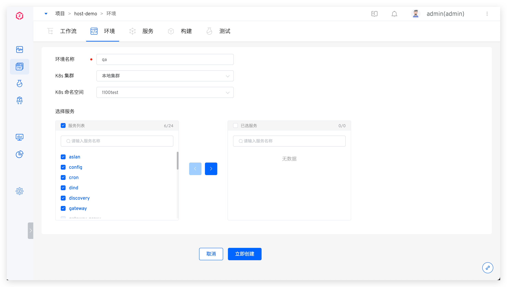
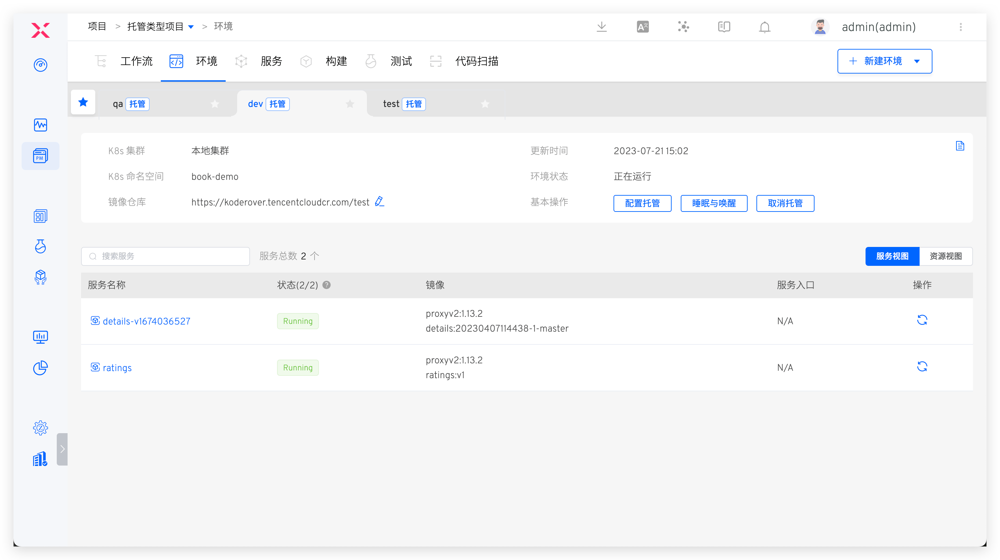
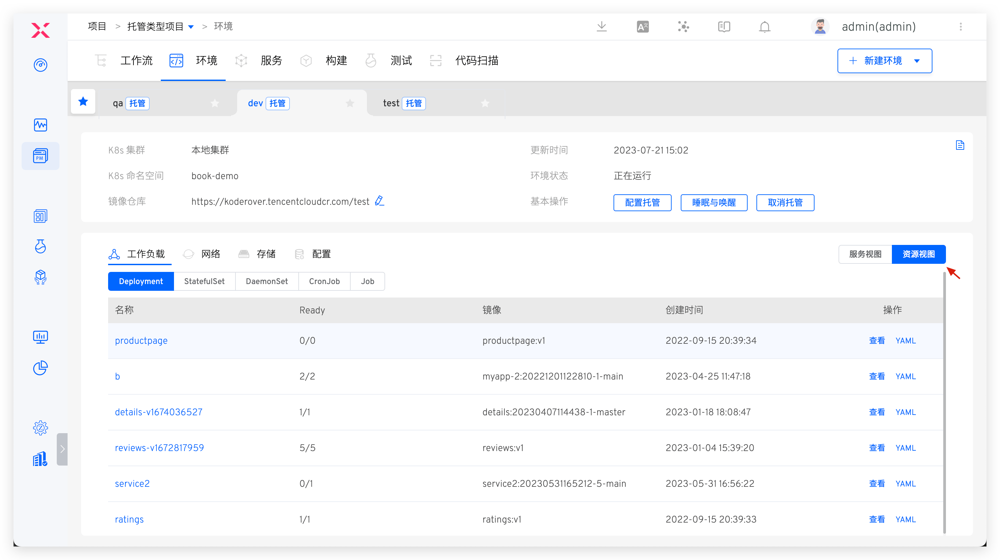
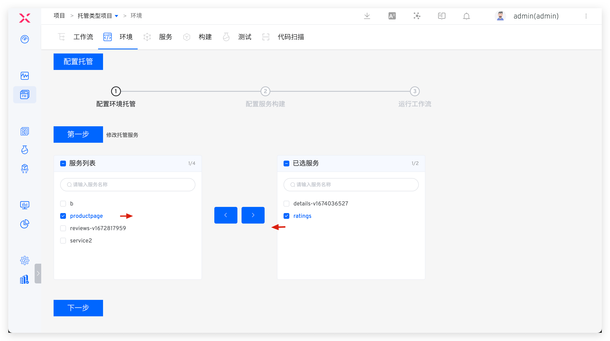
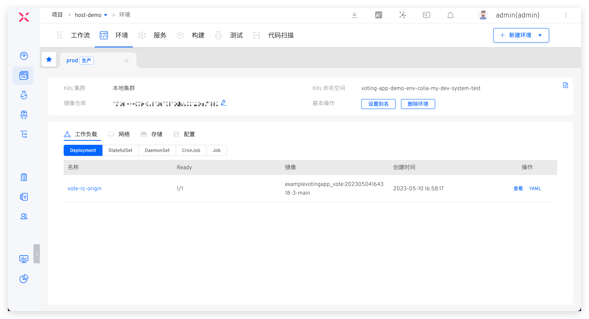

本文主要介绍 K8s 托管项目中的环境相关操作。

## 新建测试环境

在 K8s 托管项目中点击`新建环境`按钮进入创建环境页面，填写相关参数后立即创建即可。

参数说明：

- `环境名称`：填写环境名称
- `K8s 集群`：要被托管的服务所在的 Kubernetes 集群，注意：该集群需事先在 Zadig 中集成，可参考[集群管理](/dev/pages/cluster_manage)操作
- `K8s 命名空间`：要被托管的服务所在的 Kubernetes 命名空间
- `选择服务`：要被托管的服务

## 查看测试环境

点击不同的环境 Tab 即可查看该环境及环境中被托管服务的详情，点击`资源视图`，可从工作负载/网络/存储/配置等资源视角对该环境所托管命名空间下的资源进行查看。

### 基本信息
包括 K8s 集群、K8s 命名空间、更新时间、环境状态等信息，其中环境状态有以下几种情况：
- `创建中`：正在创建。
- `正在运行`：环境中所有服务都是正常的 Running 状态。
- `运行不稳定`：环境中一部分服务处于 Unstable 状态，可能的情况有两种：
	- 容器服务出现了问题。
	- 容器服务正在进行更新操作，例如更新镜像，会出现短时间的服务 Unstable，当更新过程完成之后，服务状态会恢复为 Running。

### 服务列表

服务列表中展示了当前环境下所有被托管的服务，相关参数说明：

- `状态`：服务的运行状态
- `镜像信息`：当前服务运行的镜像，可点击服务名在服务详情页进行修改
- `服务入口`：如果该服务存在 Ingress 信息，则会展示
- `操作`：快速重启服务

### 变更记录
点击右上角的图标可查看该环境的操作日志。

### 服务详情

在服务列表中点击具体的服务可查看该服务的更多信息，可以对服务进行服务重启、服务伸缩、配置管理、更新镜像等操作。具体请阅读[服务详情](/dev/project/env/service/)。

## 配置托管

> 为测试环境配置托管服务

点击基本操作中的`配置托管`，对当前环境下被托管的服务进行管理，按需添加或移除：

## 取消托管

> 为测试环境取消托管

点击基本操作中的`取消托管`，可取消对当前环境中服务的托管，取消后环境将被删除。

## 睡眠与唤醒

参考文档：[睡眠与唤醒](/dev/project/env/k8s/#睡眠与唤醒)。

## 生产环境

### 新建生产环境

点击`新建环境`，选择`生产环境`，填写相关参数后立即创建即可。

参数说明可参考：[新建环境](/dev/project/prod/env/k8s/#新建环境)。

### 查看生产环境

1. 生产环境所在的 Tab 中会有`生产`标识。
2. 环境的基本信息中包含环境所在的 Kubernetes 集群、命名空间、所使用的镜像仓库。
2. 可以为环境设置别名，用于在环境 Tab 中显示。
3. 可从工作负载/网络/存储/配置等资源视角对该环境所在命名空间下的资源进行查看。

