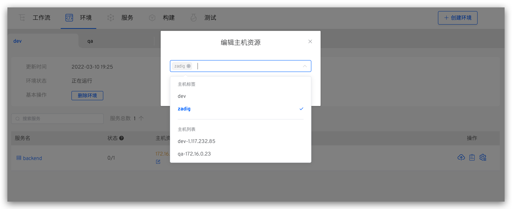

本文介绍如何在 Zadig 系统上进行主机管理。

## 查看主机

访问`资源配置` -> `主机管理`中可查看所有主机资源，系统会基于高级设置中的探活配置，定时（每 10 秒）检测主机在线状态。

## 添加主机

### 添加单个主机

**第一步：配置基本信息**

访问 `资源配置` -> `主机管理`，点击`新建`，填写参数后保存。

参数说明：
- `主机名称`：自定义，用于标识主机的名称
- `标签`：自定义主机标签，用于快速识别主机资源
- `主机地址`：主机的访问地址及端口，端口值默认为 22
- `用户名`：主机登录用户名
- `登录主机`：若开启，在环境中可登录主机
- `SSH 私钥`：用于登录鉴权
- `调度工作流任务`：若开启，工作流任务可以在主机上执行
- `任务根目录`：用于调度工作流任务时，任务的工作目录
- `任务并发数`：执行工作流任务的并发数

**第二步：接入主机**

根据主机架构选择对应命令在主机上执行。

### 批量导入主机

管理员访问 `资源配置` -> `主机管理`，点击`新建`

参数说明：

- `下载模板`：导入的主机文件内容需符合 Zadig 给出的模板文件中定义结构。
- `上传文件`：根据模板文件修改，上传修改后的主机列表文件。
- `导入选项`：
    1. 增量：主机管理列表中已有条目不会重新导入，仅添加文件中新增的主机信息。
    2. 覆盖已有主机：主机管理列表中的已有条目重新导入且添加文件中新增的主机信息。

## 主机使用

主机服务添加资源配置，支持两种选择方式：“主机标签” 和 “主机名称”。

可通过 `环境`，点击服务，查看服务部署详情。

