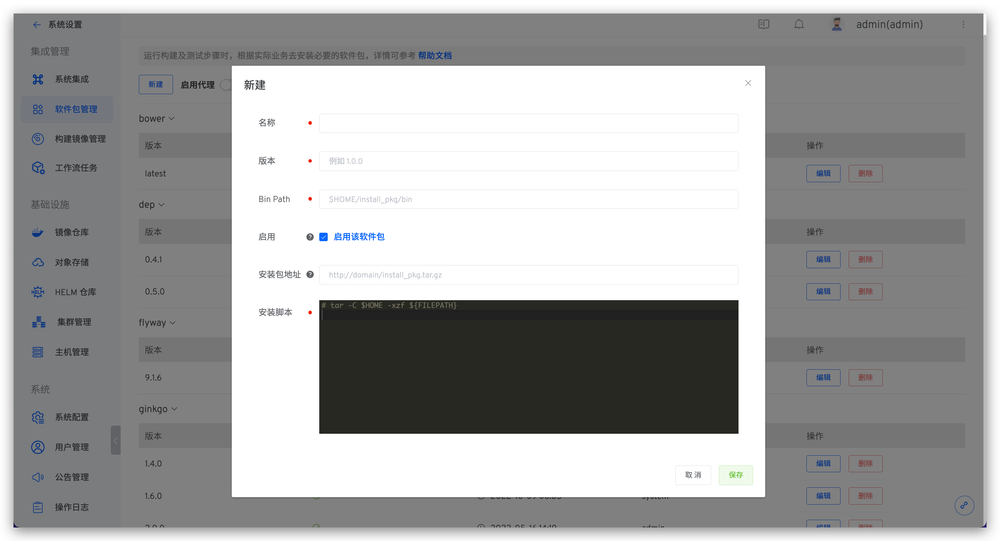

本文介绍如何在 Zadig 系统上配置和使用软件包。在 Zadig 中运行构建、测试、代码扫描以及通用任务时，一般都需要用户根据实际业务去安装必要的软件包环境来进行构建或者编译。比如编译后端相关代码就需要 Go 环境、Java 环境等，前端代码的 NodeJS 环境以及其他环境。

## 新建软件包

点击`系统设置` -> `软件包管理`-> 点击`新建`。

参数说明：
- `名称`：软件包的名称
- `版本`：软件包的版本
- `Bin Path`：软件包安装的二进制 Bin Path ，默认为 `$HOME/软件包名`
- `启用`：控制软件包列表中是否展示，正在使用中的不受影响，启用的软件包可以在 `项目` -> `构建` -> `添加`构建 -> `依赖的软件包` 中展示
- `安装包地址`：系统自动从配置地址下载安装包并做缓存，安装包可通过 `${FILEPATH}` 变量获取
- `安装脚本`：软件包的安装 `shell` 脚本

## 使用软件包

支持为构建、测试、代码扫描以及通用任务配置依赖的软件包，参考文档如下：

- [构建配置](/dev/project/build/)
- [测试配置](/dev/project/test/#测试配置)
- [代码扫描配置](/dev/project/scan/)
- [通用任务配置](/dev/project/workflow-jobs/#通用任务)

## 内置软件包

为方便用户快速配置，系统内置了以下常用软件包。访问`系统设置` -> `软件包管理`，可查看具体配置。

- `bower`
- `dep`
- `ginkgo`
- `glide`
- `go`
- `jMeter`
- `java`
- `maven`
- `node`
- `phantomjs`
- `php`
- `python`
- `yarn`
