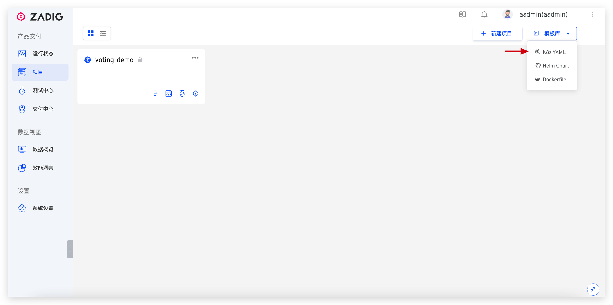
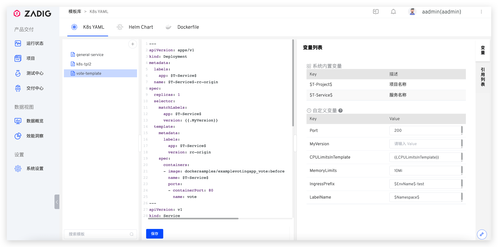
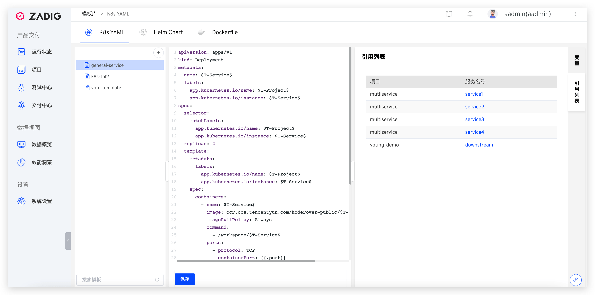

::: tip 背景
</img> K8s YAML 模板适用于使用 K8s YAML 部署的项目。支持用户在通用的模板上创建服务，提供更大的可扩展性。
:::

## 新建模板

> 可将 K8s 资源的 YAML 配置文件抽象，在项目中创建服务时基于模板库对服务进行定义。

- 依次访问`项目`-`模板库`-`K8s YAML` 进入到 K8s YAML 模板库的管理页面，点击`+`按钮后输入 K8s YAML 模板名字并在右侧填写模板内容。模板内容保存成功后，系统会自动解析出模板中所使用变量。

### 变量列表

可以在 K8s YAML 模板中使用系统内置变量和自定义变量。

- `系统内置变量`：包括 `$T-Project$` 和 `$T-Service$`，可直接在 K8s YAML 模板中使用。在项目中基于模板创建服务后，二者会自动被替换为对应的项目名称和服务名称。
- `自定义变量`：通过形如 `{{.key}}` 的方式在模板中定义使用，可赋予默认值。在项目中基于模板创建服务，以及创建环境时，均可修改自定义变量的默认值。

可按需对自定义变量赋默认值。除了使用常量值，系统还支持使用 `$EnvName$` 和 `$Namespace$` 给变量赋值，参见下图中的 `IngressPrefix` 和 `LabelName` 变量。

### 应用到服务

点击`应用到服务`，即可使用最新的模板内容更新所有开启了`自动同步`的服务配置。

> 对服务开启`自动同步`操作参考[使用模板新建服务](/cn/Zadig%20v1.12.0/project/service/k8s/#新建服务)。

## 使用模板
在 [K8s YAML 项目](/cn/Zadig%20v1.12.0/project/k8s-yaml/)中创建服务时可选择从模板导入服务，参考[使用模板新建服务](/cn/Zadig%20v1.12.0/project/service/k8s/#新建服务)。

## 查看引用列表

点击 K8s YAML 模板右侧的`引用列表`，即可查看引用该模板的项目和服务列表。

