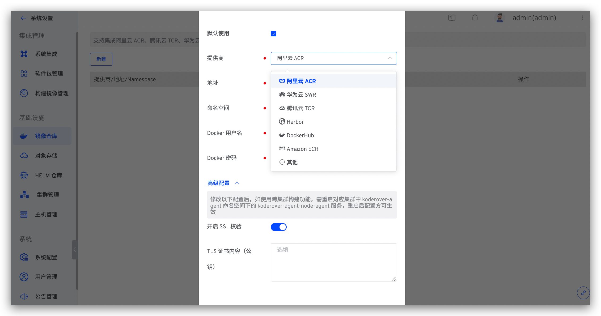

本文介绍如何在 Zadig 系统上集成镜像仓库。Zadig 支持集成云厂商提供的标准镜像仓库或者自建镜像仓库。镜像仓库主要用于存放构建输出的镜像以及预发布的镜像，涉及到工作流的运行，以及环境的启动。

## 添加镜像仓库

点击 `系统设置` -> `镜像仓库` -> `新建`，按需选择对应的提供商

参数说明：

- `默认使用`：若设置为`默认使用`，新建环境时会默认使用该镜像仓库
- `提供商`：支持阿里云 ACR、华为云 SWR、腾讯云 TCR、Harbor、DockerHub、Amazon ECR 及其他 Registry 标准对接
- `地址`：镜像仓库地址
- `命名空间`：空间名称
- `Docker 用户名`：镜像仓库 `Docker 用户名`
- `Docker 密码`：镜像仓库 `Docker 密码`
- `开启 SSL 校验`：可关闭 SSL 校验，关闭后系统将镜像地址注入`insecure-registry`中。
- `TLS 证书内容（公钥）`：如果镜像仓库配置自签 TLS/SSL 证书，需配置证书公钥内容方可正常使用。

::: warning 修改 开启 SSL 校验 和 TLS 证书内容（公钥）配置注意事项
1. 修改配置后，会导致 Zadig 服务重启，可能会影响工作流的执行。所以建议在没有工作流执行的情况下配置。
2. 修改配置后，如使用跨集群构建功能，需重启对应集群中 koderover-agent 命名空间下的 koderover-agent-node-agent 服务，重启后配置方可生效。
:::
## 使用镜像仓库

- 工作流 - 构建

工作流执行构建步骤时，将构建产物推送到指定的镜像仓库。

- 工作流 - 部署

工作流执行部署步骤时，从指定的镜像仓库中拉取镜像。

- 工作流 - 分发部署

工作流执行分发部署步骤时，将产物推送到工作流分发配置中所选的镜像仓库。
如有指定部署环境，部署过程从指定的镜像仓库中拉取镜像。

- 环境 - 镜像更新

环境中，更新服务镜像时，从指定的镜像仓库中拉取镜像。