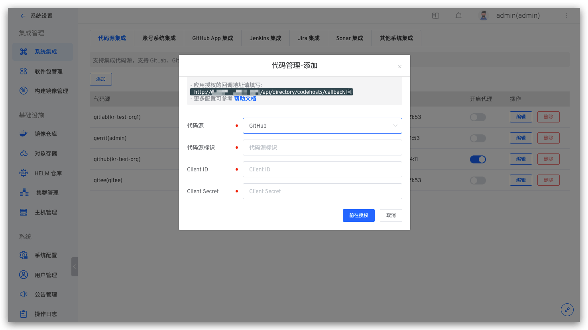

本文主要介绍在 Zadig 上如何集成 GitHub 代码源。

> 目前系统采用 OAuth2 的方式与 GitHub 进行代码的授权认证

如需集成 GitHub，可以按照以下流程配置：

- GitHub Organization 管理员新建 OAuth 应用程序
- 配置 OAuth 应用程序，填写基本信息以及回调地址
- 获取 OAuth 应用程序的 `Client ID`、`Client Secret` 信息
- 配置 GitHub 集成，将获取到的 `Client ID`、`Client Secret` 信息填写到 Zadig 系统
- 跳转到 GitHub 进行认证授权

### 步骤 1：新建 GitHub OAuth 应用程序

> `要启用 GitHub OAuth2，你必须在 GitHub 中注册一个应用程序。`

1. 个人账号下的代码库接入：可以通过点击 Github 账号头像 -> Settings -> Developer settings -> OAuth Apps 来新建应用程序。
2. GitHub Organization 下的代码仓库接入：可以通过点击 Organization Settings -> Developer settings -> OAuth Apps 来新建应用程序。

下面以 GitHub Organization 为例，如下所示。

- 打开 `Organization Settings`。

- 选择 `Developer settings` -> `OAuth Apps`，点击 `New OAuth App` 新建应用程序。

### 步骤 2：配置 GitHub OAuth 应用程序

在新建应用程序页面，你需要进行如下步骤：

- 1. Application name：zadig，也可以填写可识别的任一名称。
- 2. Homepage URL：http://[koderover.yours.com]
- 3. Authorization CallBack URL： `http://[koderover.yours.com]/api/directory/codehosts/callback`
- 4. 点击创建

:::tip 注意
回调地址中 `koderover.yours.com` 需要替换为 Zadig 系统部署的实际地址
:::

### 步骤 3：获取 Client ID、Client Secret 信息

应用创建成功后，GitHub 会返回应用的基本信息，点击 `Generate a new client secret` 生成 `Client Secret`。

此时页面包括完整的 `Client ID` 、`Client Secret`。

### 步骤 4：将 Client ID、Client Secret 集成到系统

切换到 Zadig 系统，管理员依次点击`系统设置` -> `集成管理` -> `代码源集成` -> 点击添加按钮。

依次填入如下已知信息：

- `代码源`：此处选择 `GitHub`
- `代码源标识`：自定义，方便在 Zadig 系统中快速识别出该代码源，该信息在整个系统内唯一
- `Client ID`：步骤 3 应用创建成功返回的 Client ID
- `Client Secret`：步骤 3 生成的 Client Secret

信息确认无误后点击 `前往授权`，耐心等待，此时系统会跳转到 GitHub 进行授权。

点击授权按钮，同意授权后，GitHub 会跳转到 Zadig 系统，至此 GitHub 集成完毕。
