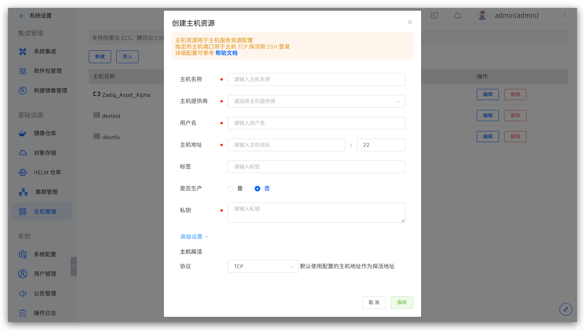
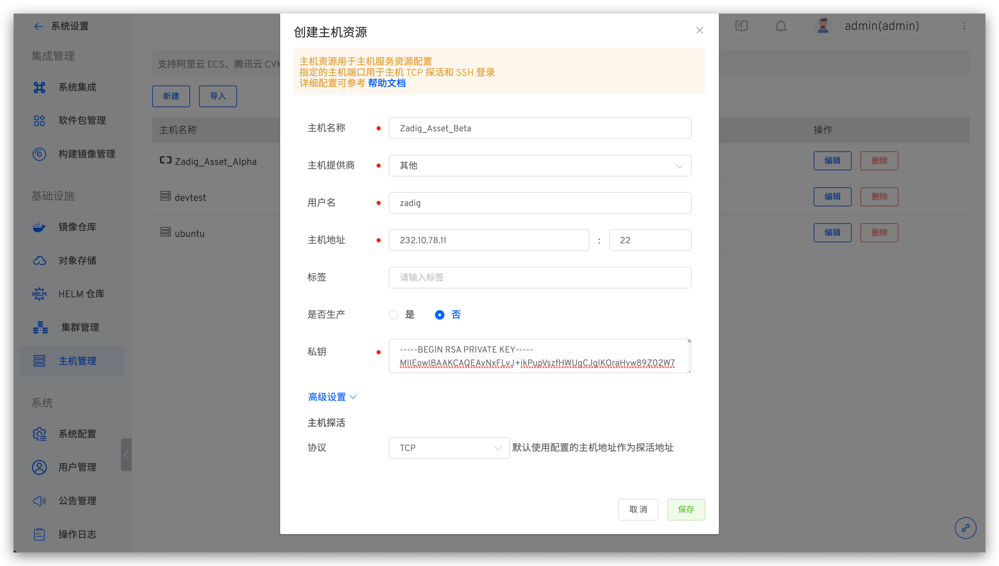

本文介绍如何在 Zadig 系统上进行主机管理。

## 查看主机

管理员登录 Zadig，在`系统设置` ->  `主机管理`中可查看所有主机资源，系统会基于高级设置中的探活配置，定时（每 10 秒）检测主机在线状态。

## 添加主机

### 添加单个主机

管理员登录 Zadig, 进入 `系统设置` -> `主机管理`，点击`新建`

参数说明：
- `主机名称`：自定义，用于标识主机的名称
- `用户名`：主机的 username
- `主机地址`：主机的访问地址及端口，端口值默认为 22
- `标签`：自定义，主机标签
- `私钥`：SSH 访问私钥。通过 ssh-keygen -t rsa -C "your_email@example.com" 方式生成
- `高级设置`：配置主机探活，系统每 10 秒会基于该配置对主机发起请求进行检测
    - TCP 协议：将会使用主机配置中的地址和端口作为探活地址，下图例中即为 `232.10.78.11:22`

    - HTTP/HTTPS 协议：按需自定义探活配置

## 主机使用

主机服务添加资源配置，支持两种选择方式：“主机标签” 和 “主机名称”。

可通过 `环境`，点击服务，查看服务部署详情。

