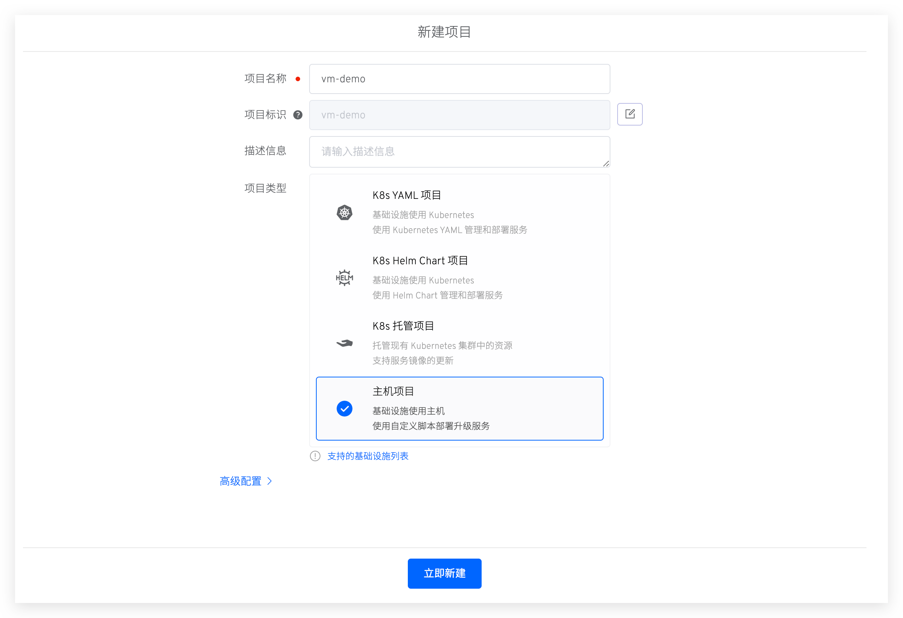
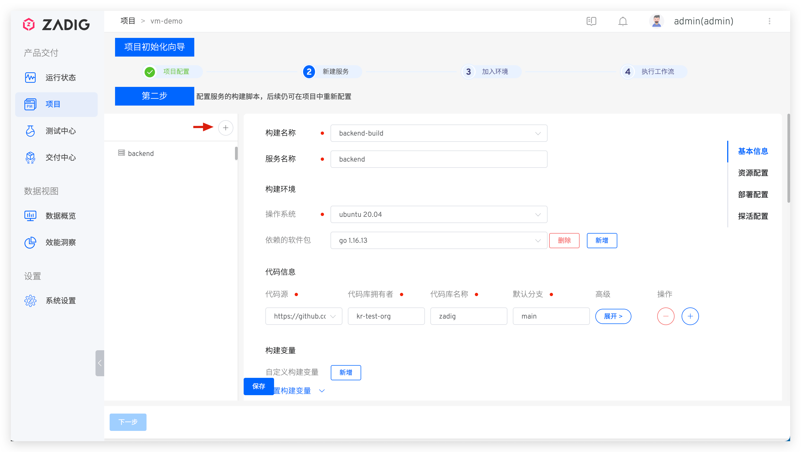
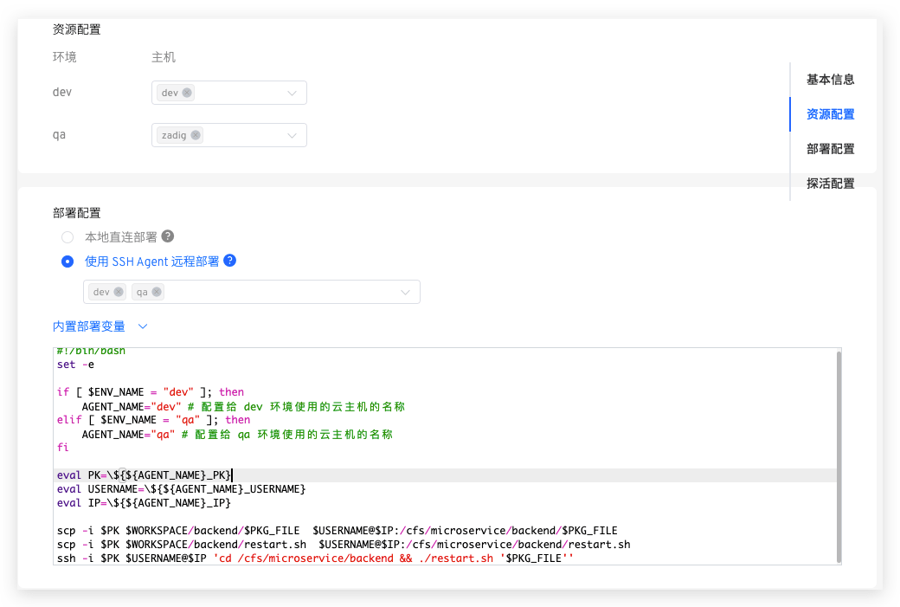
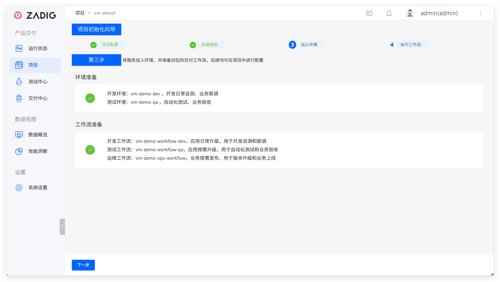
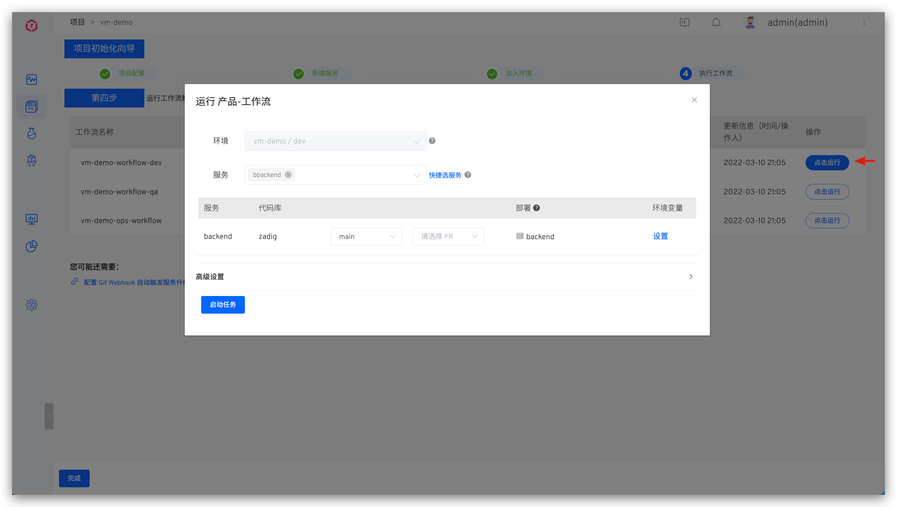

## 新建项目

进入 Zadig 系统，点击「项目」-「新建项目」，填写项目名称，选择`主机项目`的项目类型新建项目。



## 服务配置

> 可参阅 [主机服务](/cn/Zadig%20v1.15.0/project/service/vm/)，完成相关配置项。

本例中使用 [koderover/zadig](https://github.com/koderover/zadig) 仓库的 [microservice-demo](https://github.com/koderover/zadig/tree/main/examples/microservice-demo) 案例中的 [backend](https://github.com/koderover/zadig/tree/main/examples/microservice-demo/backend) 服务。

点击 `+` 按钮，填写服务名称。并分别为其配置构建、主机资源、服务部署及服务探活等信息。



### 基本信息

包括服务名基本信息及服务构建配置，构建配置更细节的信息可参考[构建配置](/cn/Zadig%20v1.15.0/project/build/)。

1. 填写 `backend` 服务构建所需基本信息，并填写构建脚本。


::: details 查看通用构建脚本
```shell
#!/bin/bash
set -ex
cp -r $WORKSPACE/zadig/examples/microservice-demo/backend $WORKSPACE/backend
cp $WORKSPACE/zadig/examples/microservice-demo/vm/restart.sh $WORKSPACE/backend/restart.sh
cd $WORKSPACE/backend
chmod +x restart.sh
make build-backend
tar cvf $PKG_FILE backend
```
:::

2. 配置二进制包存储。

点击`添加步骤`，选择`二进制包存储`，填写二进制包存放路径。这里填写`zadig/examples/microservice-demo/backend`。


### 资源配置和部署配置

为服务选择将部署的主机资源（项目初始化向导结束后，系统将会自动创建包含该服务的 `dev` 和 `qa` 环境），并配置部署方式，填写部署脚本，参考：[部署配置](/cn/Zadig%20v1.15.0/project/service/vm/#部署配置)。

::: tip
需要先集成主机资源，可参考：[主机管理](/cn/Zadig%20v1.15.0/settings/vm-management/)。
:::

 

::: details 查看部署脚本
``` shell
if [ $ENV_NAME = "dev" ]; then
    AGENT_NAME="dev" # 配置给 dev 环境使用的云主机的名称
elif [ $ENV_NAME = "qa" ]; then
    AGENT_NAME="zadig" # 配置给 qa 环境使用的云主机的名称
fi

eval PK=\${${AGENT_NAME}_PK}
eval USERNAME=\${${AGENT_NAME}_USERNAME}
eval IP=\${${AGENT_NAME}_IP}

scp -i $PK $WORKSPACE/backend/$PKG_FILE  $USERNAME@$IP:/cfs/microservice/backend/$PKG_FILE
scp -i $PK $WORKSPACE/backend/restart.sh  $USERNAME@$IP:/cfs/microservice/backend/restart.sh
ssh -i $PK $USERNAME@$IP 'cd /cfs/microservice/backend && ./restart.sh '$PKG_FILE''
```
:::

### 探活配置
为 `backend` 服务设置探活检测。
> 更详细的信息可参考 [探活配置](/cn/Zadig%20v1.15.0/project/service/vm/#探活配置)。


## 加入环境

主机服务配置完毕后，保存并点击`下一步`，Zadig 系统会默认为该项目创建两套集成环境和两条工作流。



## 工作流交付

待环境和工作流准备完毕，点击`下一步`，选择 dev 环境的工作流，可触发 dev 环境的服务更新。


