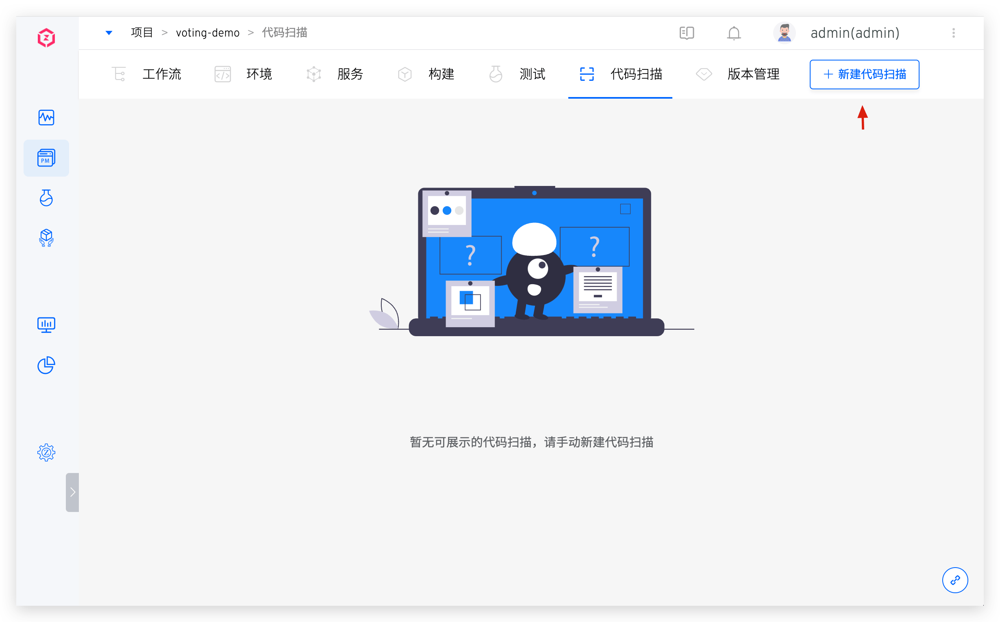
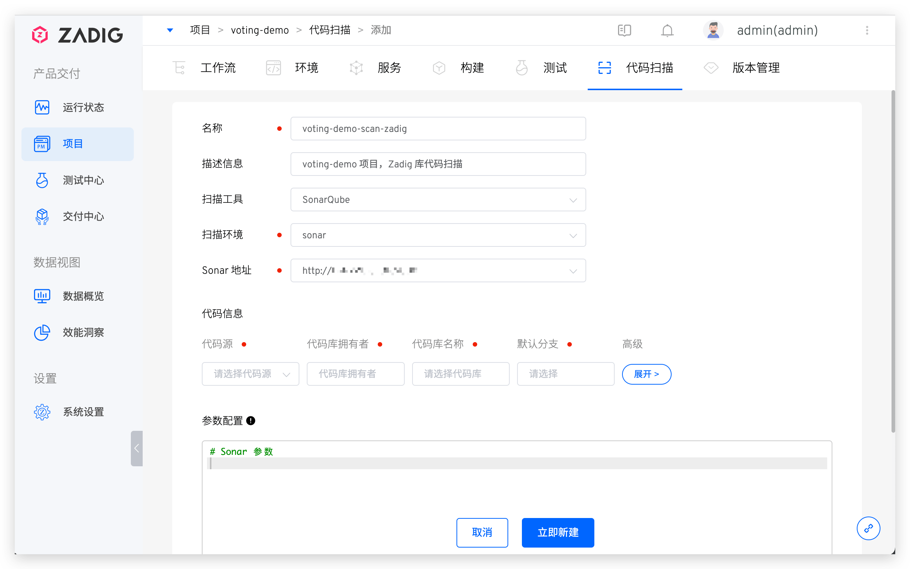
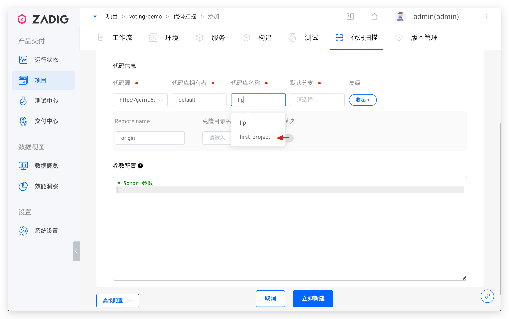
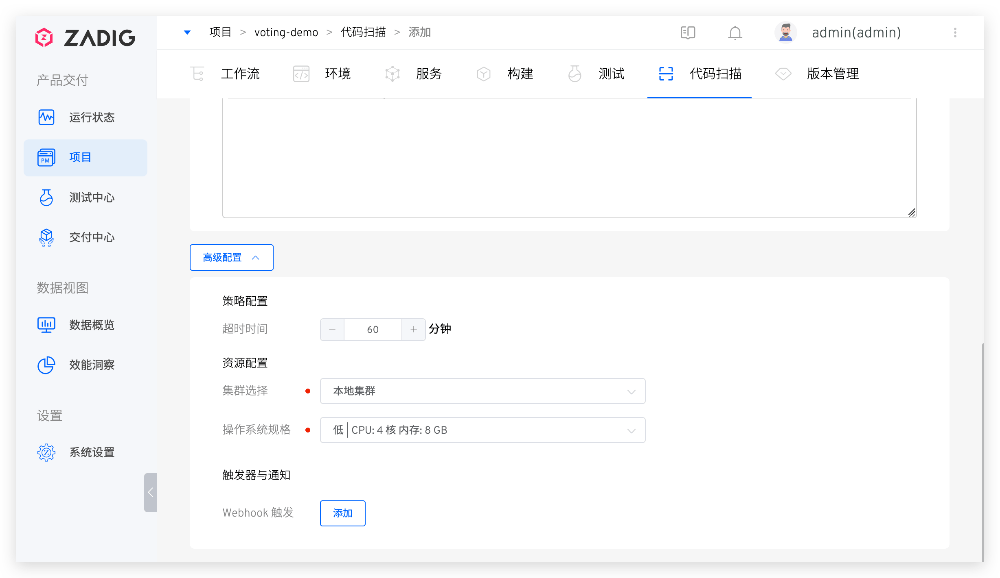
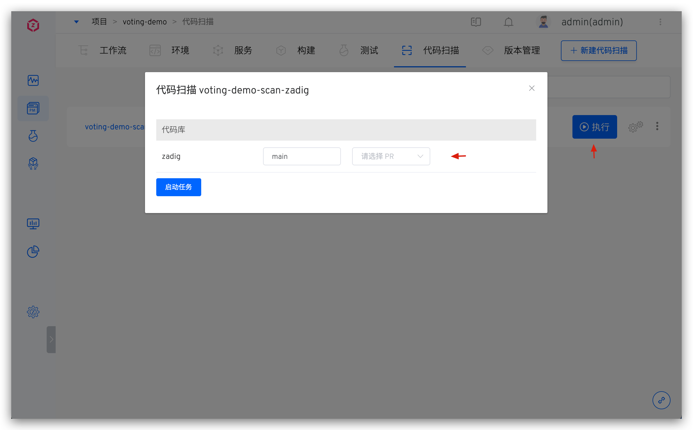
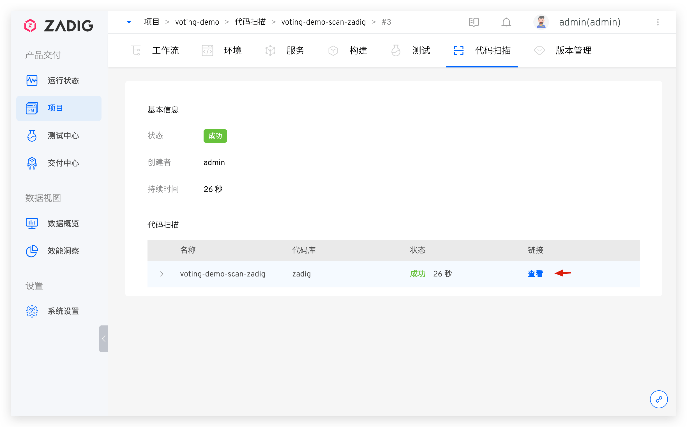

支持在 Zadig 中使用 SonarQube 工具和自定义工具对代码进行扫描，下文展开介绍。

## 新建代码扫描

访问项目 -> 代码扫描，点击`新建代码扫描`后填写配置。





### 基本信息

- `名称`：代码扫描名称，同一项目下不允许重复
- `扫描工具`：可指定 `SonarQube` 或其他
- `扫描环境`：执行扫码任务时的具体运行环境
    - 若使用 `SonarQube` 工具进行代码扫描，系统已内置了支持该工具的环境 `sonar`，选择 `sonar` 即可
    - 若使用其他工具进行代码扫描，可参考[自定义镜像](/cn/Zadig%20v1.15.0/settings/custom-image/)按需添加
- `Sonar 地址`：使用 `SonarQube` 工具做代码扫描时需配置该项
    - 需要事先在系统中集成 Sonar，参考文档：[Sonar 集成](/cn/Zadig%20v1.15.0/settings/sonar/)
    - 当代码扫描执行完成后，Zadig 会将结果上传到此处指定的系统中

### 代码信息
> 需事先在 Zadig 中集成代码源，参考文档：[代码源集成](/cn/Zadig%20v1.15.0/settings/codehost/overview/)。
选择要被扫描的代码库，一个代码扫描配置中可配置一个代码库。



参数说明：
- `代码源`：代码库所在的平台，目前支持 GitHub、GitLab、Gerrit、Gitee
- `代码库拥有者`：支持开源库，以及所配置的代码源下的代码库拥有者
- `代码库名称`：代码库的名称。对于 Gerrit 代码源，支持模糊匹配，如上图例中所示
- `默认分支`：执行代码扫描任务时，默认选取的分支
- `Remote name`：指定远程代码仓库的名称，默认 `origin`
- `克隆目录名`：定义代码库被克隆后的目录名称，默认为代码库的名称
- `子模块`：同步 `submodule` 中配置的代码库

### 参数配置

使用 `SonarQube` 工具进行代码扫描时配置的相关参数，其中 `sonar.host.url` 和 `sonar.login` 无需配置，在执行代码扫描时系统会自动注入。更多参数配置可参考 [SonarQube 文档](https://docs.sonarqube.org/latest/analysis/analysis-parameters/)。

> 若扫描环境为 `sonar`，则参数配置中可使用 `$BRANCH` 变量获取当前被扫描代码库的分支信息。


### 高级配置



说明：

- `策略配置`：配置代码扫描的超时时间，若超过设置的时间阈值后扫描仍未结束，则视为超时失败
- `资源配置`：选择代码扫描任务运行时所使用的集群资源，其中本地集群指 Zadig 系统所在的集群，可参考[集群管理](/cn/Zadig%20v1.15.0/pages/cluster_manage/)集成更多集群资源
- `操作系统规格`：配置资源规格用于执行代码扫描任务。平台默认提供 高/中/低/最低 四种配置供选择，可以根据实际需要自定义
- `触发器与通知`：配置 Webhook 事件，自动触发代码扫描任务执行，配置细节参考：[触发器与通知](#触发器与通知)

### 触发器与通知

> 目前 GitHub/GitLab 代码源支持自动触发代码扫描功能


参数说明：

- `代码库`：即[代码信息](#代码信息)配置中的代码库
- `目标分支`：监听代码变更事件的分支
- `触发事件`: 指定触发代码扫描运行的 Webhook 事件，可选事件如下：
    - `Push commits` 事件（Merge 操作）时触发
    - `Pull requests` 提交 pull request 时触发
    - `Push tags` 新建 tag 后触发
- `自动取消`：若勾选，则当多个 Webhook 事件先后触发代码扫描任务时，系统会自动取消队列中的任务
- `文件目录`: 当指定文件或目录发生变化（新增/修改/删除）时，触发代码扫描，使用以下代码仓库文件结构示例说明：

``` bash
├── reponame  # 仓库名称
  ├── Dockerfile 
  ├── Makefile
  ├── README.md   
  ├── src        
    ├── service1/
    ├── service2/
    └── service3/
```
| 触发场景 | 文件目录配置 |
|----|------------|
| 所有文件更新|`/`|
| 除 *.md 以外的其他文件更新|`/`<br>`!.md`|
| 除 service1 目录下的其他文件更新 | `/`<br>`!src/service1/`|
| service1 目录下所有文件更新 | `src/service1/` |
| src 目录下（除 service1 目录下的文件）的文件更新|`src`<br>`!src/service1/`|

## 执行代码扫描

选择具体的代码扫描 -> 点击`执行`，可对指定分支或 Tag 中的代码进行扫描。



当代码扫描任务运行完毕，可点击链接快速跳转至 SonarQube 系统中查看结果。

> 使用 `SonarQube` 工具做代码扫描时支持该功能。


