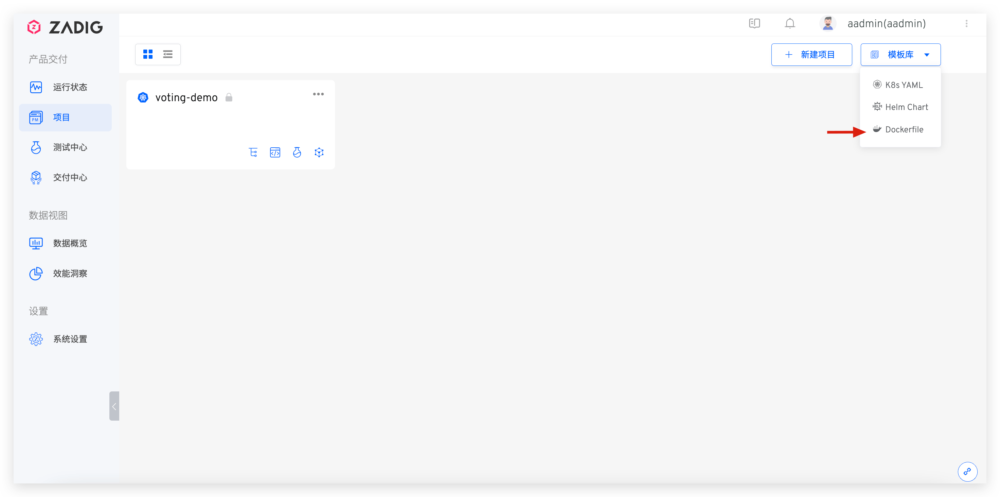
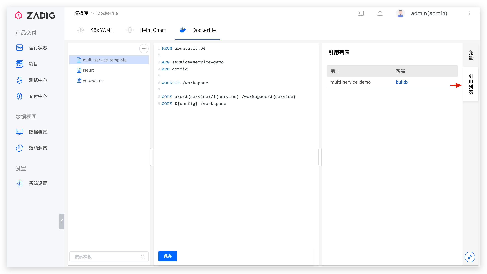

::: tip 背景
</img> Dockerfile 模板能力，支持用户将通用的镜像构建步骤包装成模板，最大程度地减少重复构建配置工作，暂不支持在主机项目中使用。
:::

## 新建模板

::: tip 小贴士
Dockerfile 模板在整个系统内均有效，可被应用到不同的项目中使用。
:::

依次访问`项目`-`模板库`-`Dockerfile` 进入 Dockerfile 模板管理页面。

点击`+`按钮后输入 Dockerfile 模板名字并在右侧填写模板内容。模板内容保存成功后，系统会自动解析出模板中使用 ARG 命令定义的变量以及变量的值。

## 使用模板

配置构建时，在`添加步骤`中选择镜像构建，`Dockerfile 来源`选择模板库并按需选择 Dockerfile 模板。

> 关于`添加步骤`中的镜像构建，更多说明请阅读 [镜像构建](/cn/Zadig%20v1.15.0/project/build/#更多构建步骤)。

1. 选择 Dockerfile 模板后，系统会自动将模板中的变量信息显示出来，也可点击右侧的`预览`查看模板的完整内容。
2. 根据构建服务的实际情况，按需填写构建参数，通过 `--build-arg 变量1=变量的值 --build-arg 变量2=变量的值` 的方式来对模板进行赋值。

## 查看引用列表

点击 Dockerfile 模板右侧的`引用列表`，即可查看引用该模板用于构建镜像的项目和构建列表。

