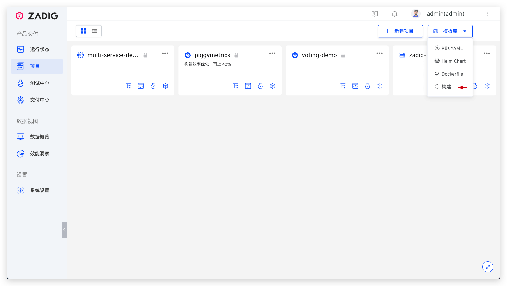
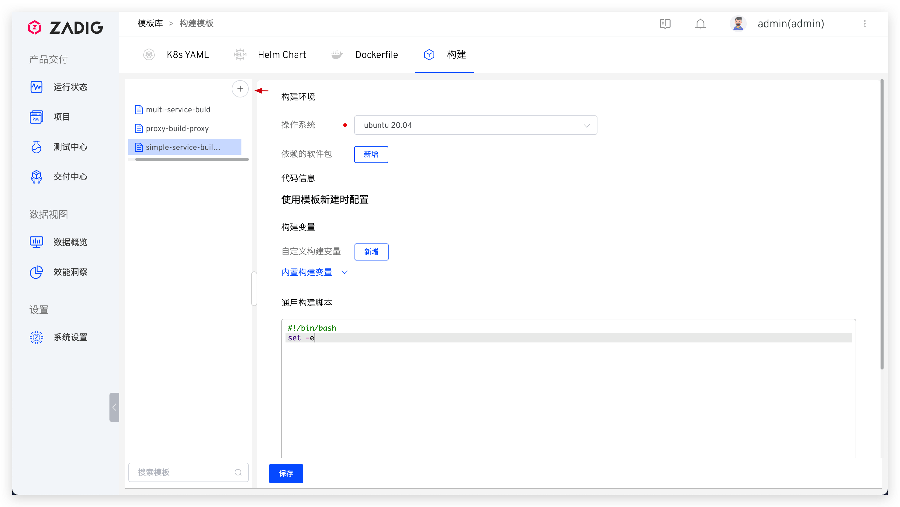

::: tip 背景
将服务的构建配置抽取成模板，为服务创建构建时可选择基于模板创建，适用于大量服务的构建配置同构的场景。
:::

## 新建模板

依次访问`项目 `-> `模板库` -> `构建` 进入构建模板管理页面。



点击 `+` 按钮，填写模板名称，参考[构建配置](/cn/Zadig%20v1.16.0/project/build/)完成构建模板的配置。
> 模板中的`代码信息`部分无需配置，在使用构建模板为服务创建构建时再配置。



::: tip
结合使用构建变量 `$REPONAME_<index>` 可巧妙的完成构建模板的配置，比如服务的源代码及编译配置在 A 仓库，Dockerfile 文件在 B 仓库，构建配置中的脚本可组织如下：

``` bash
#!/bin/bash
set -ex

cd $WORKSPACE/$REPONAME_0/service/
cp $WORKSPACE/$REPONAME_1/dockerfiles/$SERVICE.Dockerfile .
make build
docker build -t $IMAGE -f $SERVICE.Dockerfile .
docker push $IMAGE
```

使用构建模板创建构建时，按照顺序完成对应代码库的配置即可，参考[使用构建模板](/cn/Zadig%20v1.16.0/project/build/#zadig-构建模板)。
:::


## 使用模板

参考[使用构建模板](/cn/Zadig%20v1.16.0/project/build/#zadig-构建模板)。
