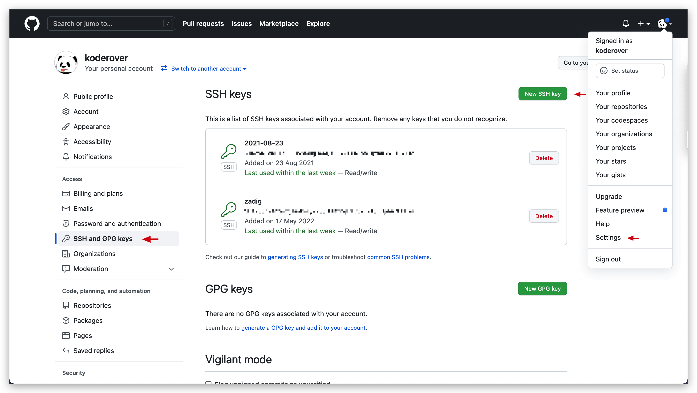
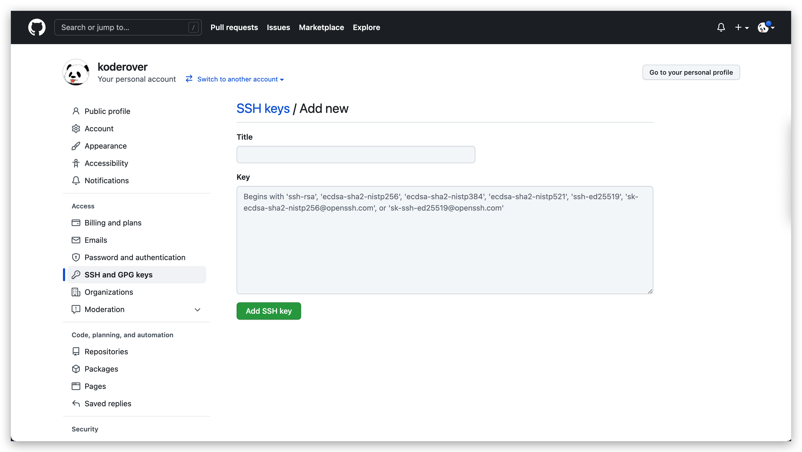
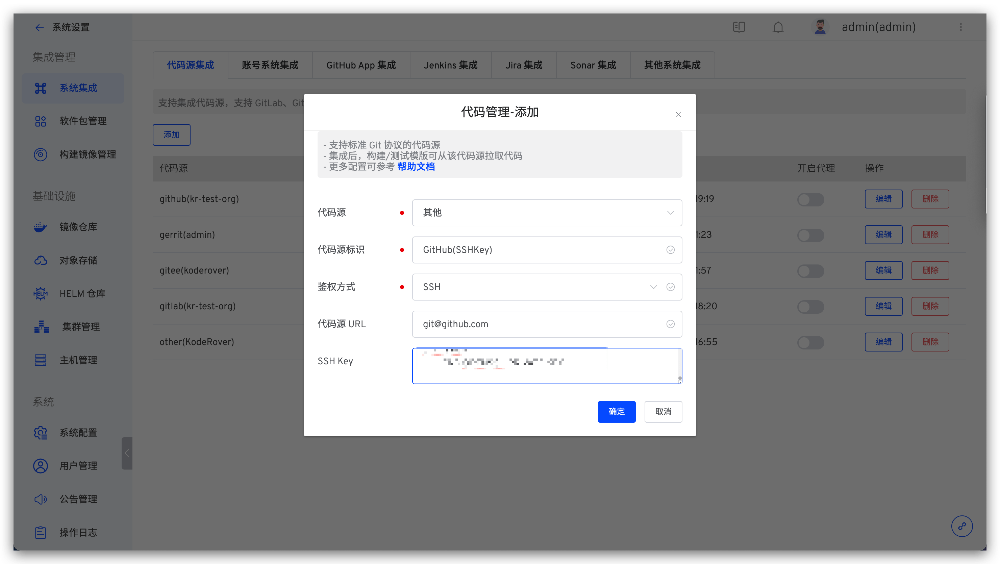
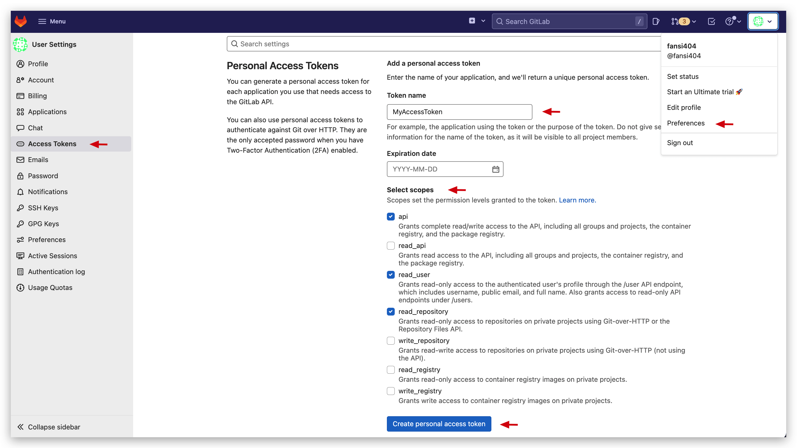
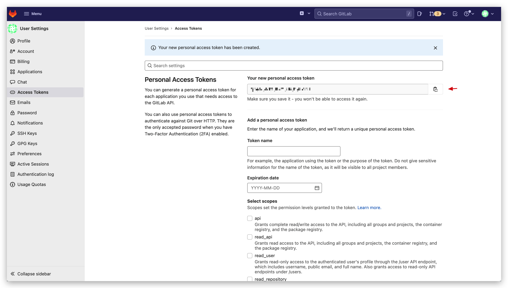
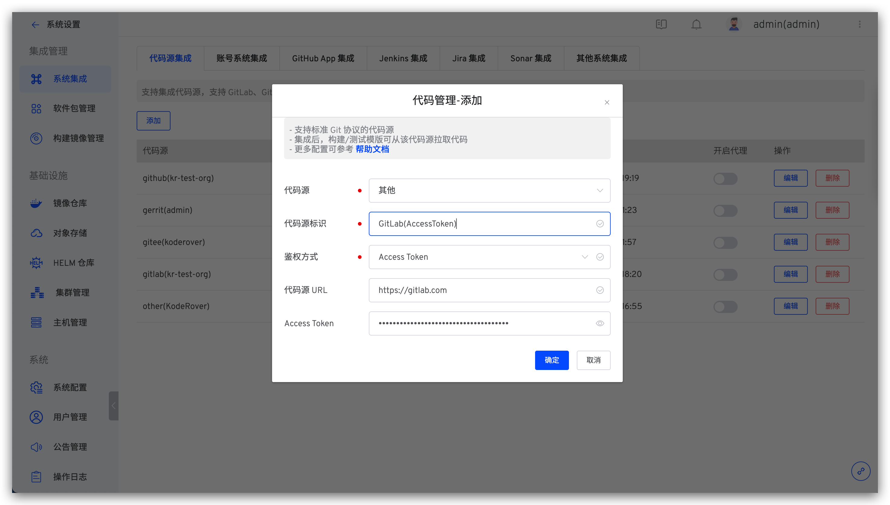

本文主要介绍如何集成支持标准 Git 协议的代码源：包括使用 SSH Key 鉴权和使用 Access Token 鉴权。

## SSH Key 鉴权方式

### 步骤 1：配置 SSH Key

在对应的代码源中配置 SSH 公钥，该配置的操作路径因不同代码源而异，请参阅对应代码源的官方文档操作。下面以 GitHub 代码源为例进行演示。

1. 生成 SSH 公私钥对，通过 `ssh-keygen -t rsa -C "your_email@example.com"` 方式生成
2. 登录 GitHub 后点击右上角头像 -> `Settings` -> `SSH And GPG Keys` -> `New SSH Key`，填写以下信息后点击 `Add SSH Key`
    -  `Title`：自定义
    -  `Key`：上一步中生成的公钥信息，即 `id_rsa.pub` 的内容




### 步骤 2：将配置填入 Zadig 系统

管理员登录 Zadig 系统，依次访问`系统设置` -> `系统集成` -> `代码源` -> 点击添加按钮。



依次填入如下信息：

- `代码源`：选择`其他`
- `代码源标识`：自定义，方便在 Zadig 系统中快速识别出该代码源，该信息在整个系统内唯一
- `鉴权方式`：选择 `SSH Key`
- `代码源 URL`：填写对应代码源地址，比如 `git@github.com`
- `SSH Key`：进入 **步骤 1** 中生成密钥对的目录，执行以下命令后在此处的输入框中操作粘贴即可

``` bash
cat id_rsa | pbcopy
```

## Access Token 鉴权方式

### 步骤 1：获取 Access Token

在对应的代码源中配置 Access Token，Access Token 配置因不同代码源而异，请参阅对应代码源的官方文档操作。下面以获取 GitLab 代码源的 Access Token 为例进行演示。

1. 登录 GitLab 后点击右上角头像 -> `Preferences` -> `Access Tokens`，填写 Token 名称后勾选 `api`、`read_user`、`read_repository` ，生成 Access Token。



2. 复制生成的 Access Token 信息即可。



### 步骤 2：将配置填入 Zadig 系统

管理员登录 Zadig 系统，依次访问`系统设置` -> `集成管理` -> `代码源集成` -> 点击添加按钮。



依次填入如下信息：

- `代码源`：选择`其他`
- `代码源标识`：自定义，方便在 Zadig 系统中快速识别出该代码源，该信息在整个系统内唯一
- `鉴权方式`：选择 `Access Token`
- `代码源 URL`：填写对应代码源地址，比如 `https://gitlab.com`
- `Access Token`：在 **步骤 1** 中获得的 Access Token
