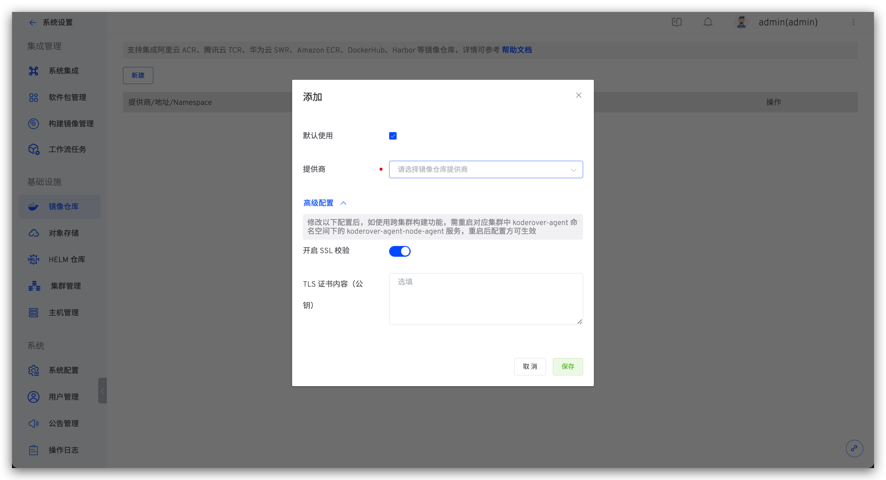
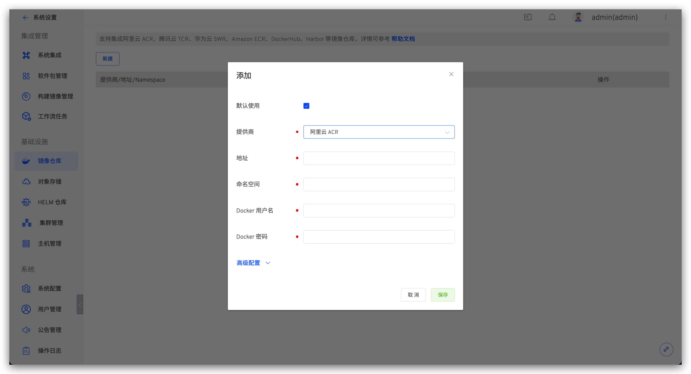
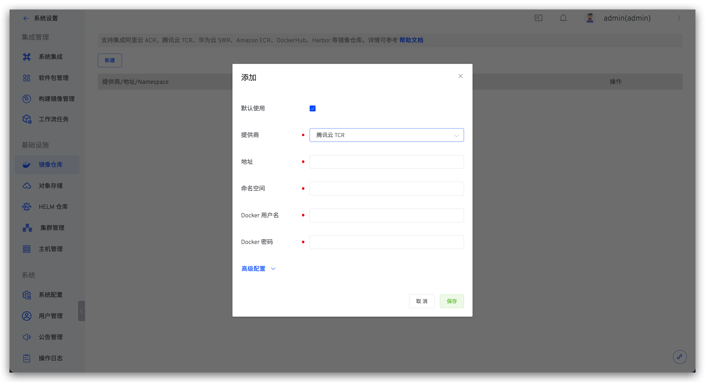
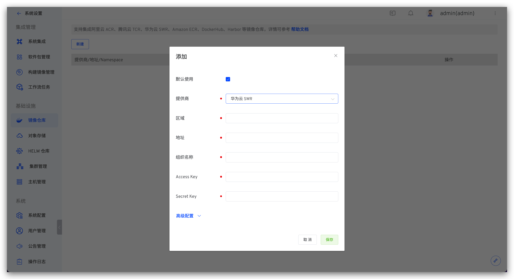
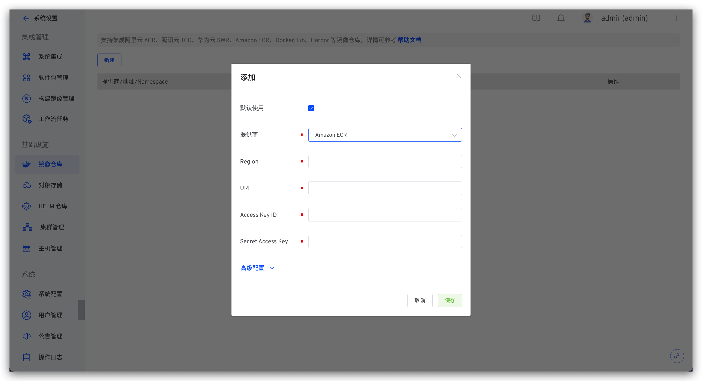
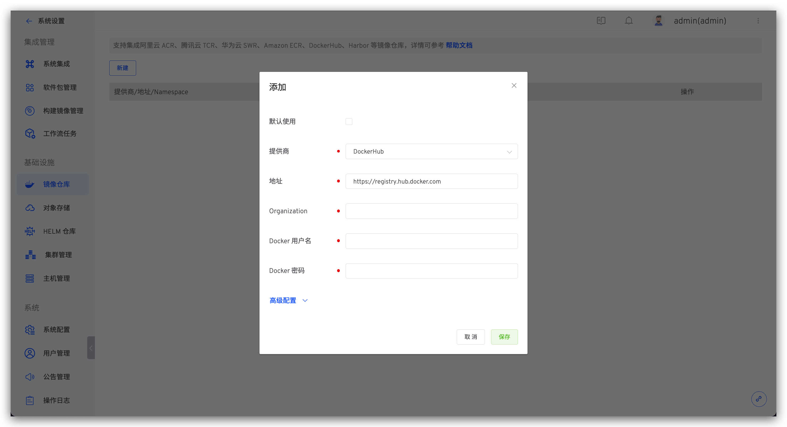
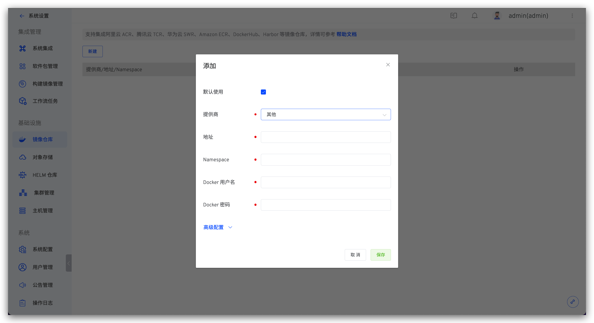

本文介绍如何在 Zadig 系统上集成镜像仓库。Zadig 支持集成云厂商提供的标准镜像仓库或者自建镜像仓库。镜像仓库主要用于存放构建输出的镜像以及预发布的镜像，涉及到工作流的运行，以及环境的启动。

## 添加镜像仓库

点击 `系统设置` -> `系统集成` -> `镜像仓库` -> `新建`，按需选择对应的提供商

参数说明：

- `默认使用`：若设置为`默认使用`，新建环境时会默认使用该镜像仓库
- `提供商`：支持阿里云 ACR、华为云 SWR、腾讯云 TCR、Harbor、DockerHub、Amazon ECR 及其他 Registry 标准对接

高级配置：

- `开启 SSL 校验`：可关闭 SSL 校验，关闭后系统将镜像地址注入`insecure-registry`中。
- `TLS 证书内容（公钥）`：如果镜像仓库配置自签 TLS/SSL 证书，需配置证书公钥内容方可正常使用。

::: warning 修改 开启 SSL 校验 和 TLS 证书内容（公钥）配置注意事项
1. 修改配置后，会导致 Zadig 服务重启，可能会影响工作流的执行。所以建议在没有工作流执行的情况下配置。
2. 修改配置后，如使用跨集群构建功能并且集群是直接连接接入的，需要对集群操作更新组件后配置才会生效。
:::

### 阿里云 ACR (个人版)

参数说明：

- `地址`：镜像仓库地址，比如：http://registry.cn-shanghai.aliyuncs.com
- `命名空间`：镜像仓库的命名空间，类似 DockerHub 中的组织概念，更多信息可阅读 [命名空间](https://www.alibabacloud.com/help/zh/container-registry/latest/manage-namespaces)
- `Docker 用户名`：登录镜像仓库的 Docker 用户名
- `Docker 密码`：登录镜像仓库的 Docker 密码

### 腾讯云 TCR（个人版）

参数说明：

- `地址`：镜像仓库地址，比如：https://koderover-zadig.tencentcloudcr.com
- `命名空间`：镜像仓库的命名空间，类似 DockerHub 中的组织概念，更多信息可阅读 [命名空间](https://cloud.tencent.com/document/product/1141/39295#M)
- `Docker 用户名`：登录镜像仓库的 Docker 用户名
- `Docker 密码`：登录镜像仓库的 Docker 密码

### 华为云 SWR

参数说明：

- `区域`：镜像仓库所属区域，比如华东上海一区：cn-east-3
- `地址`：镜像仓库地址，比如：https://swr.cn-east-3.myhuaweicloud.com
- `组织`：镜像仓库所属组织名称，更多信息可阅读 [基本概念-组织](https://support.huaweicloud.com/productdesc-swr/swr_03_0003.html)
- `Access Key`：用于鉴权的 Access Key，更多信息可阅读 [获取 AK/SK 访问密钥](https://support.huaweicloud.com/usermanual-swr/swr_01_1000.html)
- `Secret Key`：用于鉴权的 Secret Key，更多信息可阅读 [获取 AK/SK 访问密钥](https://support.huaweicloud.com/usermanual-swr/swr_01_1000.html)

### Amazon ECR

参数说明：

- `Region`：支持集成私有镜像仓库，Region 为镜像仓库所属区域，比如：ap-northeast-1
- `URI`：镜像仓库地址，比如：https://koderover-zadig.dkr.ecr.ap-northeast-1.amazonaws.com
- `Access Key ID`：用于鉴权的 Access Key ID，更多信息可阅读 [AWS KMS 概念](https://docs.aws.amazon.com/kms/latest/developerguide/concepts.html)
- `Secret Access Key`：用于鉴权的 Secret Access Key，更多信息可阅读 [AWS KMS 概念](https://docs.aws.amazon.com/kms/latest/developerguide/concepts.html)

### Harbor

参数说明：

- `地址`：镜像仓库地址
- `项目`：Harbor 镜像仓库的项目信息，更多信息可阅读 [项目](https://goharbor.io/docs/2.6.0/working-with-projects/create-projects/)
- `Docker 用户名`：登录 Harbor 镜像仓库的 Docker 用户名
- `Docker 密码`：登录 Harbor 镜像仓库的 Docker 密码

### DockerHub

参数说明：

- `地址`：镜像仓库地址，比如：https://koderover-zadig.tencentcloudcr.com
- `Organization`：镜像仓库的组织名称，更多信息可阅读 [Organization](https://docs.docker.com/docker-hub/orgs/)
- `Docker 用户名`：登录镜像仓库的 Docker 用户名
- `Docker 密码`：登录镜像仓库的 Docker 密码

### 其他

参数说明：

- `地址`：镜像仓库地址
- `Namespace`：镜像仓库的 Namespace 名称
- `Docker 用户名`：登录镜像仓库的 Docker 用户名
- `Docker 密码`：登录镜像仓库的 Docker 密码

## 使用镜像仓库

- 工作流 - 构建

工作流执行构建步骤时，将构建产物推送到指定的镜像仓库。

- 工作流 - 部署

工作流执行部署步骤时，从指定的镜像仓库中拉取镜像。

- 工作流 - 分发部署

工作流执行分发部署步骤时，将产物推送到工作流分发配置中所选的镜像仓库。
如有指定部署环境，部署过程从指定的镜像仓库中拉取镜像。

- 环境 - 镜像更新

环境中，更新服务镜像时，从指定的镜像仓库中拉取镜像。