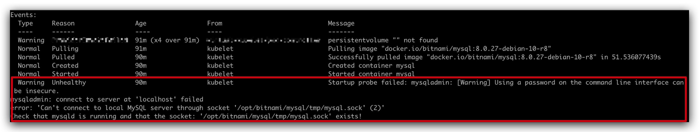
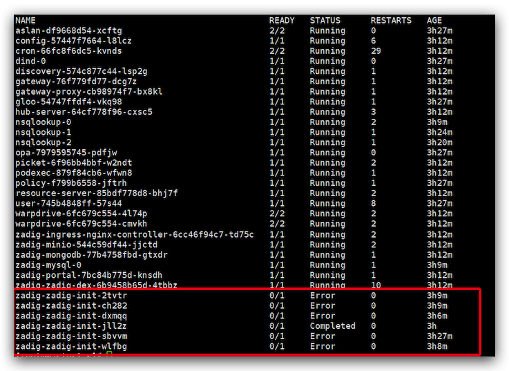
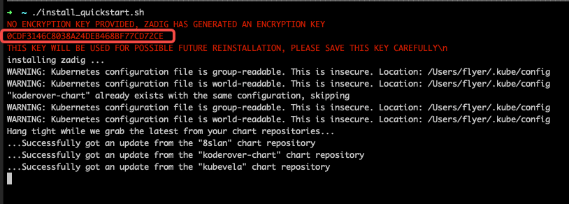
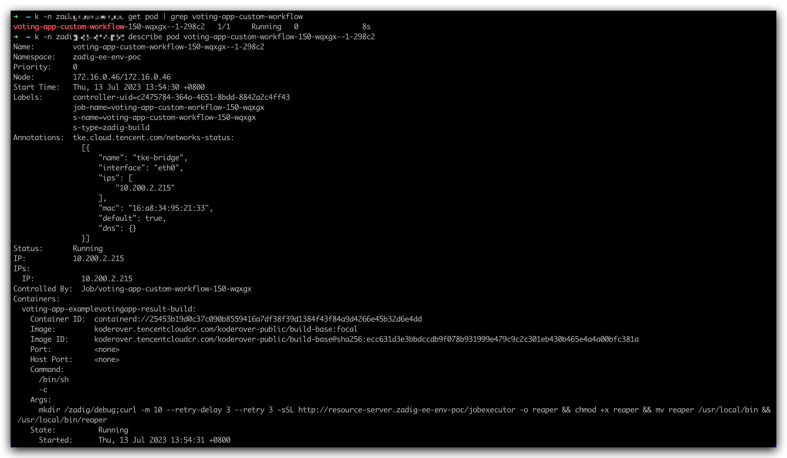

## all-in-one 模式安装失败，报错 failed post-install: timed out waiting for the condition

诊断思路：执行以下命令查看 Pod 状态，检查是否有未能启动的 Pod，如果 mysql 处于 `Pending` 状态，一般都是由于 PV 配置不正确导致的。

`kubectl -n {Zadig 所在的 Namespace} get pod`

## 安装失败，报错 failed to parse version: ${FROM_VERSION}, err: No Major.Minio.Patch elements found

这是因为之前有过安装失败的版本未完全卸载，导致安装行为变为升级行为导致的。解决办法为在确保完全卸载后重新安装。需要注意使用官方卸载命令，请勿直接删除 Namespace 来卸载。不同安装方式的卸载命令请参考文档：
- [基于现有 Kubernetes 安装](/cn/Zadig%20v1.18.0/install/install-on-k8s/#zadig-卸载)
- [基于现有 Helm 命令安装](/cn/Zadig%20v1.18.0/install/helm-deploy/#helm-charts-卸载)

## 安装失败，报错 install failed, error: UPGRADE FAILED: post-upgrade hooks failed: job failed: BackoffLimitExceeded
这是因为之前有过安装失败的版本未完全卸载，导致安装行为变为升级行为导致的。解决办法可参考：[Zadig 安装失败](/cn/Zadig%20v1.18.0/faq/debug-system/#安装失败-报错-failed-to-parse-version-from-version-err-no-major-minio-patch-elements-found)。

## 安装失败，报错 table connector already exists

删除 MySQL 的 dex 数据库后，新建 dex 数据库并重启 dex 服务即可。

## Mongodb 和 Minio 处于 Pending 状态，安装失败？

Zadig 系统安装的时候，不会介入到集群的存储细节中来，因此，在没有默认 storage class 或是没有指定 storage
class 的时候， 需要事先创建 PV 来让 MinIO 和 Mongodb 正确运行。 以下是一个可以运行的 PV YAML 示例

::: details
```
apiVersion: v1
kind: PersistentVolume
metadata:
  name: zadig-reserved-pv
spec:
  capacity:
    storage: 20Gi
  accessModes:
    - ReadWriteOnce
  hostPath:
    path: "/mnt/zadig/data"
    type: Directory
---
apiVersion: v1
kind: PersistentVolume
metadata:
  name: task-pv-volume
spec:
  capacity:
    storage: 20Gi
  accessModes:
    - ReadWriteOnce
  hostPath:
    path: "/mnt/zadig/data2"
    type: Directory
```
:::
## 安装后无法访问 Zadig

使用安装时指定的地址无法访问 Zadig，导致该异常的原因有很多，以下提供一些常见的排查思路：

1. 执行以下命令查看 Pod 状态，确保所有 Pod 都正常运行：
``` bash
kubectl -n {Zadig 所在的 Namespace} get pod
```
2. 执行以下命令查询安装参数并检查配置参数：

``` bash
helm get values <Zadig Release Name> -n <Zadig 所在的 Namespace>
```
检查以下参数：
- `global.extensions.extAuth.extauthzServerRef.namespace`：Zadig 部署所在的 Namespace
- `dex.config.issuer`：`http://${dex.fullnameOverride}:5566/dex`
- `dex.config.staticClients[0].redirectURIs[0]`： `${Zadig 的访问地址}/api/v1/callback`

3. 检查 aslan Pod 内是否可访问自己，具体方法为登录进 aslan Pod 后执行以下命令：
``` bash
curl http://aslan:25000
```

4. 如果问题现象是访问 Zadig 时报 403 错误，需要检查集群名称，方法如下：
  - 进入任意容器 Pod 查看 /etc/resolv.conf 文件内容，检查集群名称是否为 `cluster.local`
  - 如果集群名不为 `cluster.local`，手动修改安装参数，增加配置 `gloo.k8s.clusterName=${自定义的集群名称}`

## 使用 hostpath 类型的 PersistentVolume 安装 Zadig，MongoDB 容器一直提示权限有问题无法创建目录，Pod 启动失败

这是因为容器对于 PersistentVolume 中指定的 path 没有写入权限导致。可以手动执行创建文件目录并给予 `777` 权限模式即可，举例如下：

```bash
mkdir /mnt/zadig/data
chmod 777 /mnt/zadig/data
```

## 安装时 MySQL Pod startupProbe 报 warning 信息



在安装 Zadig 时，MySQL Pod 创建 15s 后会开始对其进行启动探测检查。这样做的目的是保证有充分的时间来保护慢启动的应用，每次检测异常时会反馈 warning。系统最多会在 100s 内进行 10 次探测检查，遇到此种情况请耐心等待片刻。

::: tip 扩展知识
关于 Kubernetes Startup Probe 的知识点可阅读 [Configure Startup Probes](https://kubernetes.io/docs/tasks/configure-pod-container/configure-liveness-readiness-startup-probes)
:::

## 安装时 zadig-init Pod 状态为 Error



zadig-init Job 会做一些系统初始化的工作，完成内置用户以及角色和绑定数据的设置。该 Job 的完成依赖于慢启动的 MySQL / MongoDB 等基础组件，遇到此种情况请耐心等待片刻。该 Job 最多会被重试 10 次，最终有一个状态为 `Completed` 的 Job，Zadig 系统即可正常使用。如果 10 次重试后 Job 仍未完成，请联系我们。

## 安装时报错 Error: failed to install CRD crds/enterprise.gloo.solo.io_v1_AuthConfig.yaml: ...
> 完整报错信息：Error: failed to install CRD crds/enterprise.gloo.solo.io_v1_AuthConfig.yaml: unable to recognize "": no matches for kind "CustomResourceDefinition" in version "apiextensions.k8s.io/v1"

Zadig 系统对 Kubernetes 集群版本有要求。遇到此种错误请检查你的 Kubernetes 集群版本，需要集群版本在 1.16 及以上，才能正常安装使用。

## 安装时依赖的 ENCRYPTION_KEY 信息遗忘，如何获取到

1. 通过 [All in one](/cn/Zadig%20v1.18.0/install/all-in-one/) 或者 [Kubernetes 脚本](/cn/Zadig%20v1.18.0/install/install-on-k8s/)安装时，可以显式配置 ENCRYPTION_KEY 环境变量，或记录脚本自动生成的 ENCRYPTION_KEY，如下图所示：



2. 安装 Zadig 成功后，可通过如下命令获取 ENCRYPTION_KEY 信息：

```bash
kubectl -n <Zadig 安装的 Namespace> get secret zadig-aes-key -o=jsonpath='{.data.aesKey}' | base64 -d
```

## 工作流执行报错 zadig-minio.**.svc.cluster.local:9000/bucket": net/url: invalid control character in URL

访问系统设置 > 对象存储，检查 minio 的配置，若为乱码，改为 `wJalrXUtnFEMI2019K7MDENGbPxRfiCYEXAMPLEKEY` 即可。

## 工作流任务执行后卡在准备环境阶段，最终超时失败

排查思路：重试工作流，在准备环境阶段查看工作流运行 Pod 的事件明细。<br>
具体途径如下：

- 执行以下命令查询工作流运行 Pod

``` bash
kubectl -n {Zadig 所在 Namespace} get pod | grep {工作流标识}
```

- 执行以下命令查看 Pod 的事件
``` bash
kubectl -n {Zadig 所在 Namespace} describe pod {上一步中查到的 Pod}
```


