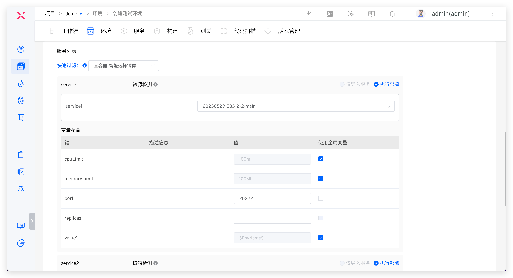
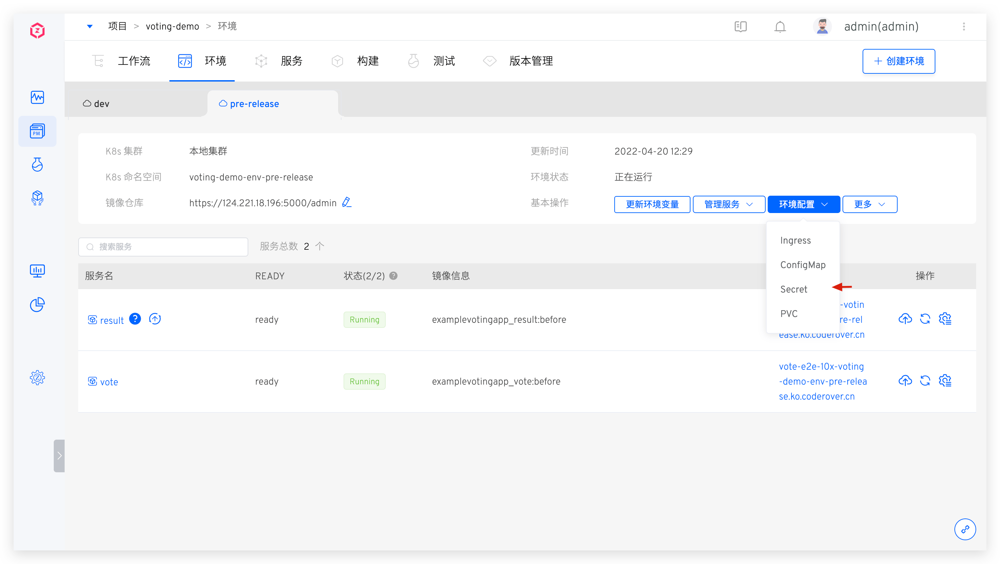
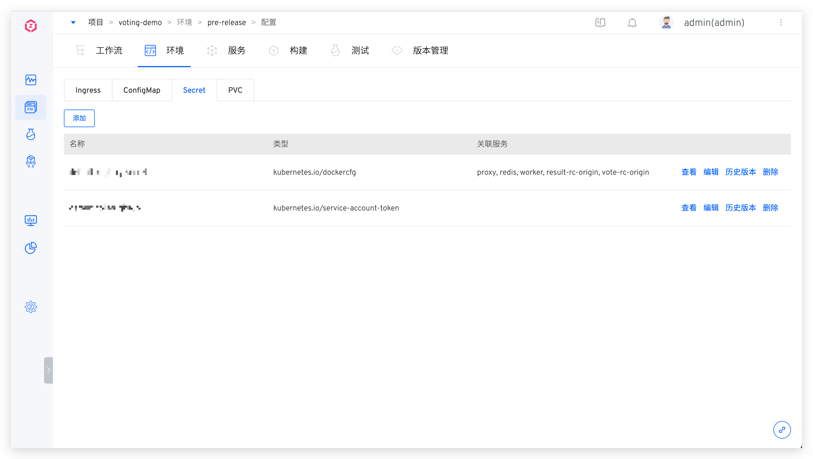
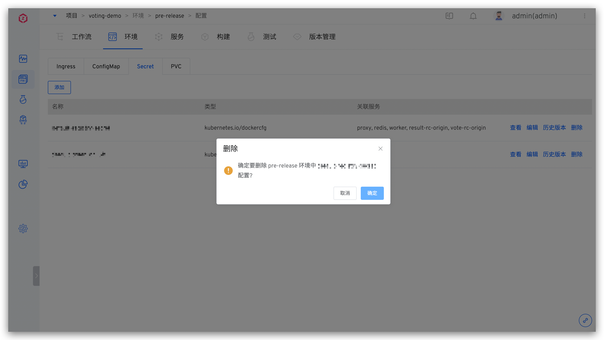
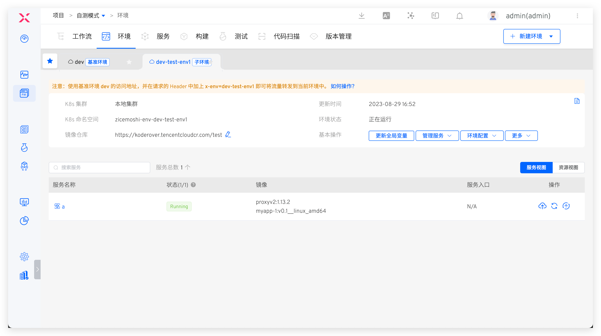
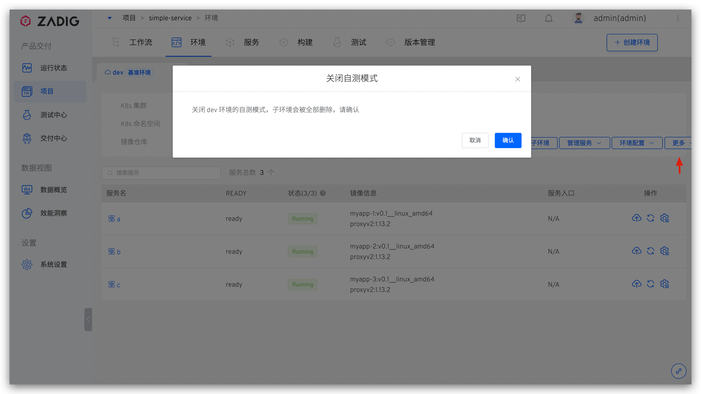

本文主要介绍 K8s YAML 项目中的测试环境和生产环境相关操作。

## 查看环境

环境创建完成后，点击不同的环境 Tab 即可切换到该环境的详情页面，点击`资源视图`，可从工作负载/容器组/网络/存储/配置等资源视角对该环境所在命名空间下的资源进行查看。

### 基本信息

环境的基本信息中包括 Kubernetes 集群，Kubernetes 命名空间，更新时间，环境状态，镜像仓库。环境状态有以下几种情况：
- `创建中`：正在创建
- `更新中`：正在更新
- `删除中`：正在删除
- `正在运行`：环境中所有服务都是正常的 Running 状态
- `运行不稳定`：环境中一部分服务处于 Unstable 状态，可能的情况有两种：
	- 容器服务出现了问题
	- 容器服务正在进行更新操作，例如更新镜像，会出现短时间的服务 Unstable，当更新过程完成之后，服务状态会恢复为 Running

### 基本操作

环境操作包括：

- `更新全局变量`：更新环境的全局变量，参考[更新环境全局变量](/cn/Zadig%20v2.0.0/project/service/variable/#更新环境全局变量)
- `管理服务`：包括[添加服务](#添加服务)、[更新服务](#更新服务)、[删除服务](#删除服务)
- `环境配置`：为环境配置 Ingress、ConfigMap、Secret、PVC 资源，细节描述请阅读[环境配置管理](#环境配置管理)
- `开启自测模式`：开启自测模式，创建子环境实现日常自测联调，细节描述请阅读[自测模式](#自测模式)
- `睡眠与唤醒`：将环境睡眠、唤醒，可实现节省环境所使用的云资源成本，细节描述请阅读 [睡眠与唤醒](#睡眠与唤醒)
- `删除环境`：删除当前环境，环境删除后不可恢复

### 变更记录

点击右上角的图标可查看该环境的操作日志。

### 服务详情

在服务列表中点击具体的服务可查看该服务的更多信息，可以对服务进行服务重启、服务伸缩、配置管理、更新镜像等操作。具体请阅读[服务详情](/cn/Zadig%20v2.0.0/project/env/service/)。

## 新建环境

::: tip
服务数量以及启动服务所需的资源会影响环境的创建时间，请耐心等待。
:::

### 测试环境

在项目中，点击`新建环境`按钮，选择测试环境后进入创建环境页面。

#### 基本信息

- `环境名称`：要创建的环境的名称，根据实际语义配置即可，比如：`dev`、`pre-release`。
- `创建方式`：支持`新建`、`复制`和`回溯`三种方式，复制环境可参考：[复制环境](#复制环境)，回溯创建环境可参考：[回溯环境](#回溯环境)。
- `资源选择`：
	- `K8s 集群`：选择创建环境时所使用的集群资源，其中`本地集群`指 Zadig 系统所在的集群。关于集群的集成可参考[集群管理](/cn/Zadig%20v2.0.0/pages/cluster_manage/)。
	- `K8s 命名空间`：不同的环境会使用独立的 Kubernetes 命名空间实现隔离。Zadig 系统创建命名空间的默认规则为 `项目名-env-环境名`，用户也可以自定义或者选择已有命名空间。
	- `镜像仓库`：指定环境创建后所使用的镜像仓库，使用工作流构建部署服务，以及修改服务镜像，均会使用此处指定的镜像仓库。关于镜像仓库的集成可参考[镜像仓库管理](/cn/Zadig%20v2.0.0/settings/image-registry/#添加镜像仓库)。
- `服务选择`：选择创建环境所包含的服务，默认为当前项目下的所有服务。

#### 环境配置
在创建环境时为环境创建配置，说明如下：

- 可创建多个 Ingress、ConfigMap、Secret、PVC 类型的配置
- 支持直接粘贴或从代码库导入配置，支持的代码库请参考：[代码源信息](/cn/Zadig%20v2.0.0/settings/codehost/overview/#功能兼容列表)
- 环境创建成功后，此处新建的配置即会在环境/集群中生效，也可以在环境创建完成后再管理环境配置，参考[环境配置管理](#环境配置管理)

#### 全局变量

创建环境时可按需对全局变量的默认值做覆盖，实现不同环境的差异化配置，参考文档：[全局变量](/cn/Zadig%20v2.0.0/project/service/variable/#创建环境)。

#### 服务列表

该部分可以让用户自定义服务所使用的镜像和变量。

在 `快速过滤` 中配置镜像：

- `全容器-智能选择镜像`：给每个容器自动选择指定镜像仓库中最新的镜像版本
- `全容器-全部默认镜像`：给每个容器选择服务 YAML 中配置的镜像版本

在 `变量配置` 中为服务变量赋值，可以使用全局变量或手动设置。

> 提示：环境创建完毕后，也可以在环境中修改服务的变量配置，重新指定是否使用全局变量。

### 生产环境

在项目中，点击`新建环境`按钮，选择生产环境后进入创建环境页面。

参数说明：
- `环境名称`：要创建的环境的名称，比如：`env-shanghai-ap1`、`env-shanghai-ap2`。
- `K8s 集群`：选择创建环境时所使用的集群资源，其中`本地集群`指 Zadig 系统所在的集群。关于集群的集成可参考[集群管理](/cn/Zadig%20v2.0.0/pages/cluster_manage/)。
- `K8s 命名空间`：选择环境所使用的 K8s 命名空间，后续服务将会被部署在该命名空间中，此处不可选择已经被 Zadig 中其他环境使用的命名空间。
- `镜像仓库`：指定环境创建后所使用的镜像仓库，使用工作流构建部署服务，以及修改服务镜像，均会使用此处指定的镜像仓库。关于镜像仓库的集成可参考[镜像仓库管理](/cn/Zadig%20v2.0.0/settings/image-registry/#添加镜像仓库)。
- `别名`：为环境设置别名，用于在环境列表页中显示，非必填，可根据自身需要设置。

## 复制环境

> 基于已有**测试环境**的环境，复制一份新测试环境。新环境的 K8s 集群、镜像仓库、全局变量、服务列表、服务镜像版本以及服务的配置默认和被复制环境一致。

在项目中，点击`新建环境`按钮，选择测试环境后进入创建环境页面。

参数说明：

- `环境名称`：自定义，根据实际语义配置
- `创建方式`：选择`复制`
- `复制来源`：选择被复制的环境
- `资源选择`：参考 [新建环境 > 基本信息](/cn/Zadig%20v2.0.0/project/env/k8s/#基本信息-2) 中的描述
- `选择服务`：默认和被复制环境中的一致，可手动删除
- `环境配置`：参考 [新建环境 > 环境配置](/cn/Zadig%20v2.0.0/project/env/k8s/#环境配置) 中的描述
- `全局变量`：默认和被复制环境中的一致，可手动修改
- `服务列表`：默认和被复制环境中的一致，可手动修改

## 回溯环境

> 基于已有的服务版本创建环境，对版本进行回溯。

使用交付物部署工作流创建版本后，在创建环境时可以基于指定的版本来创建实现版本回溯，创建版本可参考：[创建版本](/cn/Zadig%20v2.0.0/project/version/#k8s-yaml-项目)。

- `环境名称`：自定义，根据实际语义配置
- `创建方式`：选择`回溯`
- `选择版本`：指定回溯版本
- `资源选择`：参考 [新建环境 > 基本信息](/cn/Zadig%20v2.0.0/project/env/k8s/#基本信息-2) 中的描述
- `选择服务`：默认和被复制环境中的一致，可手动删除
- `环境配置`：参考 [新建环境 > 环境配置](/cn/Zadig%20v2.0.0/project/env/k8s/#环境配置) 中的描述

## 管理服务

点击`管理服务`，可以对环境中的服务进行添加、更新、删除操作。

### 添加服务

要添加的服务需要事先在 [服务](/cn/Zadig%20v2.0.0/project/service/k8s/) 中定义。选择服务后，系统会自动检测服务中定义的资源在所选的 Kubernetes 命名空间中是否存在，如果资源已存在，则可以选择一键导入已有服务，或者重新部署服务。

在`变量配置`中为服务配置变量，参考文档 [服务变量](/cn/Zadig%20v2.0.0/project/service/variable/#更新服务变量)。

### 更新服务

选择当前环境中已有的服务对其进行更新：包括修改服务配置中的变量值以及同步更新服务配置。

::: tip
如果服务加入环境后，镜像有做过更新（比如：使用工作流部署过服务镜像，或者在环境中手动切换过服务镜像），则服务镜像并不会基于服务配置中的镜像信息更新。
:::

### 删除服务

将服务从当前环境中删除。

::: tip
1. 服务服务是通过`执行部署`方式创建的，则删除服务操作会同步删除 Kubernetes 集群中的服务资源
2. 如果服务是通过`仅导入服务`方式创建的，并且导入后未在 Zadig 平台中做过任何更新，则删除服务操作并不会将 Kubernetes 集群中的服务资源删除
:::

## 服务回滚

点击服务右侧的历史版本图标可查看服务的所有历史版本，比较两个不同版本的服务配置差异，一键将服务回滚到指定版本。

::: tip
回滚后，服务的 YAML 配置及自定义变量的值都会回退到指定版本的状态。
:::

## 环境配置管理

可对环境中的 Ingress、ConfigMap、Secret、PVC 配置进行操作，以 Secret 配置为例说明如下。 

### 查看

点击基本操作中的`环境配置` -> `Secret`，可查看当前环境中的 Secret 配置列表，以及有使用到 Secret 配置的服务集合。

### 添加

手动输入 K8s YAML 文件内容，或从 GitHub/GitLab 代码库导入文件（扩展名为 `.yaml`）可创建配置。

从代码库导入时可按需开启自动同步功能，开启后，Zadig 会定时从代码库拉取配置文件并将其自动更新到环境中。

### 编辑

点击`编辑`按钮修改 Secret 配置，可按需选择修改后是否重启与之有关联的服务。

### 版本回滚

点击`历史版本`按钮，选择两个版本后可对比版本之间的差异，点击`回滚`按钮可快速回滚当前环境中的配置。

### 删除

点击`删除`按钮可删除环境中的配置。需要注意删除配置后可能会造成关联服务无法正常运行，请确认无不良影响后再操作。

## 自测模式

> 仅测试环境支持自测模式。

下面以 simple-service 项目为例来说明如何使用环境的自测模式。项目中环境和服务背景，以及自测联调需求说明如下：
1. 项目中共包括 3 个微服务 a、b、c，服务调用链路：a -> b -> c
2. dev 环境为日常稳定测试环境，其中包括全部微服务 a、b、c。
3. 日常会对 a 服务进行高频改动，希望能对 a 服务进行充分自测，确定其变更可交付

### 开启自测模式

在 `dev` 环境，开启自测模式：

系统对自测模式的依赖条件做检查：

1. 系统无法自动检查 Tracing 组件，需要管理员自行确保
2. 系统会对 Istio 是否安装做自动检查，如果没有请在环境所在集群进行安装
3. 服务调用链自动检查，主要依据是有 K8s Service 类型的资源和服务对应

开启自测模式后，`dev` 环境中的服务会重启，稍等片刻待服务重启完毕后，该环境即成为基准环境。

### 创建子环境

::: tip
创建子环境时可选服务列表来源于基准环境
:::

在 `dev` 基准环境中点击`创建子环境`，选择 a 服务可创建包含 a 服务的子环境 `dev-test-env1`：

### 自测联调

当需要请求服务 a 时，在请求的 Header 头中加入 `x-env:dev-test-env1` 即可将请求流量转发到子环境 `dev-test-env1` 中，实现子环境和 `dev` 环境的自测联调。效果如下所示：

1. 未加 x-env 请求头，直接请求服务 a，`dev` 环境中的服务 a/b/c 会处理请求，子环境中无请求流量输入。

2. 增加 `x-env: dev-test-env1` 请求头访问服务 a，子环境中的服务 a 会接收到请求并给出响应，对于请求链路上的 b/c 服务，`dev` 环境中的服务会给出正常响应。

### 关闭自测模式

当自测联调诉求结束后，在基准环境中点击`更多` -> `关闭自测模式`即可关闭自测模式。

- 关闭自测模式操作会同时删除该基准环境下创建的所有子环境
- 关闭自测模式后，环境中的服务会重启，稍等片刻待服务重启完毕后，该环境即恢复正常可用

## 睡眠与唤醒

1. 支持一键将环境睡眠，环境中所有服务实例副本数将会自动调整为 0，CronJob 会被挂起，节省环境所使用云资源成本。
2. 唤醒环境，环境中的所有服务根据服务编排顺序恢复到睡眠之前的状态。
3. 支持配置 Cron 表达式来实现环境的定时睡眠/唤醒，Cron 表达式的形式为 `* * * * *`，下图示例中，每天 22:00 环境将会自动睡眠，每天 8:00 将会自动唤醒。

## 设置别名

> 仅生产环境支持设置别名。

点击`基本操作` -> `更多` -> `设置别名`按钮并输入新的名称后即可为环境设置别名并在 Tab 中展示。

## 删除环境

点击`基本操作` -> `更多` -> `删除环境`按钮并输入环境名即可删除环境。如果环境是基于新的 Namespace 创建的，在删除时勾选`同时删除环境对应的 K8s 命名空间和服务`，则删除环境操作会同时删除环境对应的 Namespace 及其中由 Zadig 系统创建的资源。

::: tip
1. 鉴于生产服务的严肃性，在 Zadig 中删除生产环境只是将环境记录删除，Kubernetes 集群中相关服务资源并不会删除。
2. 如果需要删除集群中的资源，请在确保没有影响后手动操作。
:::