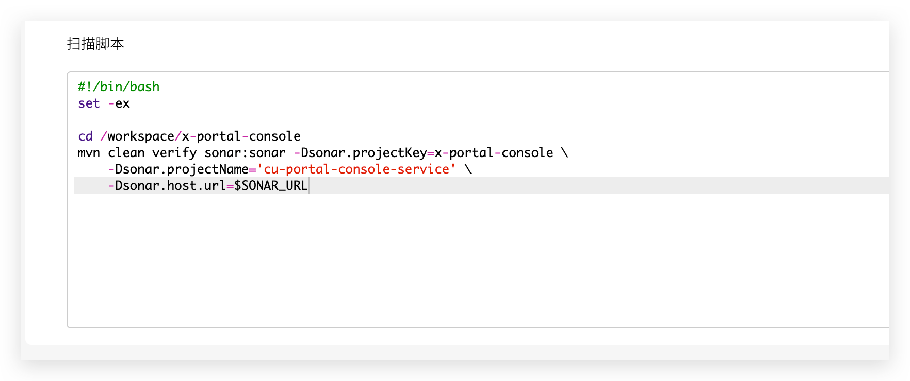
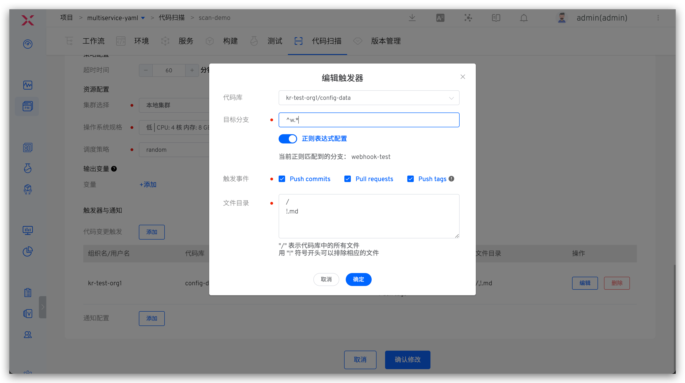
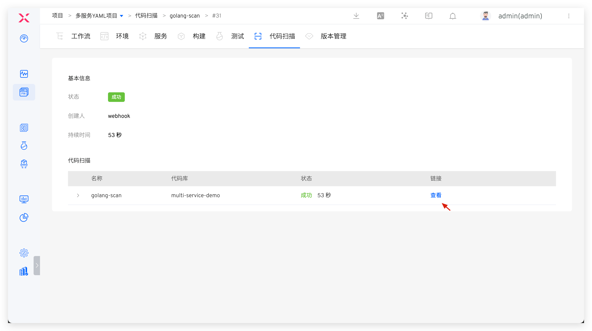

本文主要介绍如何使用 Zadig 的代码扫描。目前支持以下功能：

- 支持对所有语言的代码进行代码扫描
- 支持在 Zadig 中使用 SonarQube 工具和自定义工具对代码进行扫描
- 支持基于 SonarQube 扫描结果配置质量门禁检查
- 支持一键跳转到 Sonar 系统中分析代码扫描结果
- 支持对多个代码仓库进行代码扫描
- 支持基于代码变更自动触发代码扫描运行
- 支持将代码扫描执行结果通知到钉钉、企业微信、飞书中

## 新建代码扫描

访问项目 -> 代码扫描，点击`新建代码扫描`后填写配置。


### 基本信息

- `名称`：代码扫描名称，同一项目下不允许重复
- `扫描工具`：可指定 `SonarQube` 或`其他`
- `扫描环境`：执行扫码任务时的具体运行环境
    - 若使用 `SonarQube` 工具进行代码扫描，系统已内置了支持该工具的环境 `sonar`，选择 `sonar` 即可
    - 若使用其他工具进行代码扫描，可参考[自定义镜像](/cn/Zadig%20v2.0.0/settings/custom-image/)按需添加
- `依赖的软件包`：使用 `SonarQube` 工具做代码扫描时可配置该项，用于指定扫描过程中需要用到的各类软件包工具，比如不同版本的 Java、Go、Node 等
    - 选择软件包的过程中需要注意多个软件包之间的依赖关系，按照顺序进行安装。例如：Govendor 依赖 Go，那么请先选 Go，再选择 Govendor
    - 平台已内置一些常见的软件包，如果有其他软件包或者版本需求，系统管理员可以在[软件包管理](/cn/Zadig%20v2.0.0/settings/app/)中配置其安装脚本
- `Sonar 地址`：使用 `SonarQube` 工具做代码扫描时需配置该项
    - 需要事先在系统中集成 Sonar，参考文档：[Sonar 集成](/cn/Zadig%20v2.0.0/settings/sonar/)
    - 当代码扫描执行完成后，Zadig 会将结果上传到此处指定的系统中


### 代码信息
为代码扫描配置代码信息，代码扫描执行时将按照指定的配置来拉取代码。支持的代码源请参考文档 [代码源信息](/cn/Zadig%20v2.0.0/settings/codehost/overview/#功能兼容列表)，代码信息中的具体字段说明请参考文档 [代码信息字段说明](/cn/Zadig%20v2.0.0/project/build/#代码信息)。

### 变量

包括系统内置变量和用户自定义变量，可在扫描脚本中直接使用。

> 提示：在 [扫描脚本](#扫描脚本) 中添加 `env` 命令可查看所有构建变量。

**内置变量**

内置变量及其描述说明如下：

|变量名称|描述|
|-------|---|
|`SONAR_URL`|Sonar Server 的访问地址|
|`WORKSPACE`|当前代码扫描的工作目录|
|`PROJECT`|项目标识|
|`TASK_ID`|代码扫描任务的 ID|
|`TASK_URL`|代码扫描任务的 URL|
|`CI`|值恒等于 true，可视需要使用，比如用于判断是 CI 脚本，还是其他脚本|
|`Zadig`|值恒等于 true，可视需要使用，比如用于判断是否在 Zadig 系统中执行|
|`REPONAME_<index>`|1. 获取指定 `<index>` 的代码库名称<br>2. 其中 `<index>` 为代码扫描配置中代码的位置，初始值为 0<br>3. 下图例中，在构建脚本中使用 `$REPO_0` 即可获得第一个代码库的名称 `voting-app`|
|`REPO_<index>`|1. 获取指定 `<index>` 的代码库名称，并自动将名称中的中划线 `-` 替换为下划线 `_`<br>2. 其中 `<index>` 为代码扫描配置中代码的位置，初始值为 0<br>3. 下图例中，在构建脚本中使用 `$REPO_0` 即可获得第一个代码库转化后的名称 `voting_app`|
|`<REPO>_PR`|1. 获取代码扫描过程中指定 `<REPO>` 使用的 Pull Request 信息，使用时请将 `<REPO>` 替换为具体的代码库名称<br>2. 当 `<REPO>` 信息中含有中划线 `-` 时，需要将 `-` 替换为下划线 `_`<br>3. 下图例中希望获取 `voting-app` 库的 Pull Request 信息，使用 `$voting_app_PR` 或者 `eval PR=\${${REPO_0}_PR}` 即可<br>4. 若构建时指定了多个 PR，比如指定的 PR ID 为 1、2、3，则该变量的值为 `1,2,3` <br> 5. 当代码库为`其他`代码源时，不支持该变量|
|`<REPO>_BRANCH`|1. 获取代码扫描过程中指定 `<REPO>` 使用的分支信息，使用时请将 `<REPO>` 替换为具体的代码库名称<br>2. 当 `<REPO>` 信息中含有中划线 `-` 时，需要将 `-` 替换为下划线 `_`<br>3. 下图例中希望获取 `voting-app` 库的分支信息，使用 `$voting_app_BRANCH` 或者 `eval BRANCH=\${${REPO_0}_BRANCH}`即可|
|`<REPO>_TAG`|1. 获取代码扫描过程中指定 `<REPO>` 使用的 Tag 信息，使用时请将 `<REPO>` 替换为具体的代码库名称<br>2. 当 `<REPO>` 信息中含有中划线 `-` 时，需要将 `-` 替换为下划线 `_`<br>3. 下图例中希望获取 `voting-app` 库的 Tag 信息，使用 `$voting_app_TAG` 或者 `eval TAG=\${${REPO_0}_TAG}` 即可|
|`<REPO>_COMMIT_ID`|1. 获取代码扫描过程中指定 `<REPO>` 使用的 Commit ID 信息，使用时请将 `<REPO>` 替换为具体的代码库名称<br>2. 当 `<REPO>` 信息中含有中划线 `-` 时，需要将 `-` 替换为下划线 `_`<br> 3. 下图例中希望获取 `voting-app` 库的 Commit ID 信息，使用 `$voting_app_COMMIT_ID` 或者 `eval COMMIT_ID=\${${REPO_0}_COMMIT_ID}` 即可<br> 4. 当代码库为`其他`代码源时，不支持该变量|
|`<REPO>_ORG`|1. 获取代码扫描过程中指定 `<REPO>` 使用的组织/用户信息，使用时请将 `<REPO>` 替换为具体的代码库名称<br>2. 当 `<REPO>` 信息中含有中划线 `-` 时，需要将 `-` 替换为下划线 `_`<br> 3. 下图例中希望获取 `voting-app` 库的组织/用户信息，使用 `$voting_app_ORG` 或者 `eval ORG=\${${REPO_0}_ORG}` 即可|

**自定义变量**

说明：

- 支持使用字符串类型或者枚举类型的变量，自定义变量一旦创建后，其键值不可被修改。
- 可以设置字符串类型的变量为敏感信息，扫描日志中不会输出敏感变量的值。

### 扫描脚本
按需配置扫描脚本，对代码进行扫描。


### SonarScanner 扫描

在`添加步骤`中可配置 SonarScanner 扫描，其中 `sonar.host.url` 和 `sonar.login` 无需配置，在执行代码扫描时系统会自动注入。更多参数配置可参考 [SonarQube 文档](https://docs.sonarqube.org/latest/analysis/analysis-parameters/)。


### 高级配置


说明：
- `质量门禁检查`：参考文档 [质量门禁检查](#质量门禁检查)
- `超时时间`：若超过设置的时间阈值后扫描仍未结束，则视为超时失败
- `缓存配置`：开启缓存后，代码扫描执行时会使用此处配置的缓存目录
- `集群选择`：选择代码扫描任务运行时所使用的集群资源，其中本地集群指 Zadig 系统所在的集群，可参考[集群管理](/cn/Zadig%20v2.0.0/pages/cluster_manage/)集成更多集群资源
- `操作系统规格`：配置资源规格用于执行代码扫描任务。平台提供 高/中/低/最低 四种配置供选择。此外，还可以根据实际需要自定义，若需使用 GPU 资源，资源配置形式为 `vendorname.com/gpu:num`，更多信息请参考文档 [调度 GPU](https://kubernetes.io/zh-cn/docs/tasks/manage-gpus/scheduling-gpus/)
- `调度策略`：选择集群调度策略，默认使用`随机调度`策略，集群调度策略管理请参考文档 [设置调度策略](/cn/Zadig%20v2.0.0/pages/cluster_manage/#设置调度策略)
- `输出变量`：将代码扫描中的环境变量输出，可实现自定义工作流中不同任务之间的变量传递，参考文档 [变量传递](/cn/Zadig%20v2.0.0/project/common-workflow/#变量传递)
- `触发器与通知`：配置 Webhook 事件，自动触发代码扫描任务执行，配置细节参考：[触发器与通知](#触发器与通知)

### 触发器与通知

#### 触发器

> 支持的代码源请参考：[代码源信息](/cn/Zadig%20v2.0.0/settings/codehost/overview/#功能兼容列表)



参数说明：

- `代码库`：即[代码信息](#代码信息)配置中的代码库
- `目标分支`：监听代码变更事件的分支
- `触发事件`: 指定触发代码扫描运行的 Webhook 事件，可选事件如下：
    - `Push commits` 事件（Merge 操作）时触发
    - `Pull requests` 提交 pull request 时触发
    - `Push tags` 新建 tag 后触发
- `自动取消`：若勾选，则当多个 Webhook 事件先后触发代码扫描任务时，系统会自动取消队列中的任务
- `文件目录`: 当指定文件或目录发生变化（新增/修改/删除）时，触发代码扫描，使用以下代码仓库文件结构示例说明：

``` bash
├── reponame  # 仓库名称
  ├── Dockerfile 
  ├── Makefile
  ├── README.md   
  ├── src        
    ├── service1/
    ├── service2/
    └── service3/
```
| 触发场景 | 文件目录配置 |
|----|------------|
| 所有文件更新|`/`|
| 除 *.md 以外的其他文件更新|`/`<br>`!.md`|
| 除 service1 目录下的其他文件更新 | `/`<br>`!src/service1/`|
| service1 目录下所有文件更新 | `src/service1/` |
| src 目录下（除 service1 目录下的文件）的文件更新|`src`<br>`!src/service1/`|

#### 通知

支持将代码扫描执行结果通知到钉钉、企业微信、飞书平台中，配置可参考文档：[通知](/cn/Zadig%20v2.0.0/project/workflow-im/)。


## 质量门禁检查

> 扫描工具为 SonarQube 时支持。

在高级配置中开启质量门禁检查，开启后，Zadig 将从 SonarQube 中获取门禁规则，如果门禁未通过，任务状态将置为失败。同时返回具体规则和规则判定结果


如需设置规则，可前往 SonarQube 系统，修改或新增 Quality Gate 配置。


## 执行代码扫描

选择具体的代码扫描 -> 点击`执行`，可对指定分支或 Tag 中的代码进行扫描。


当代码扫描任务运行完毕，可点击链接快速跳转至 SonarQube 系统中查看结果。

> 使用 `SonarQube` 工具做代码扫描时支持该功能。


