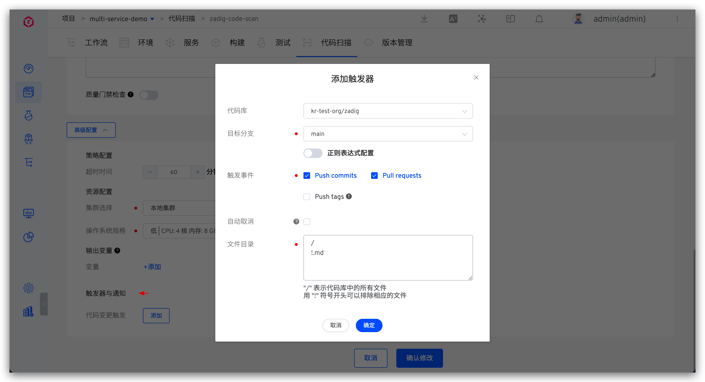
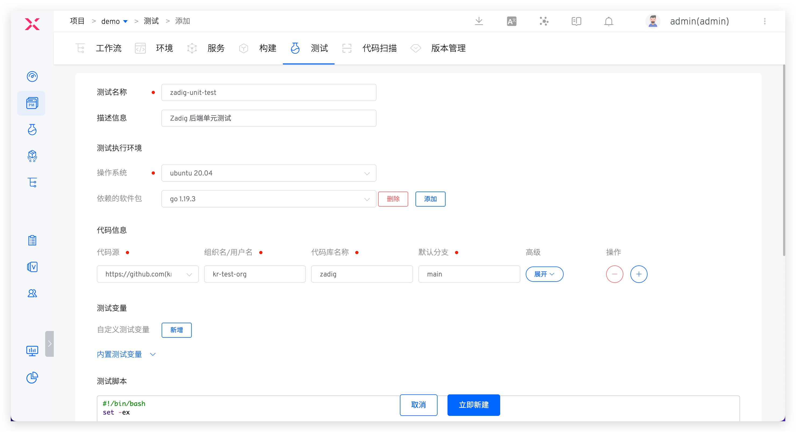
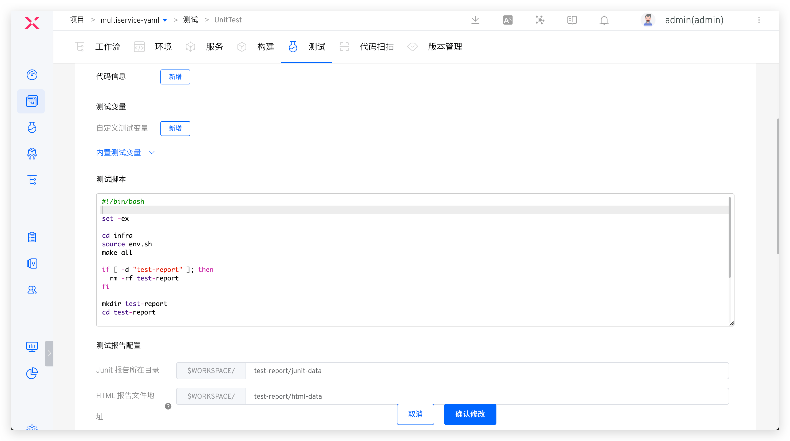
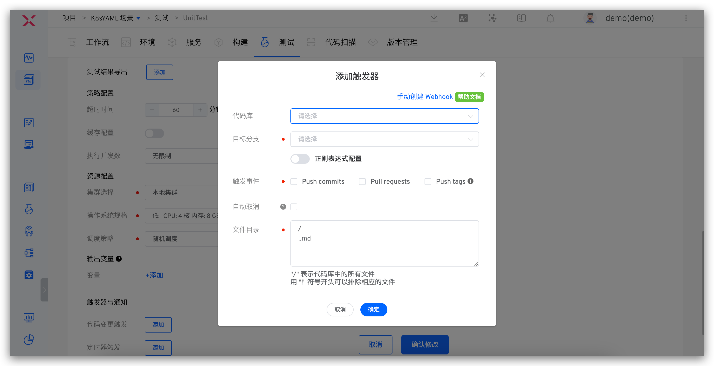
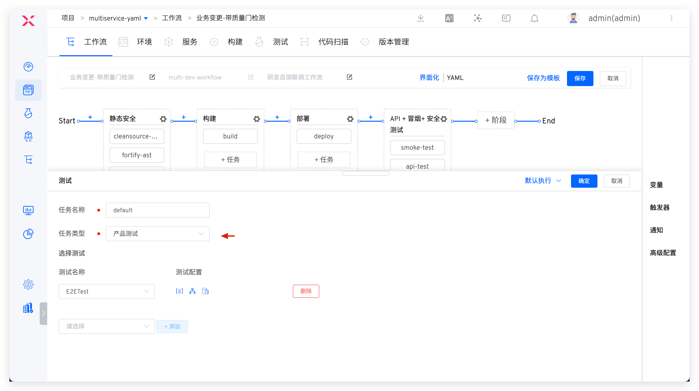
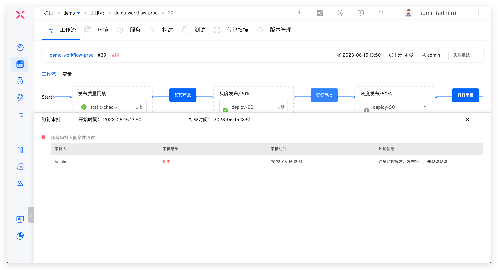

## 概述

Zadig 具备管理软件开发全生命周期的能力，几乎支持市面上所有测试工具、服务、以及平台系统，同时支持多种测试框架和不同的测试类型，通过强大的运行时环境治理和自定义工作流能力，为测试团队提供强有力的工程支撑。 
本手册可帮助测试团队更好地应对当前的测试行业挑战，将测试服务和能力左移、右移到开发团队、运维团队等全生命周期中，尽早发现问题，赋能其他角色也参与到质量建设中来，规避因修复此类问题而造成额外成本。

## 编排不同的测试类型

### 代码扫描

::: tip
支持主流的静态安全工具，例如 SonarQube、Coverity 和任何自定义扫描工具。
:::

#### 如何配置

以 SonarQube 示例：新增代码扫描，指定扫描工具 `SonarQube`，配置待扫描的代码库、扫描脚本、开启质量门禁检查。参考文档：[代码扫描](/cn/Zadig%20v2.1.0/project/scan/#新建代码扫描)。

2. 在代码扫描中配置代码变更触发器，参考文档：[触发器配置](/cn/Zadig%20v2.1.0/project/scan/#触发器与通知)。

#### 如何编排

编辑自定义工作流，在指定阶段（比如：构建之前）添加`代码扫描`任务，将代码扫描编排进工作流中。

### 单元测试

::: tip
支持对 Java、Golang、Python、C++、JavaScript、C#、PHP、Ruby 等各种语言的技术栈执行单元测试。
:::

#### 如何配置

1. 新增测试，配置基本信息、代码信息和测试脚本，在测试报告配置中指定报告目录，参考文档：[测试](/cn/Zadig%20v2.1.0/project/test/)。

2. 在测试中配置代码变更触发器，参考文档：[触发器配置](/cn/Zadig%20v2.1.0/project/test/#webhook-触发器)。

3. 在测试中配置 IM 通知，参考文档：[通知配置](/cn/Zadig%20v2.1.0/project/test/#通知配置)。

#### 如何编排

编辑工作流，在指定阶段（比如：部署之后）添加`测试`任务即可。

### 集成测试
::: tip
1. 支持配置服务和测试用例的关联关系，执行服务级别的测试：针对部署的服务，执行对应的测试用例。
2. 支持的集成测试类型包括但不限于：API 接口测试、UI 测试、端到端测试、压力测试、场景测试等。
:::

#### 如何配置
配置过程和单元测试类似，参考文档：[在 Zadig 中配置测试](/cn/Zadig%20v2.1.0/test-manual/#如何配置-2)。

#### 如何编排

编辑工作流，增加`测试`任务，任务类型指定为`服务测试`，参考文档：[工作流测试配置](/cn/Zadig%20v2.1.0/project/workflow-jobs/#测试任务)。

### 系统测试

::: tip
运行产品级别的测试，对产品进行全面的系统测试，从整体充分把握系统质量。
:::

#### 如何配置
配置过程和单元测试类似，参考文档：[在 Zadig 中配置测试](/cn/Zadig%20v2.1.0/test-manual/#如何配置-2)。

#### 如何编排

编辑工作流，增加`测试`任务，任务类型指定为`产品测试`，参考文档：[工作流测试配置](/cn/Zadig%20v2.1.0/project/workflow-jobs/#测试任务)。

## 持续测试运行场景

### 开发阶段

> 流程：代码实现 > 代码提交 > 自动触发静态代码扫描质量门禁 > 开发人员及时获得反馈 > 有的放矢改进

代码开发完毕提交 PR 后会自动触发代码扫描执行，可有效拦截未通过质量门禁的代码变更。扫描结果会自动 comment 在代码变更中，开发人员可点击快速获得扫描结果，针对反馈进一步优化代码。从代码源头来规避质量风险，做到 fail fast > feedback fast > fix fast。

### 测试阶段

> 流程：静态扫描（开启质量门禁） > 构建 > 部署 > 自动化测试 > IM 通知

Zadig 可一键拉起独立的开发、测试环境（参考文档：创建环境[8]），只需要将测试编排进自定义工作流中就可以实现在开发环境、测试环境分别建设自动化测试套件，将测试能力编排进团队日常合作的每一个环节中：
- 开发自测阶段，更新开发自测环境并执行自动化测试。
- 多名开发联调测试阶段，可以将多人的改动同时部署更新进行集成测试验证。

- 测试工程师验收阶段，可在 Zadig 中分析测试报告，并根据覆盖情况持续补充自动化用例集，确保自动化测试套件与业务功能一同迭代，持续为团队提供价值，测试工程师的能力也在平台中得到充分展现。

此外，工作流运行结果可及时通知到 IM 群中，团队内每个人都能及时感知自动化执行情况，为质量负责。

### 发布阶段

> 流程：发布质量门禁 > 发布委员会人工审核 > 分批次灰度发布 > 系统测试 > IM 通知

测试验收通过后进行发布上线操作，建议几种配置策略：
1. 建设发布门禁，通过自定义任务自动获取安全扫描、单元测试、集成测试等质量结果来判断是否允许上线，作为上线过程的卡点，确保版本验收通过并且符合质量要求后再做上线操作。
2. 灵活编排 MSE 灰度、蓝绿、金丝雀、分批次灰度、Istio 等发布策略，以确保发布可靠性，可参考：[发布策略](/cn/Zadig%20v2.1.0/project/release-workflow/)。
3. 发布阶段适当增加测试团队人工审批，以确保业务流程上的发布合规性。

## 持续测试效果度量

持续测试的效果可以通过测试用例的编写人员比例、发现的 Bug 数量、自动化测试的有效性、以及是否在 CI/CD 中运行自动化测试来等方面来度量，具体参考如下：

| 衡量因素 | 衡量的指标              | 目标 |
|--------|-----------------------------|---------|
|测试的编写人员 | 由公司的开发、测试和其他成员编写的测试所占的百分比 | 验收测试的主要创建和维护人员应为开发者 |
|在不同阶段发现的 Bug 数量|所发现的 Bug 的比例随时间的变化|在测试阶段发现更多的 Bug|
|修复验收测试失败所用时间|修复验收测试失败所需的时间|修复时间的变化趋势：开发者应能够轻松修复验收测试失败 |
|自动化测试的有效性|测试失败的原因：因实际缺陷导致、编码质量问题导致的自动化测试失败数量|自动化测试失败始终表示产品中存在实际缺陷|
|自动化测试是否在 CI/CD 工作流中运行|检查所有测试套件是否在每个流水线触发器中运行（是/否）|自动化测试的集成：自动化测试应在主流水线和主工作流中运行|

此外，在 Zadig 的效能洞察中可追踪软件交付全生命周期的全部质量数据，可自定义 XOps 敏捷质效看板，追踪事故恢复时长、缺陷遗失率、严重缺陷率、返工率等质量数据，快速识别质量短板，用数据驱动团队有的放矢持续改进。

