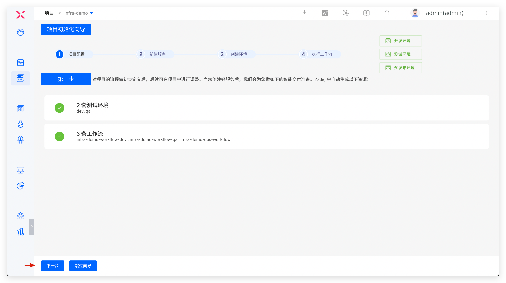
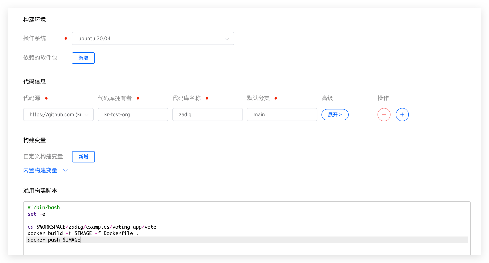

## 快速搭建项目

以下内容为 K8s YAML 项目的快速搭建步骤，如果你需要具体的案例，可参考：[教程](https://www.koderover.com/tutorials-detail/codelabs/GitHub/index.html?index=..%2F..index#0)。

### 新建项目

进入 Zadig 系统，点击「项目」-「新建项目」，填写项目名称，选择`K8s YAML 项目`的项目类型新建项目。

点击`下一步`，进入服务配置环节。

### 服务配置
创建服务并为服务配置构建。创建服务可参考文档：[新建 K8s YAML 服务](/cn/Zadig%20v2.1.0/project/service/k8s/#新建服务)。服务创建完毕后，系统会自动解析 K8s 资源及相关服务组件。

> 服务组件的概念介绍可参考文档：[服务组件](/cn/Zadig%20v2.1.0/env/overview/#什么是服务组件)。

点击`添加构建`，为服务组件添加构建配置，可参考文档：[构建配置](/cn/Zadig%20v2.1.0/project/build/)。

### 配置环境

服务配置完毕后点击`下一步`, 进入创建环境页面，用户可根据需要配置业务环境。

> 相关参数说明可参考文档：[创建环境](/cn/Zadig%20v2.1.0/project/env/k8s/#新建环境)。

点击 `创建环境` ，待环境创建完毕，点击`下一步`，即可进入到工作流交付环节。

::: tip
服务数量以及启动服务所需的资源会影响环境的创建时间，请耐心等待。
:::

### 工作流交付

- 执行 `dev` 工作流，对 `dev` 环境的服务进行更新升级。

- 在工作流执行详情页面可实时跟踪构建日志。

- 待工作流成功运行完毕，服务会被自动更新部署。

