本文主要介绍如何在 Zadig 上灵活地利用主机资源进行 Android 和 iOS App 的编译和发布。

## 前置操作：集成主机作为构建节点

需要先在 Zadig 上集成主机资源，Zadig 工作流任务才可以使用主机作为构建节点，具体集成过程如下：

**第一步**：在 Zadig 上「资源配置」> 「主机管理」> 添加主机，填写以下必要的信息。
- 主机名称：用于标识主机的名称
- 标签：工作流可以通过标签来限制任务执行的主机
- 调度工作流任务：选择`是`，允许工作流任务调度到该主机上
- 任务根目录：工作流任务的工作目录

**第二步**：在主机上安装 Zadig Agent。 根据主机的实际系统和架构选择对应命令在主机上执行。此处我们集成了两台主机（标签分别为`linux` 和 `mac`）分别用于后续 Android App 和 iOS App 的构建发布。

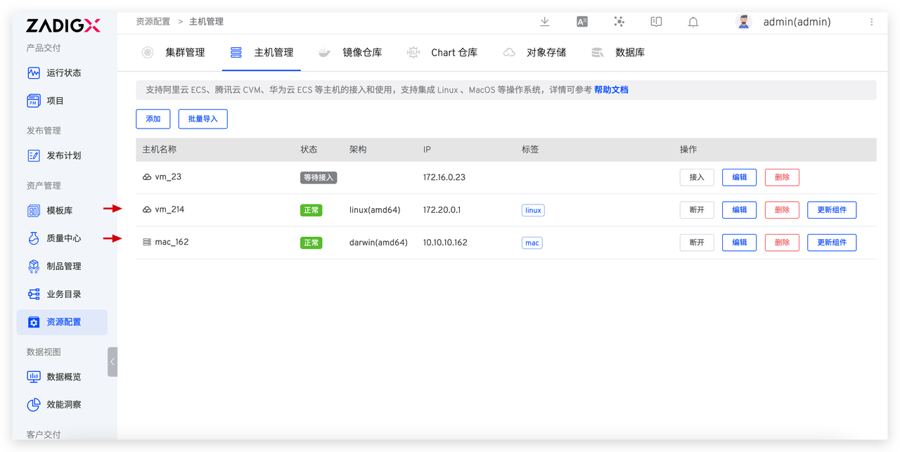

## Android App 自动化发布

### 配置工作流

**第一步**：新建自定义工作流 > 添加「阶段」> 添加「任务」，选择「通用任务」

**第二步**：配置「通用任务」

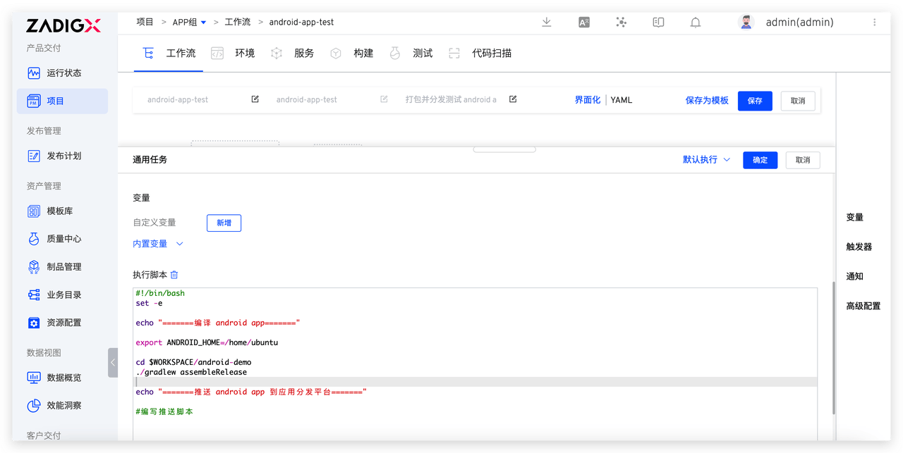
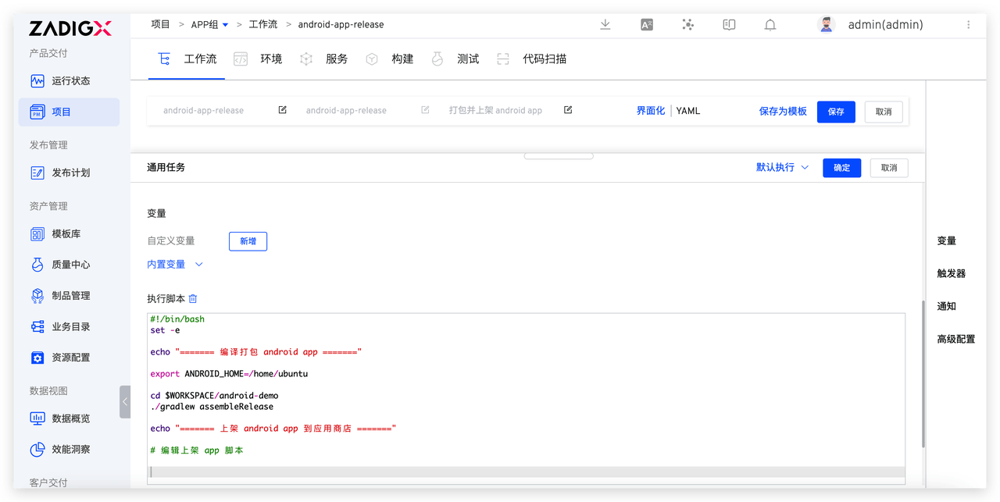

- 基础设施：选择`主机`
- 执行主机：选择预先配置的 `linux` 主机标签
- 代码信息：选择 Android App 所在的代码库
- 执行脚本：测试和发布阶段编写不同脚本实现交付过程自动化
  - 测试阶段：包括编译打包 Android App 和推送 App 到应用分发平台步骤
  - 发布阶段：包括编译打包 Android App 和上架 App 到应用商店步骤

### 执行工作流

执行工作流选择代码信息，完成 Android App 自动化发布过程。

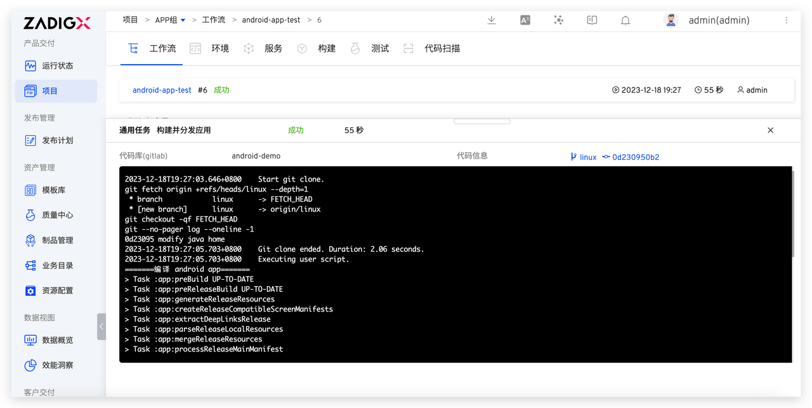

## iOS App 自动化发布

### 配置工作流

**第一步**：新建自定义工作流 > 添加「阶段」> 添加「任务」，选择「通用任务」

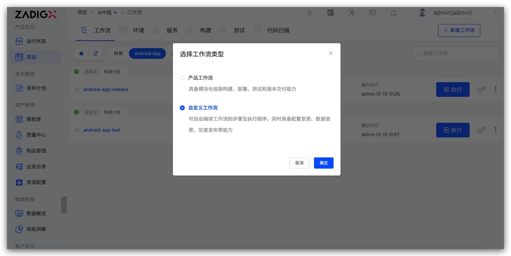
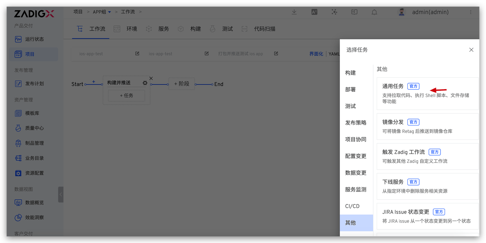

**第二步**：配置「通用任务」

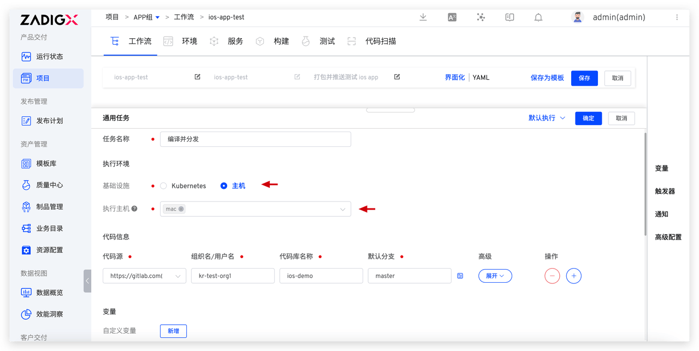
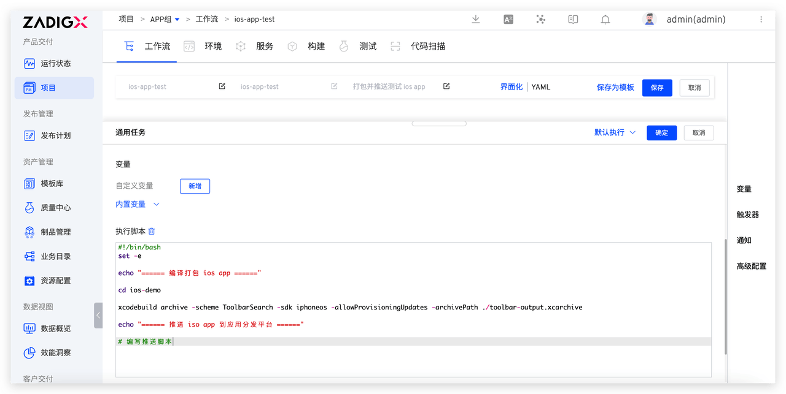
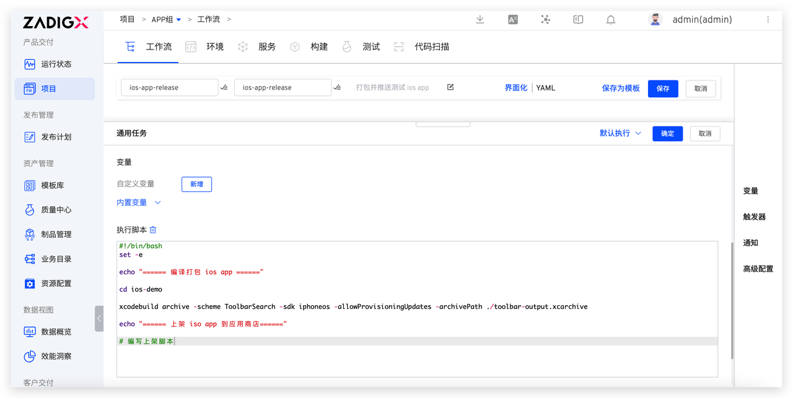

- 基础设施：选择`主机`
- 执行主机：选择预先配置的 `mac` 主机标签
- 代码信息：选择 iOS App 所在的代码库
- 执行脚本：测试和发布阶段编写不同脚本实现交付过程自动化
  - 测试阶段：包括编译打包 iOS App 和推送 App 到应用分发平台步骤
  - 发布阶段：包括编译打包 iOS App 和上架 App 到应用商店步骤

### 执行工作流

执行工作流选择代码信息，完成 iOS App 自动化发布过程。

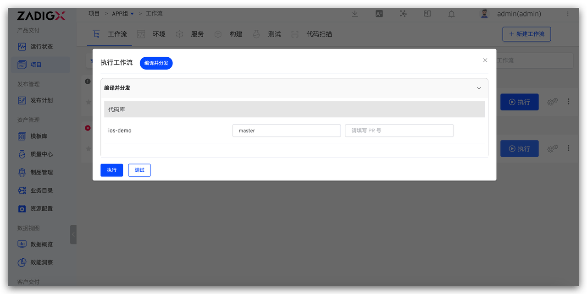
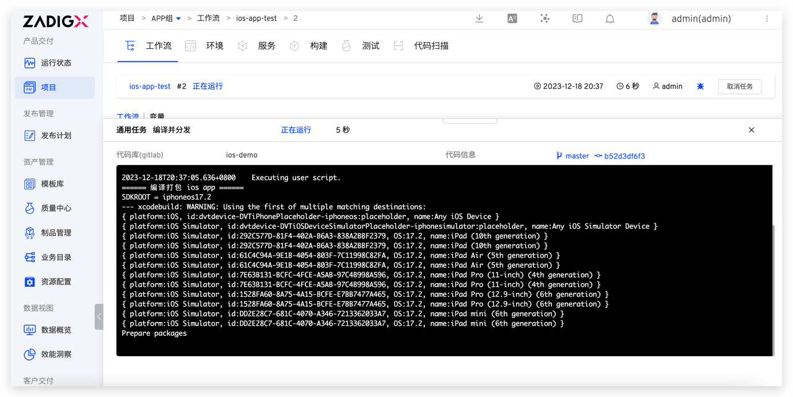

> Zadig 后续版本将支持 Windows 主机作为构建节点，满足 Windows 应用的构建发布，敬请期待……