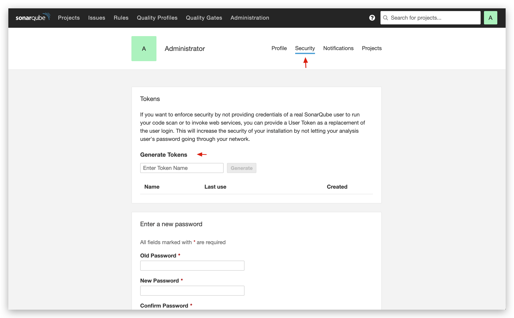
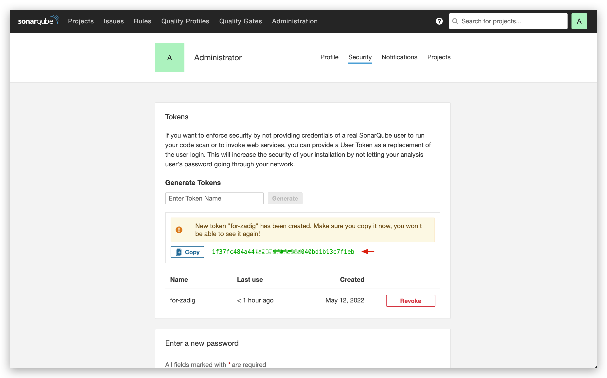

本文介绍在 Zadig 系统上集成代码质量管理平台 SonarQube。

## 在 SonarQube 系统中生成 API Token

登录 SonarQube -> 点击右上角账号头像 -> `My Account`。

切换到 `Security` 页面，在 `Generate Token` 中填写 Token 名称后点击右侧的 `Generate` 按钮即可。

## 在 Zadig 中集成 SonarQube

在 Zadig 中依次访问 `系统设置` ->  `系统集成` -> `代码扫描`，添加 SonarQube 的相关信息，如下图所示。

参数说明：

- `访问地址`：SonarQube 系统的地址，比如 `https://sonar.koderover.com`
- `系统标识`：自定义，方便在 Zadig 系统中快速识别，系统标识信息需唯一
- `Token`：上一步中创建的 API Token
