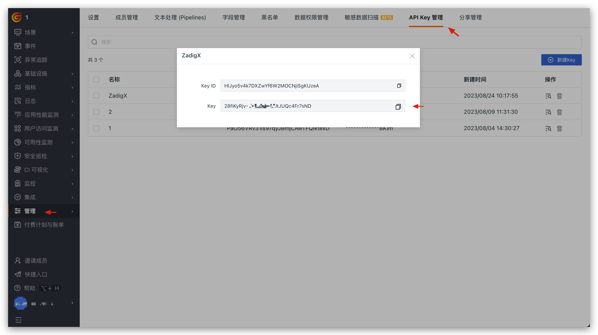
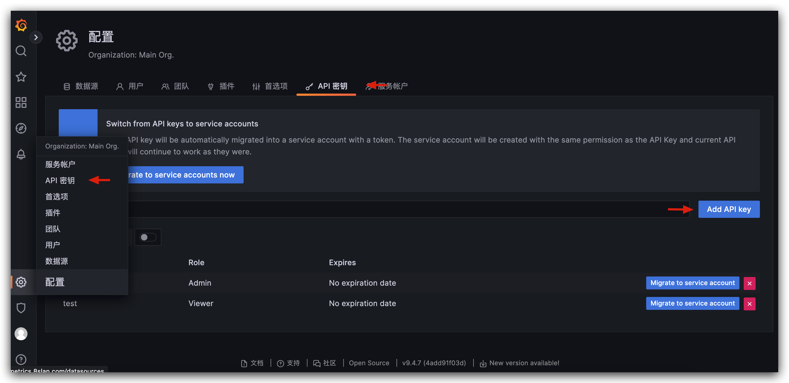
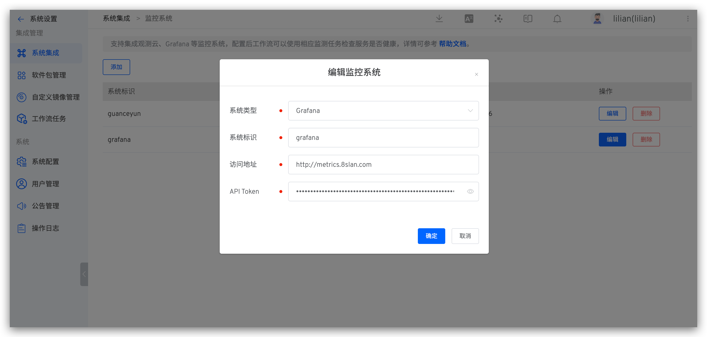

本文介绍在 Zadig 系统上集成监控系统观测云。

## 如何集成观测云

### 步骤 1：获取观测云 API Key

在观测云工作空间的管理 > API Key 管理，新建 API Key 并保存 Key 信息。

### 步骤 2：在 Zadig 上配置观测云

系统管理员依次访问 `系统设置` -> `系统集成` -> `监控系统`，添加观测云的相关信息，如下图所示。

参数说明：
- `系统类型`：选择`观测云`
- `系统标识`：自定义，方便在 Zadig 系统中快速识别出该系统即可
- `访问地址`：观测云访问地址
- `OpenAPI 地址`：和观测云系统部署类型、部署节点相关，参考 [官方文档](https://docs.guance.com/open-api/#endpoint) 查阅
- `API Token`：第一步中获取的 API Key 信息

## 如何使用观测云

在自定义工作流中配置`观测云监测` 任务即可使用观测云监测服务是否健康，参考文档：[观测云监测](/cn/Zadig%20v2.1.0/project/workflow-jobs/#观测云监测)。

## 如何集成 Grafana

### 步骤 1：获取 Grafana API 密钥

在 Grafana 配置 > API 密钥中，新建 API 密钥并保存信息。

### 步骤 2：在 Zadig 上配置 Grafana

系统管理员依次访问 `系统设置` -> `系统集成` -> `监控系统`，添加 Grafana 的相关信息，如下图所示。

参数说明：
- `系统类型`：选择`Grafana`
- `系统标识`：自定义，方便在 Zadig 系统中快速识别出该系统即可
- `访问地址`：Grafana 访问地址
- `API Token`：第一步中获取的 API 密钥

## 如何使用 Grafana 

在自定义工作流中配置 `Grafana 服务监测任务`即可使用 Grafana 监测服务是否健康，参考文档：[Grafana 监测](/cn/Zadig%20v2.1.0/project/workflow-jobs/#grafana-监测)。
