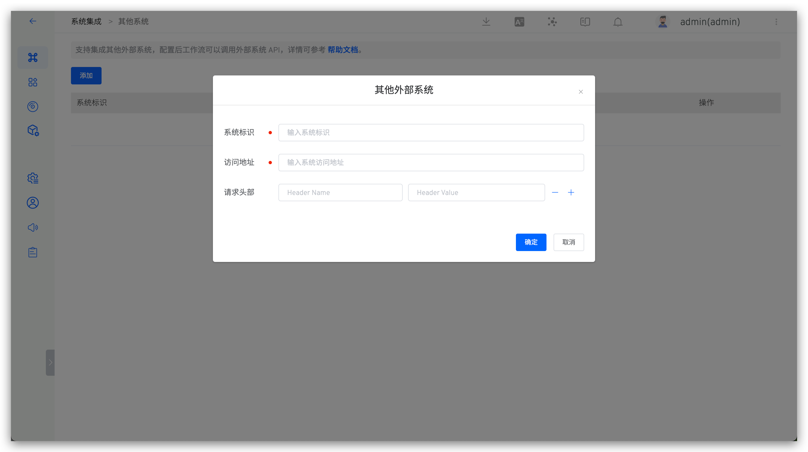

本文介绍在 Zadig 系统上集成其他外部系统。主要应用场景：
1. 在`版本交付`-> `创建版本` 模块，配置 Hook 后，外部系统可以接收 Helm Chart 版本交付完成的信息。
2. 在`工作流` -> `扩展` 模块，配置扩展后，外部系统可以接收工作流任务的相关信息。
3. 在`数据视图` -> `效能洞察` 模块，配置指标项，可以从外部系统采集数据。

访问 Zadig，点击 `系统设置` -> `系统集成`  -> `其他系统` ，添加外部系统相关信息，如下图所示。

字段说明：

- `系统标识`：自定义，方便在 Zadig 系统中快速识别，系统标识信息需唯一。
- `访问地址`：外部系统访问地址。
- `请求头部` ：请求外部系统所需要的请求头信息，非必填。