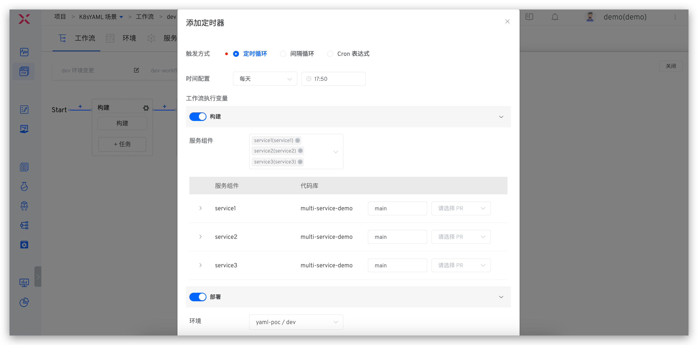
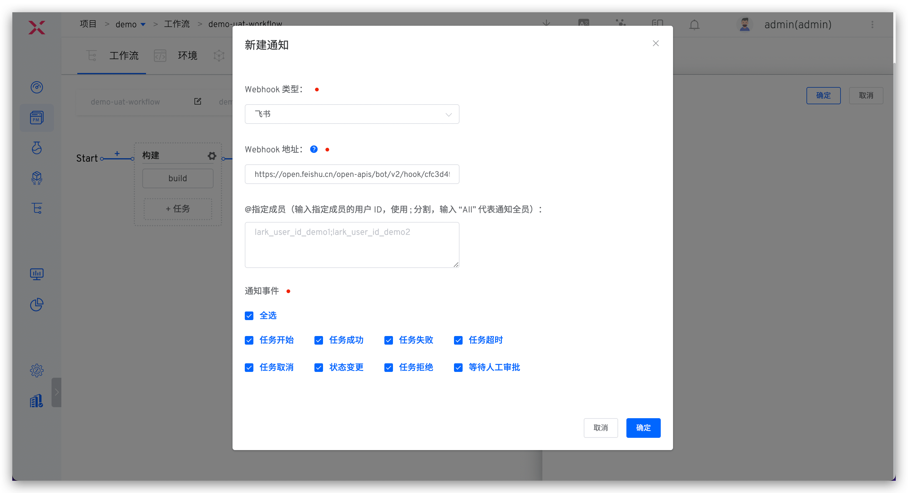
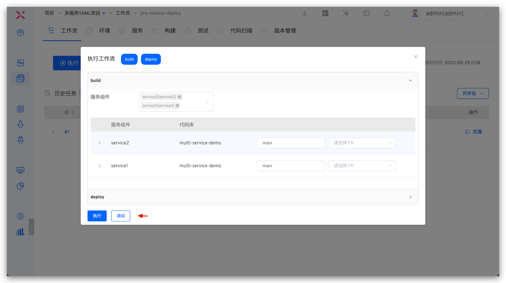
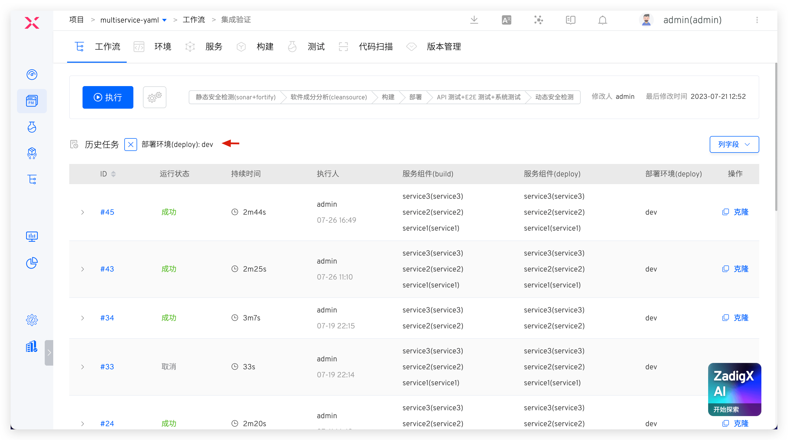

工作流中提供了充分的开放性，支持自由编排工作流流程，自定义执行步骤，下面展开介绍相关配置。

## 新建
### 新建空白工作流

进入项目中点击新建工作流，系统提供`界面化`和 `YAML` 两种方式来配置工作流。


### 使用模板新建

新建工作流，可以选择自定义企业模板或者系统内置的工作流模板来新建工作流，如下图所示。


## 界面化配置

### 基本信息

包括工作流名称、标识和描述信息：
- `工作流名称`：支持中文、大小写字母、数字及特殊字符，在所属项目中唯一，可修改。
- `工作流标识`：支持大小写字母、数字及中划线，全局唯一，不支持修改。
- `描述`：描述该工作流的详细信息，在工作留详情页展示。


### 阶段

点击 `+阶段` 增加新的阶段配置。


参数说明：
- `阶段名称`：在同一个工作流中，阶段名称唯一
- `并发执行`：开启后，在该阶段下配置的多个任务将会并发执行
- `前置步骤`：可按需开启人工审批。开启后，需要审批通过，该阶段下的任务才会被执行

### 任务
点击阶段下方的 `+任务` 为阶段增加任务配置，系统支持的任务类型及具体配置可参考文档 [工作流任务](/cn/Zadig%20v2.2.0/project/workflow-jobs/)。

### 人工审批
开启阶段配置中的`人工审批`，在该阶段执行之前会触发审批。具体如何使用可参考文档：[审批](/cn/Zadig%20v2.2.0/workflow/approval/)。

## YAML 方式配置

### 配置说明

用 YAML 文件的方式定义工作流，YAML 内容的整体结构描述如下：

```
display_name:「工作流名称」        // 必填项，项目内唯一，支持中文、大小写字母、数字及特殊字符
name:「工作流标识」                // 必填项，项目内唯一，支持大小写字母、数字及中划线
stages:                          // 必填项，多个阶段将会按照先后顺序执行
  - 「阶段 1 的配置」
  - 「阶段 2 的配置」
  - 「更多阶段的配置...」
project: 「工作流所属项目名称」      // 必填项
description: 「工作流描述」
multi_run: 「可选值：true/false」  // 当同时触发多次工作流时，多条任务是否能并行执行，默认为 false
```

其中每一个阶段的具体配置如下：

```
name: 「阶段的名称」              // 必填项
parallel: 「可选值：true/false」  // 该阶段下的多个任务是否可以并发执行，默认为 false
approval: 「人工审批配置」         // 非必填，按需配置
jobs:                           // 必填项
  - 「任务 1 的配置」
  - 「任务 2 的配置」
  - 「更多任务的配置...」
```

人工审批的具体配置如下：

```
enabled: true
type: 「审批类型」                     // lark : 飞书审批 native：Zadig 审批
description: 「审批描述信息」
  native_approval:
    approve_users:                   // Zadig 审批人信息
      - user_id: 「审批人 ID」
        user_name: 「审批人昵称」
    needed_approvers: 「需要审批的人数」 // 整数类型
    timeout: 10                       // 整数类型，单位：分钟
  lark_approval:
    timeout: 10
    approval_id: 「审批应用 ID」
    approve_users:
      - id: 「审批人 ID」
        name: 「审批人昵称」
        avatar:  「审批人头像」
```

目前内置了构建和部署两种类型的任务，构建任务的具体配置如下：

> 在指定的构建中有相关构建变量配置时，在 YAML 中设置构建变量才有效。

```
name:「任务的名称」                    // 必填项
type: zadig-build                    // 必填项，指定为 zadig-build
spec:                                // 必填项
  docker_registry_id: 「镜像仓库 ID」
  service_and_builds:                // 服务组件的构建信息，可配置多个服务组件
    - service_module: 「服务组件名称」
      service_name: 「服务名称」
      build_name: 「构建名称」
      key_vals:                      // 构建变量信息，支持配置字符串和枚举类型的变量，分别见如下 string 和 choice 类型的变量示例
        - key: username              // 构建变量名称
          value: Zadig               // 构建变量值
          is_credential: false       // 是否加密，默认为 false
          type: string
        - key: password
          value: v1
          is_credential: false
          type: choice
          choice_option:             // 枚举类型变量的可选值
            - v1
            - v2
    - service_module: 「服务组件名称」  // 更多服务组件的构建信息
      service_name: 「服务名称」
      build_name: 「构建名称」
      ...
```

内置部署任务的具体配置如下：

```
name: 「任务的名称」                    // 必填项
type: zadig-deploy                   // 指定为 zadig-deploy
spec:
  env: 「部署环境」                    // 必填项
  source: 「部署时使用的服务镜像的来源」  // 必填项，可选：runtime（运行时输入） / fromjob（其他任务输出）
  job_name: 「任务的名称」             // 当 source 为 fromjob 时需配置
```

### YAML 样例

使用以下工作流配置为例：

1. 第一个阶段：包含构建任务，并行构建 2 个服务（myapp-1 和 myapp-2）
2. 第二个阶段：包含部署任务并开启人工审批，使用上述构建任务中的镜像产物来部署 pre-release 环境

对应的完整 YAML 配置示例如下，供参考：

```
name: pre-release-deploy
display_name: pre-release-deploy
stages:
  - name: 构建
    parallel: true
    jobs:
      - name: build-myapps
        type: zadig-build
        spec:
          docker_registry_id: 6247eb0832a15f910118318c
          service_and_builds:
            - build_name: simple-service-build-nginx-1
              key_vals:
                - is_credential: false
                  key: username
                  type: string
                  value: admin
                - is_credential: false
                  choice_option:
                    - v1
                    - v2
                  key: password
                  type: choice
                  value: v1
              service_module: myapp-1
              service_name: a
            - build_name: simple-service-build-myapp-2
              service_module: myapp-2
              service_name: b
  - name: 部署
    approval:
      enabled: true
      type: native
      description: '预发布环境部署，需审批通过方可执行'
      native_approval:
        approve_users:
          - user_id: af14dfd2-b57d-11ec-9511-9e1ccf83f7b3
            user_name: admin
          - user_id: 2d59d2f4-c6a5-11ec-a89e-2e173601a9ce
            user_name: Zadig
        timeout: 120
        needed_approvers: 1
    jobs:
      - name: deploy
        type: zadig-deploy
        spec:
          env: pre-release
          job_name: build-myapps
          source: fromjob
project: simple-service
description: 预发布环境部署
multi_run: false
```

## 变量

工作流中提供丰富的变量能力，以支持参数化配置工作流，并且支持通过变量在任务、阶段、工作流、项目之间传递信息。

### 内置变量

|变量来源| 变量                                               | 说明                                                |
|------|---------------------------------------------------|-----------------------------------------------------|
| 项目 |  <span v-pre>`{{.project}}`</span>                | 项目名称  |
| 工作流 |  <span v-pre>`{{.workflow.name}}`</span>           | 工作流标识 |
|  |  <span v-pre>`{{.workflow.task.id}}`</span>        | 工作流任务的 ID 序号，下图例中即为 `1`                   |
| |  <span v-pre>`{{.workflow.task.creator.id}}`</span>   | 工作流任务执行者的用户名，下图例中即为 `admin`          |
| |  <span v-pre>`{{.workflow.task.creator}}`</span>   | 工作流任务执行者的昵称，下图例中即为 `admin-nickname`     |
| |  <span v-pre>`{{.workflow.task.timestamp}}`</span> | 工作流任务创建时的 Unix 时间戳，下图例中即为 `1686642562` |
| 构建任务| <span v-pre>`{{.job.<任务名称>.SERVICES}}`</span> | 执行构建任务所选的服务组件名称集合<br>变量的值形如 `aslan/zadig,zadig-portal/zadig` (服务组件名称/服务名称)|
| | <span v-pre>`{{.job.<任务名称>.BRANCHES}}`</span> | 执行构建任务所选的服务组件对应的第一个代码库的分支信息集合<br>变量的值形如 `feature1,feature2,feature3`|
| | <span v-pre>`{{.job.<任务名称>.IMAGES}}`</span> | 执行构建任务所选的服务组件对应的镜像集合<br>变量的值形如 `image1:tag1,image2:tag2`|
| | <span v-pre>`{{.job.<任务名称>.GITURLS}}`</span> | 执行构建任务所选的服务组件对应的第一个代码库信息集合，变量的值形如 `https://gitlab.com/group1/repo1,https://gitlab.com/group2/repo2`（代码源 URL/组织名或用户名/代码库名称）|
| | <span v-pre>`{{.job.<任务名称>.<服务>.<服务组件>.COMMITID}}`</span> | 指定服务组件的第一个仓库的 commit 信息 |
| | <span v-pre>`{{.job.<任务名称>.<服务>.<服务组件>.BRANCH}}`</span> | 指定服务组件时的第一个仓库的分支信息 |
|部署任务| <span v-pre>`{{.job.<任务名称>.envName}}`</span> | 部署环境 |
|      | <span v-pre>`{{.job.<任务名称>.IMAGES}}`</span> | 被部署的服务组件的镜像集合<br>变量的值形如 `image1:tag1,image2:tag2` |
|镜像分发任务| <span v-pre>`{{.job.<任务名称>.IMAGES}}`</span> | 被分发的服务组件的目标镜像集合<br>变量的值形如 `image1:tag1,image2:tag2` |


### 自定义变量

编辑工作流，点击页面右侧的 `变量` 为工作流配置自定义变量。


参数说明：

- `类型`：支持字符串/多行文本/枚举/代码库类型
  - 字符串类型的值为单行文本
  - 在系统设置中集成代码源后，才能配置代码库类型变量的值，代码源集成请参考[代码源集成](/cn/Zadig%20v2.2.0/settings/codehost/overview/)
  - 代码库类型的变量可用于通用任务的代码信息配置中
- `键`：自定义变量的键
- `值`：自定义变量的值，支持运行时输入和固定值两种配置方式，详细介绍可参考文档 [变量赋值方式](#变量赋值方式)

### 变量赋值方式

点击变量右侧的小图标为变量赋值，不同的赋值方式说明如下：

- `运行时输入`：执行工作流时再指定该变量的值
- `固定值`：设置变量值为固定值，工作流执行时页面中该变量不可见，无需再为该变量赋值
- `全局变量/其他任务输出`：使用全局变量或其他任务输出的变量来赋值，工作流执行时会自动对全局变量进行渲染，实现不同任务之间的变量传递
  - 支持的全局变量包括 [内置变量](#内置变量) 和 [自定义变量](#自定义变量)
  - 若使用 `其他任务输出`，需要先为任务配置输出变量，参考文档：[配置输出变量](#变量传递)


### 变量传递

支持在不同的任务之间传递变量，传递流程：

1. 在前置任务的高级配置中声明要输出的变量
2. 在后置任务中通过`全局变量/其他任务输出`的方式使用该变量

**配置输出变量**

构建/测试/代码扫描/通用任务中支持配置输出变量，不同任务输出变量的形式如下：
- 构建任务：<span v-pre>`{{.job.<任务名称>.<服务名称>.<服务组件名称>.output.<变量名>}}`</span>
- 测试任务：<span v-pre>`{{.job.<任务名称>.<测试名称>.output.<变量名>}}`</span>
- 代码扫描任务：<span v-pre>`{{.job.<任务名称>.<代码扫描名称>.output.<变量名>}}`</span>
- 通用任务：<span v-pre>`{{.job.<任务名称>.output.<变量名>}}`</span>

以构建任务进行示例，在高级配置中添加输出变量，填写变量名。

::: tip
1. 添加的变量可来自于构建配置中的自定义变量，或者在构建脚本中设置的变量，比如 `export key=value`
2. 系统默认会输出构建中的 `IMAGE` 和 `PKG_FILE` 变量，分别表示服务的镜像名称和交付物文件名称
:::


**使用输出变量**

支持`全局变量/其他任务输出`配置方式的任务可参考文档：[不同任务中支持的配置方式](/cn/Zadig%20v2.2.0/project/workflow-jobs/#不同任务中支持的配置方式)。<br>
以通用任务自定义变量进行示例：在通用任务中为变量赋值时指定为`全局变量/其他任务输出`，并选择在前置任务中配置的输出变量，即可实现不同任务之间的变量传递。


## 触发器配置

为工作流配置触发器，当满足触发条件的事件发生时会自动触发工作流执行，支持 Git 触发器、定时器、JIRA 触发器、飞书项目触发器和通用触发器，具体如何使用可参考文档：[工作流触发器](/cn/Zadig%20v2.2.0/project/workflow-trigger/)。


### Git 触发器

参数说明：

- `代码库`：需要监听触发事件的代码仓库，代码源选择不同对应的触发事件也会不同。
- `目标分支`：提交 pull request 时的 Base 分支。支持正则表达式配置，语法参见 [Regexp Syntax](https://pkg.go.dev/regexp/syntax@go1.17.3#hdr-Syntax)。
- `触发事件`: 指定触发工作流运行的 Webhook 事件，可选事件如下：
    - `Push commits` 事件（Merge 操作）时触发。
    - `Pull requests` 提交 pull request 时触发。
    - `Push tags` 新建 tag 之后触发。
- `触发策略`: `Push commits` 和 `Pull requests` 事件支持自动取消，如果你希望只触发最新的提交，则使用这个选项会自动取消队列中正在进行的前序任务。
- `文件目录`: 通过设置文件和文件目录，可以实现对文件以及目录的监听，当文件或者目录发生变化时（新增、修改或者删除），触发工作流。也可以忽略对应的文件或者目录变更，不进行工作流的触发。

使用以下代码仓库文件结构为例：
    
``` bash
├── reponame  # 仓库名称
  ├── Dockerfile 
  ├── Makefile
  ├── README.md   
  ├── src        
    ├── service1/
    ├── service2/
    └── service3/
```
| 触发场景 | 文件目录配置 |
|----|------------|
| 所有文件更新|`/`|
| 除 *.md 以外的其他文件更新|`/`<br>`!.md`|
| 除 service1 目录下的其他文件更新 | `/`<br>`!src/service1/`|
| service1 目录下所有文件更新 | `src/service1/` |
| src 目录下（除 service1 目录下的文件）的文件更新|`src`<br>`!src/service1/`|

### 定时器

通过配置定时器，可以实现周期性的运行工作流。目前工作流支持的定时器方式主要有：
- 定时循环：在某个时间点定时执行某个工作流，例如每天 12:00 运行，每周一 10:00 运行
- 周期循环：周期性的执行某个任务，例如每 30 分钟执行一次工作流
- Cron 表达式：使用标准的 Linux Cron 表达式灵活的配置定时器，例如："45 4 1,10,22 * *"，每月 1、10、22 日 4:45 分执行工作流任务

#### 定时循环

具体操作步骤：
- 点击添加按钮添加一项定时循环条目，分别选择周期时间以及时间点
- 设置工作流任务参数，执行时按设置的参数执行



#### 间隔循环

具体操作步骤：

- 第 1 步：点击添加按钮添加一项间隔循环条目，分别选择间隔时间以及间隔时间单位
- 第 2 步：设置工作流参数，执行时按设置的参数执行


#### Cron 表达式
具体操作步骤：

- 第 1 步：点击添加按钮添加一项 Cron 表达式条目，填写 Cron 表达式
- 第 2 步：设置工作流参数，执行时按设置的参数执行


## 通知配置
编辑工作流，点击右侧的 `通知` 进入通知配置页面。


目前支持配置工作流通知到飞书/企业微信/钉钉中，详细的配置参数说明可参考：[IM 状态通知](/cn/Zadig%20v2.2.0/workflow/im)。



通知消息中会包含工作流所有任务的执行情况，对于构建任务、部署任务和测试任务，在通知内容中的名称规则如下：

- 构建任务：服务名称-服务组件名称-构建任务名称
- 部署任务：服务名称-部署任务名称
- 测试任务：测试名称-测试任务名称-随机字符串

以飞书示例通知效果：


## 高级配置
在`高级配置` > `运行策略`中设置并发数，多次触发工作流执行产生的多条工作流任务将会并发执行，提升工作流运行效率。


## 工作流样例

可在工作流中自由编排流程，下面简单举例几种场景。

**场景一：构建镜像到不同的仓库**

配置多个构建任务，每个任务中指定不同的镜像仓库。


**场景二：同时部署多个环境**

配置多个部署任务，每个任务中指定不同的环境。


**场景三：使用不同的镜像仓库来部署不同的环境**

配置多个构建任务，每个构建任务中指定不同的镜像仓库；为每个环境配置部署任务，服务来源选择`其他任务输出`并指定对应任务。


**场景四：审批通过后再部署环境**

部署阶段配置中增加人工审批。


在部署步骤执行之前会触发审批，审批通过后工作流才会继续执行。


## 执行
点击执行工作流，可修改工作流变量的值，按需选择被执行的任务：
> 若工作流变量的值被设置为固定值，则执行工作流时该变量在页面中不可见。


点击具体的构建任务可查看构建日志：
> 任务名称规则为：`服务名-服务组件名-任务名`


工作流执行失败后可操作重试再次执行，再次触发后将会从失败的任务开始执行，前置成功的任务（包括审批）将不会再被执行。


## 任务执行策略配置 


- 默认执行：配置默认执行的任务在 `执行任务` 和 `配置触发器` 时默认执行，用户可以选择不执行。
- 默认不执行：配置默认不执行的任务在 `执行任务` 和 `配置触发器` 时默认不执行，用户可选择执行。
- 强制执行：配置强制执行的任务在 `执行任务` 和 `配置触发器` 时必须执行，用户不可选择不执行。

## 调试 

> 支持对构建任务、测试任务以及通用任务进行调试。

点击`调试`启动工作流进入调试模式，可在工作流中的构建/测试/通用任务中的 Shell 脚本执行前增加断点操作，便于调试工作流配置。



也支持在执行工作流后，对指定的任务增加断点调试，点击右上角的调试图标后配置断点位置即可。


点击`调试控制台`即可登录到当前任务的容器中，待调试完毕后，点击`继续`，工作流才会继续执行。


## 自定义历史任务列字段

可自定义历史任务列表中的列字段，将构建、部署、测试任务中的相关信息添加到列表中。自定义列字段的格式如下：

- 服务组件(构建任务名称)
- 代码信息(构建任务名称)
- 服务组件(部署任务名称)
- 环境(部署任务名称)
- 测试结果(测试任务名称)


可针对自定义字段对工作流任务进行快速过滤。




## 共享存储
Zadig 现已支持在工作流任务中实现共享存储，具体操作步骤如下：
1. 对集群资源进行配置，定义共享的存储资源。
2. 对工作流进行配置，添加共享目录。
3. 在工作流的任务中开启共享并应用，实现任务间的共享存储。

### 集群资源配置
参考文档：[集群共享存储资源配置](/cn/Zadig%20v2.2.0/pages/cluster_manage/#共享存储资源配置)。

### 工作流配置
编辑工作流，点击 `高级配置`，添加共享目录后保存。


### 工作流任务配置

对于构建/测试/代码扫描任务，在对应任务中点击共享存储小图标开启共享存储并配置共享目录即可。以构建任务示例如下：


在支持高级配置的任务中，在高级配置中开启共享存储，选择共享目录并配置共享目录即可。以通用任务示例如下：

> 支持高级配置的任务请参考文档：[高级配置](/cn/Zadig%20v2.2.0/project/workflow-jobs/#高级配置)。


