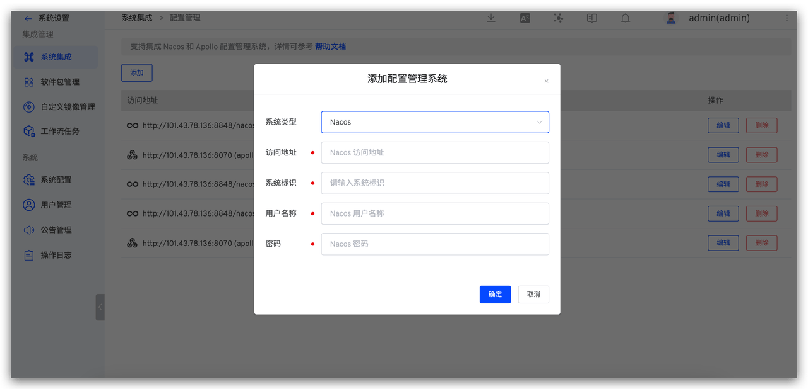
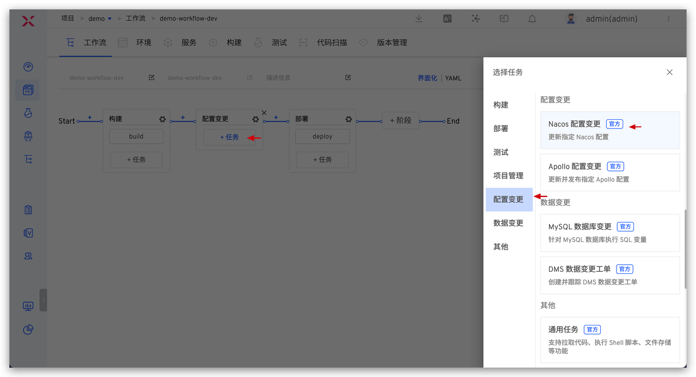
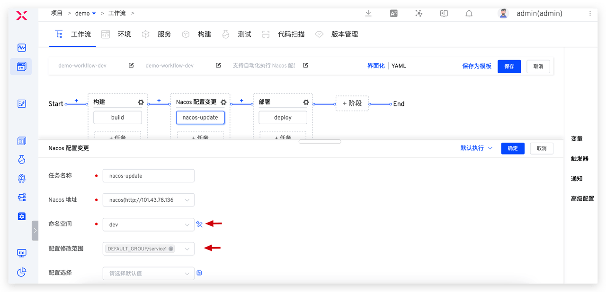
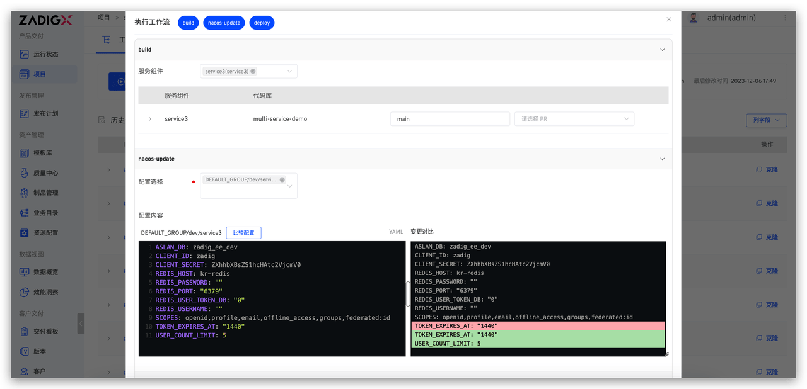
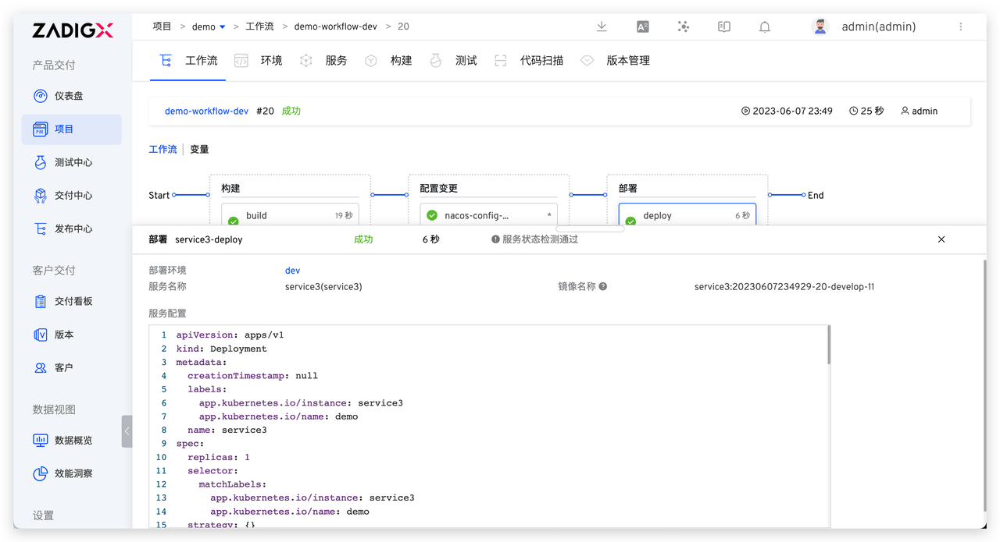
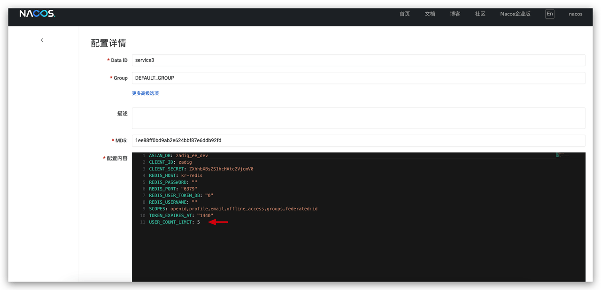
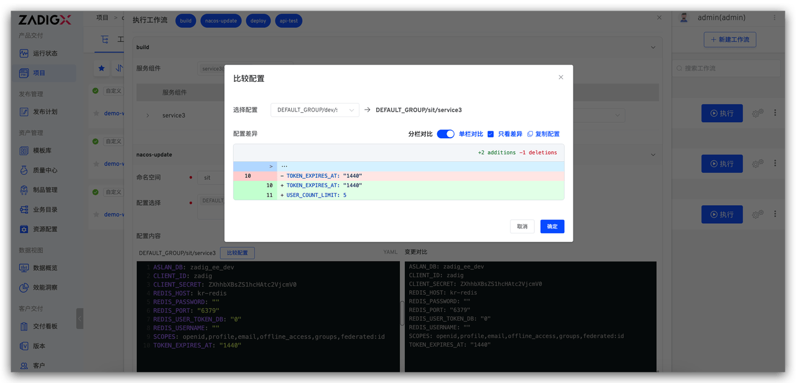
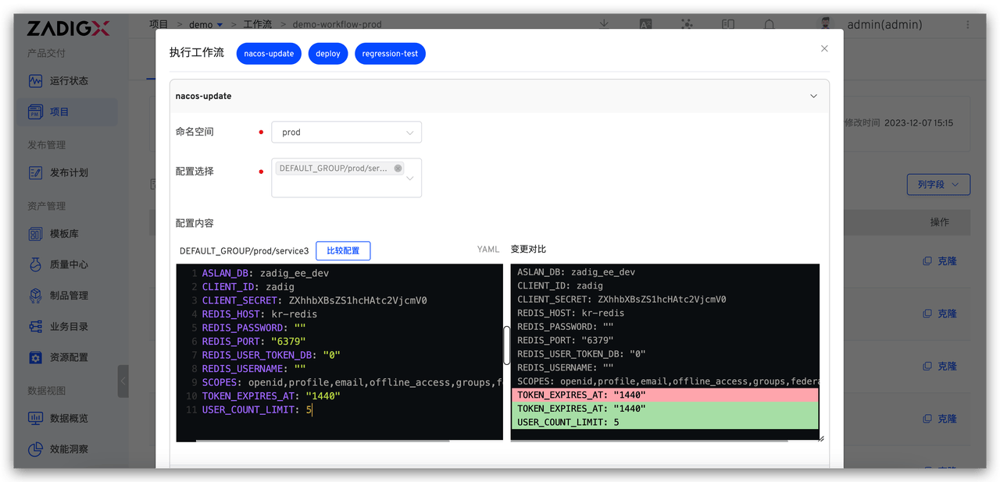
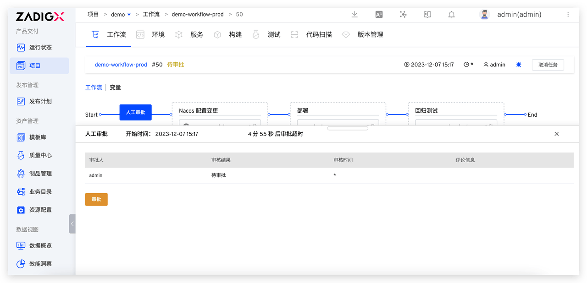

本文我们将结合实际案例，深入探讨如何通过 Zadig 解决 Nacos 配置管理的复杂性和一致性传递的难题。

## 管理员配置

管理员在 Zadig 中集成 Nacos 配置管理系统，配置工作流 「Nacos 配置变更」任务，即可实现配置的自动化变更、帮助工程师方便的完成配置的一致性传递。

### 步骤 1：集成 Nacos

访问 Zadig 系统设置 > 集成管理 > 配置管理 > 添加 Nacos 配置管理系统 

### 步骤 2：配置工作流任务

将 Nacos 配置变更任务编排进工作流中即可实现使用 Zadig 工作流一键自动变更配置。具体操作：编辑工作流 > 添加配置变更任务 > 选择 Nacos 配置变更 > 填写相关参数后保存。

为了控制多环境使用和变更权限，比如仅允许开发人员对开发环境的配置进行变更，不可修改其他环境的配置，则可以将 Nacos 配置变更任务的命名空间字段设定为特定值，并选择允许开发人员更新的配置范围。通过这种方式，实现对开发人员修改配置权限的有序控制，从而确保系统环境的稳定性。

配置 3 条工作流，具体配置参考如下：

| 工作流示例         | 用途             | 步骤配置                                                               |
|--------------------|------------------|---------------------------------------------------------------------|
| demo-workflow-dev  | 开发环境日常更新 | 构建 >  dev 环境 Nacos 配置变更 > 部署 dev 环境                        |
| demo-workflow-sit  | 集成测试环境更新 | 构建 >  sit 环境 Nacos 配置变更 > 部署 sit 环境 > 自动化测试 > IM 通知 |
| demo-workflow-prod | 生产发布         | SRE 审批 > prod 环境 Nacos 配置变更 > 部署 prod 环境 > 回归测试        |

## 工程师使用

下面我们将详细探讨开发阶段、测试阶段和生产发布阶段如何在 Zadig 上实现 Nacos 配置一致性变更。

### 场景一：开发工程师自测联调

> 构建 > Nacos 配置变更 > 部署，实现开发环境业务和配置的自动化变更。

开发工程师代码实现完毕后需要自测联调时，执行 demo-workflow-dev 工作流，选择需要更新的服务，在 Nacos 配置变更任务中选择要变更的配置并修改配置内容。

配置变更成功后会自动执行部署任务更新开发环境，实现开发环境中业务代码和配置的一键变更，快速自测联调。

### 场景二：测试工程师集成测试

> 构建 > Nacos 配置变更 > 部署 > 自动化测试 > IM 通知，实现测试环境业务和配置的自动化、高效变更。

测试工程师集成测试时，执行 demo-workflow-sit 工作流，选择需要更新的服务和对应的配置变更。

如下图所示，点击「比较配置」，选择开发环境的服务配置，可以获取开发环境和测试环境之间的配置差异。复制有差异的配置后，在测试环境的服务配置中进行相应的修改。通过变更前后的比对，一目了然地了解变更的内容。最后，点击执行工作流即可完成对测试环境配置的自动化变更。

### 场景三：发布工程师生产发布

> SRE 审批 > Nacos 配置变更 > 部署 prod 环境 > 自动化测试，实现业务和配置自动化、安全上线。

发布工程师执行 demo-workflow-prod 工作流进行生产发布，选择要变更的 Nacos 配置并修改内容。

和测试工程师操作类似，选择测试环境中的配置，获得测试环境和生产环境的差异，复制差异的配置后，对生产环境进行改动。

另外，鉴于生产发布的严肃性，通常需要相关责任人对发布内容进行审批。审批人员可以通过 Zadig 工作流任务信息详细了解本次任务的具体改动，来保障发布内容的正确性和可靠性。

