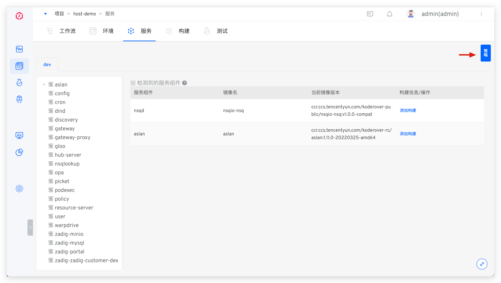
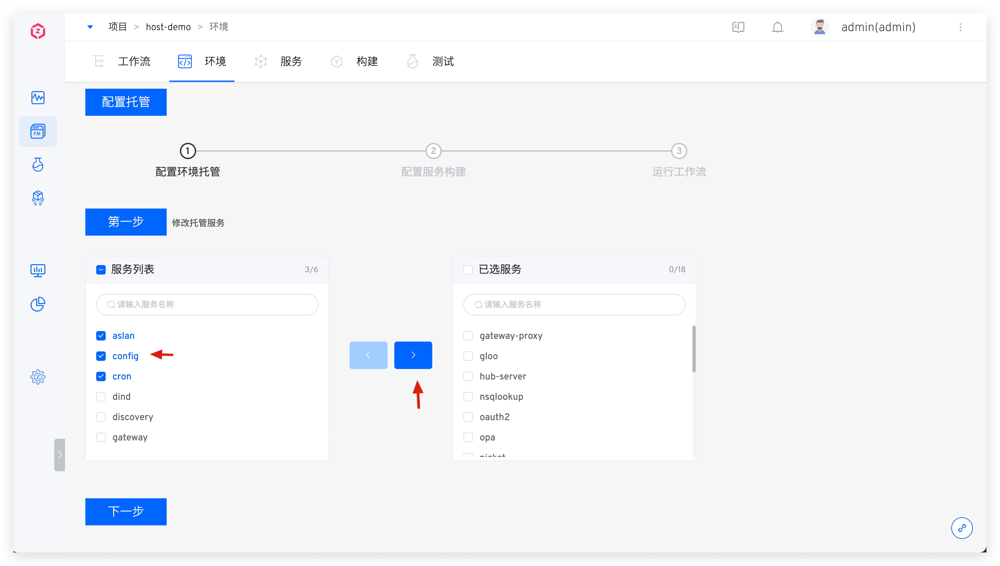

本文介绍 K8s 托管项目中的服务相关配置。

## 查看托管服务

点击切换不同的环境 Tab 即可查看将服务托管到 Zadig 平台中管理时的服务信息。

### 服务组件

参考文档：[服务组件](/cn/Zadig%20v2.2.0/env/overview/#什么是服务组件#k8s-托管项目)。

## 策略配置

在策略中设置部署服务的超时时间以及交付物命名规则。细节可阅读：[策略配置](/cn/Zadig%20v2.2.0/project/service/k8s/#策略配置)。

## 配置托管服务
需要将某个服务从环境中移除，或者添加服务到环境中时，点击环境下的`配置托管`。

按需选择左侧列表中的服务拖至右侧，点击`下一步`，新增对该服务的托管管理；或者将右侧已托管服务拖至左侧，取消对该服务的托管。

