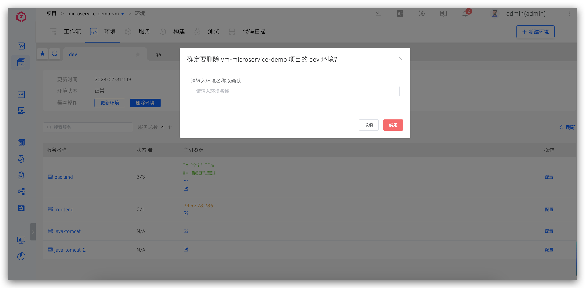

本文主要介绍主机项目中的环境相关操作。

## 新建环境
在主机项目中，点击`新建环境`按钮进入新建环境页面。

参数说明：

- `环境名称`：要创建的环境的名称，比如：`dev`、`pre-release`。
- `服务列表`：为服务选择关联的主机资源，后续使用工作流部署服务时，会将服务部署在关联的主机资源上。也可以先不关联主机资源，在环境创建完成后再在环境详情中对其进行修改。

> 关联主机资源需要先在系统中集成主机，可参考：[主机集成](/cn/Zadig%20v2.2.0/settings/vm-management/)。

## 查看环境

### 基本信息

环境创建完成后，点击不同的环境 Tab 即可切换到该环境的详情页面。

基本信息说明：

- `更新时间`：环境的更新时间。当环境从未更新时，则为环境创建时间。
- `环境状态`：包括`正在运行`和`环境可更新`两种状态。当环境创建后，[服务](/cn/Zadig%20v2.2.0/project/vm/service/)中有修改时（变更/新增/删除），环境的状态会变为可更新。
- `基本操作`：更新环境或删除环境。

服务列表信息说明：

- `服务名`：服务名称。当[服务](/cn/Zadig%20v2.2.0/project/vm/service/)中该服务有修改后，可点击服务右侧的更新按钮对其进行更新。
- `状态`：在服务所关联的主机资源中，服务在正常运行的数量/总数量。当服务未关联主机资源时，状态为 `N/A`。
- `主机资源`：服务关联的主机资源。
- `操作`：包括使用工作流构建部署升级服务；查看服务构建部署升级日志；查看服务配置。

### 登录主机

进入服务详情后点击主机资源后的`登录`操作，可以快捷地登录到对应主机上，方便进行日常 debug。

> 需要注意对应主机为在线状态，可在[ 主机管理](/cn/Zadig%20v2.2.0/settings/vm-management/#查看主机)中查阅

## 更新环境

当环境可更新时，点击基本操作中的`更新环境`即可对环境进行更新。

::: tip
当系统检测到当前项目下的服务和环境中不一致时，该环境即会处于可更新状态。导致不一致的原因包括但不限于：
1. 服务配置发生变化。
2. 服务发生变化，比如服务从项目中删除，或者给项目新加了服务。
:::

## 删除环境

点击基本操作中的`删除环境`按钮并输入环境名即可删除环境。注意此处只是删除在 Zadig 中的环境数据，并不会删除该环境中主机实体上部署的服务。

