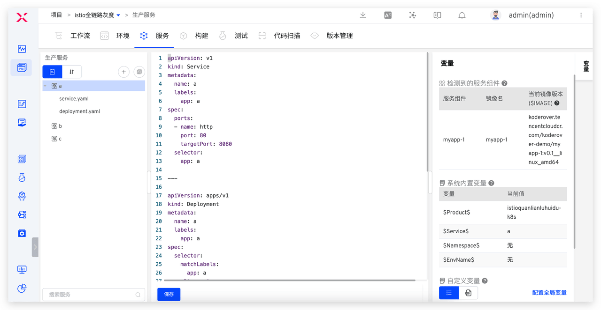
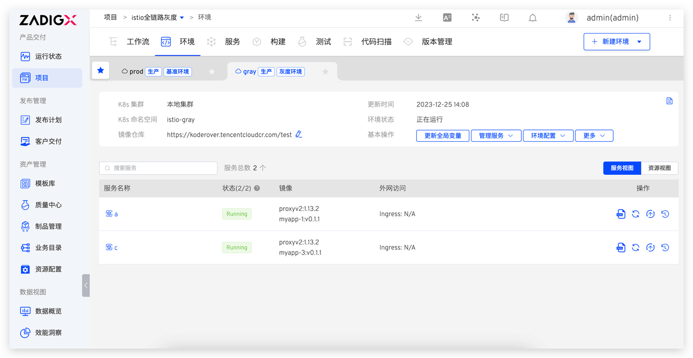
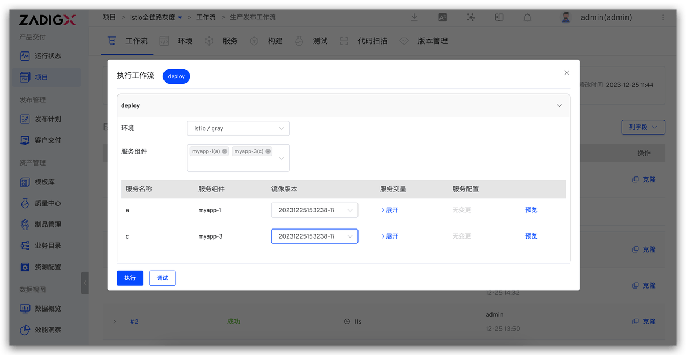
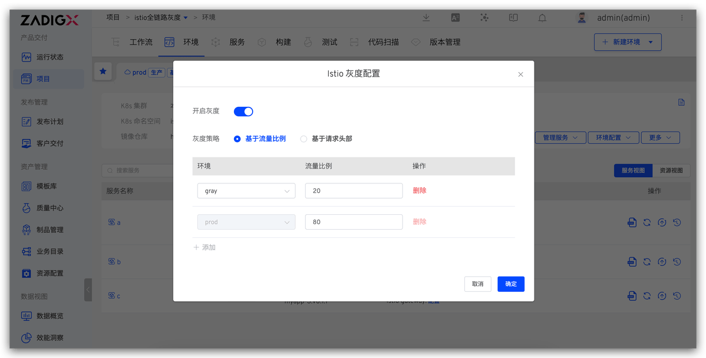
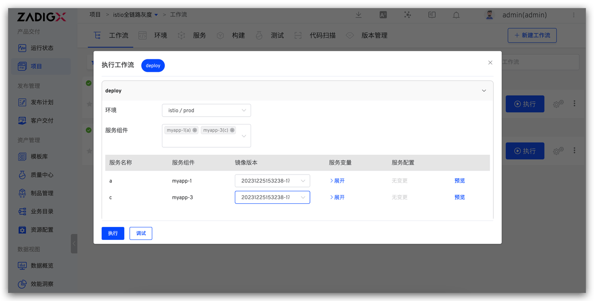

在本文中，我们将详细探讨 Zadig 如何利用 Istio 实现的全链路灰度发布方案，包括方案原理的深入介绍、管理员配置的详细讲解以及工程师在日常使用中的实际操作等方面的细节。

## 方案原理介绍


1. 开启 Istio 灰度功能，Zadig 自动为该环境所在的 Namespace 添加 istio-injection Label，为所有 Pod 注入 istio-proxy sidecar 并重启 Pod。最后创建一个 EnvoyFilter，利用 Tracing 组件的部分功能，实现在调用链路中自动传递灰度标的能力。
2. 创建灰度环境，Zadig 在灰度环境中，自动创建所有存在于基准环境的服务对应的 Service，以打通基准环境和灰度环境之间的调用链路。
3. 设置灰度策略为基于请求头部，Zadig 基于灰度环境和基准环境中的服务，为所有服务都创建一个包含 HTTPMatchRequest 的 VirutalService，用于实现根据请求 header 转发到对应环境。如果请求流量带有灰度标则会被转发到灰度环境，如果不带则会转发到基准环境。
4. 设置灰度策略为基于流量比例，Zadig 基于灰度环境和基准环境中的服务，为所有服务都创建一个包含 HTTPMatchRequest 和 HTTPRouteDestination 的 VirutalService，用于实现流量按比例分配和根据请求 header 转发到对应环境。请求流量会在进入服务网格后，基于配置的流量比例分为两部分。流量比例分配完成之后，根据流量所在的环境，分配带有特定环境标识的灰度标，之后请求流量根据灰度标，优先转发到灰度标所对应的环境。
5. 配置入口服务的 Istio 网关，Zadig 为该入口服务创建一个 Istio 网关配置，绑定用户配置的域名，同时将入口服务对应的 VirutalService 与该网关绑定。使用该域名进行访问，实现对入口服务的灰度能力。

利用上述能力，在 Zadig 上实现全链路灰度功能，无需对代码进行侵入性修改。下面详细介绍在 Zadig 上如何配置和使用 Istio 灰度功能。

## 前置条件

1. 业务架构实现全链路数据透传能力或者使用 Tracing 组件
2. 每个服务都有 K8s Service 资源
3. 集群中安装 Istio 组件

## 管理员做项目初始化

运维或者 DevOps 工程师在 Zadig 上进行项目的初始化，包括新建项目、新建服务、新建环境并启用 istio 灰度、新建灰度发布工作流等步骤。以下操作是一次性操作，后续只需按需配置工作流即可。

### 步骤 1：新建项目

在 Zadig 上新建项目，输入项目名称，项目类型选择 「K8s YAML」项目。


### 步骤 2：新建生产服务和生产环境

- 在 Zadig 服务-生产服务新建 `a` 、`b`、`c` 服务并配置对应的 YAML 和构建。具体配置参考[源码](https://github.com/koderover/zadig/tree/main/examples/grayscale-demo/yaml)。



- 在 Zadig 上新建生产`prod`环境 ，添加服务 `a`、`b`、`c`。


### 步骤 3：开启灰度并配置入口服务 Istio 网关

- 访问生产环境 > 更多 > Istio 灰度配置 > 开启灰度。


- 配置入口服务 Istio 网关。如果入口服务需要灰度，将入口服务添加到灰度 `gray` 环境中，并在生产 `prod` 环境中配置其访问地址。


### 步骤 4：新建生产发布工作流

- 新建工作流，选择「部署任务」，选择生产环境。


## 工程师执行灰度发布

### 创建灰度环境

- 访问基准环境 `prod` > 创建灰度环境 `gray`。


- 添加灰度服务。管理服务 > 添加服务 > 选择需要灰度的服务，比如`a`、`c`。



### 更新灰度环境

- 执行生产发布工作流，选择灰度 `gray` 环境，选择灰度服务`a`、`c`及对应的镜像，更新灰度环境。



### 配置灰度规则

目前 Zadig 支持`基于流量比例`和`基于请求头部`两种灰度策略，下面具体介绍如何配置和使用。

#### 基于流量比例

基于流量比例的灰度策略允许控制一部分用户请求到新版本中，根据发布观测结果逐步增加新版本的流量比例，减小潜在问题对用户的影响，待新版本稳定后，可以考虑将流量完全切换到新版本。

举例：20% 请求流入灰度环境，80% 流量流入生产环境，具体参考如下：

- 访问生产环境 > 更多操作 > Istio 灰度配置， 灰度策略选择基于流量比例， 配置 `prod` 环境流量比例为 80，`gray` 环境流量比例为 20。

::: warning 注意
两个环境的流量比例总和必须等于 100。
:::



- 执行以下请求，查看服务日志以验证流量分配结果。

```bash
for i in $(seq 1 100); do curl -X PUT http://{绑定的 istio 入口服务地址}/api/v1/count; done
```

请求分别进入服务 `a` 的生产`prod`环境和灰度`gray`环境的数量：


请求分别进入服务 `c` 的生产`prod`环境和灰度`gray`环境的数量：


#### 基于请求头部

基于请求头部的灰度策略，通过检查请求头部信息，将用户请求导向特定版本的策略。可以灵活控制不同条件下（如特定用户、特定地理位置等等）的流量分发，实现更细粒度的版本管理和灰度发布。满足逐步推出新功能、针对不同用户群体进行测试和控制的发布诉求。

举例：所有 vip 用户请求都流入灰度环境，使用新版本，具体配置参考如下：

- 访问生产环境 > 更多操作 > Istio 灰度配置，灰度策略选择`基于请求头部`，配置 `gray` 环境匹配的请求头部，匹配规则选择 `前缀匹配`，值输入 `vip`。


- 执行头部带有 `user:vip-zadig` 请求，流量正常进入`gray`环境。

```bash
curl -X GET -H "user: vip-zadig" http://{绑定的 istio 入口服务地址}/api/v1/info
```

灰度 `gray` 环境中服务`a` 日志：


- 执行不带任何头部信息的请求，流量正常进入 `prod` 环境。

```bash
curl -X GET http://{绑定的 istio 入口服务地址}/api/v1/info
```

生产 `prod` 环境中服务`a`日志：


### 发布生产环境

- 执行生产发布工作流，选择生产`prod`环境，选择`a`、`c`服务以及对应的镜像，更新生产环境。



### 清理灰度环境

发布完成后，为了避免集群资源的浪费，可以选择将灰度环境睡眠。具体操作参考[「Zadig 推出环境睡眠，平均节省一半测试资源」](https://mp.weixin.qq.com/s/Ar56J0e-Og4k6K9V4RDk-Q)一文。