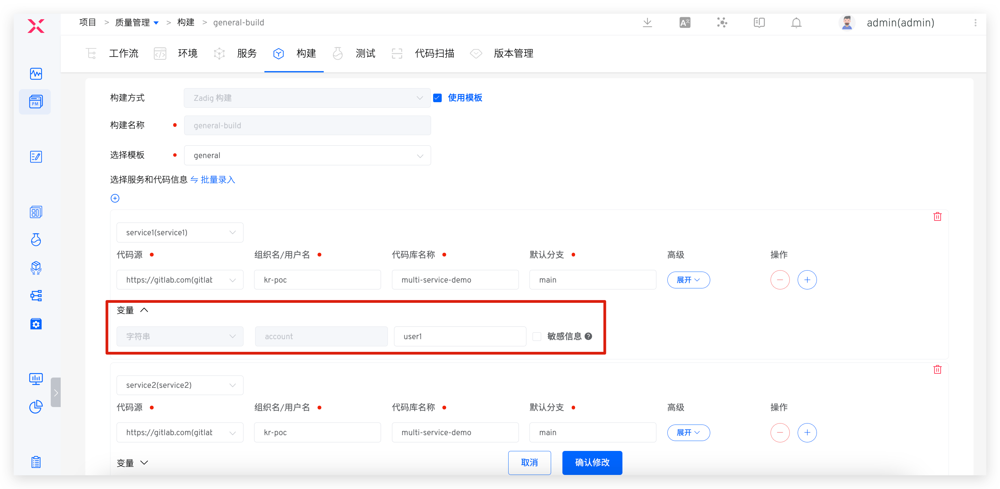

本文主要介绍如何使用 Zadig 构建模板实现多项目共享构建，标准化服务的构建过程。当大量服务的构建配置同构时（比如相同技术栈的多个服务代码分别在单独的代码库中维护，构建所依赖的软件包相同、构建脚本同构，只有代码信息有区别），可使用 Zadig 构建模板来提升配置构建的效率。

## 配置构建模板

前往 `资产管理` -> `模板库` ->`构建` 模块 ，配置构建模版，具体配置参考 [新建构建模板](/cn/Zadig%20v2.2.0/template/build/#新建模板)。

## 使用构建模板

创建 Zadig 构建，选择`使用模板` -> 填写构建名称并选择构建模板 -> 选择服务并按需配置代码信息后保存即可。

> 代码信息中的相关参数说明可参考：[代码信息说明](/cn/Zadig%20v2.2.0/project/build/#代码信息)。

如果模板中定义了变量，则可以在构建中定义变量值，如下图所示。

### 批量录入

点击`批量录入`，可批量配置使用模板的服务和代码仓库信息

::: tip 注意
- 格式：服务组件(服务),代码源标识,带分支信息的代码库 URL
- 例如：aslan(zadig),koderover,https://github.com/koderover/zadig/tree/main
- 确保代码源在 Zadig 中已经成功集成，集成方式参考文档[代码源集成](/cn/Zadig%20v2.2.0/settings/codehost/overview)
- 一行一条数据
- 支持的代码源请参考：[代码源信息](/cn/Zadig%20v2.2.0/settings/codehost/overview/#功能兼容列表)
:::