本文主要介绍如何在 Zadig 上进行 K8s YAML 项目及 K8s Helm Chart 项目的版本管理。

## K8s YAML 项目

### 创建版本

- 进入 K8s YAML 项目  -> `版本管理`，点击`创建版本`。

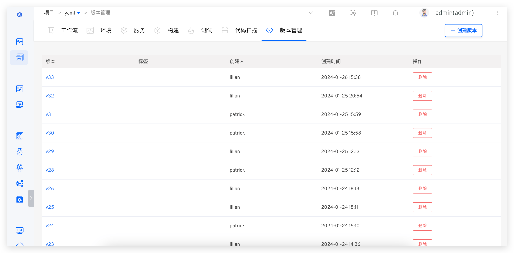

- 进入创建版本流程，第一步填写基本信息。

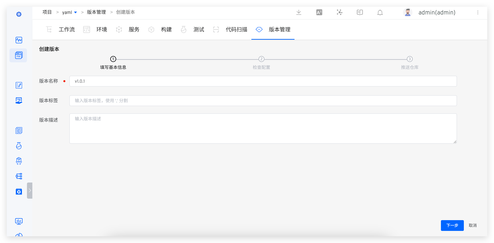

- 第二步选择环境和服务，对服务配置进行预览确认。

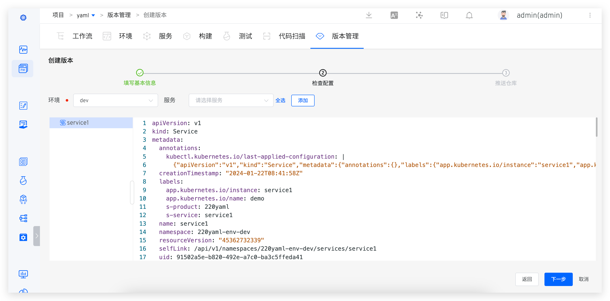

- 第三步选择镜像仓库，并按需填写配置镜像版本。


- 点击完成后，所选的服务镜像将被推送到对应仓库。

### 版本详情

在版本管理列表中点击版本可以查看具体交付信息，包括创建该版本的工作流任务、交付的镜像信息、包信息、服务配置及启动顺序等等：


### 版本发布

执行工作流的「部署」任务，选择版本，将版本内包含的所有服务**镜像**部署到指定环境。

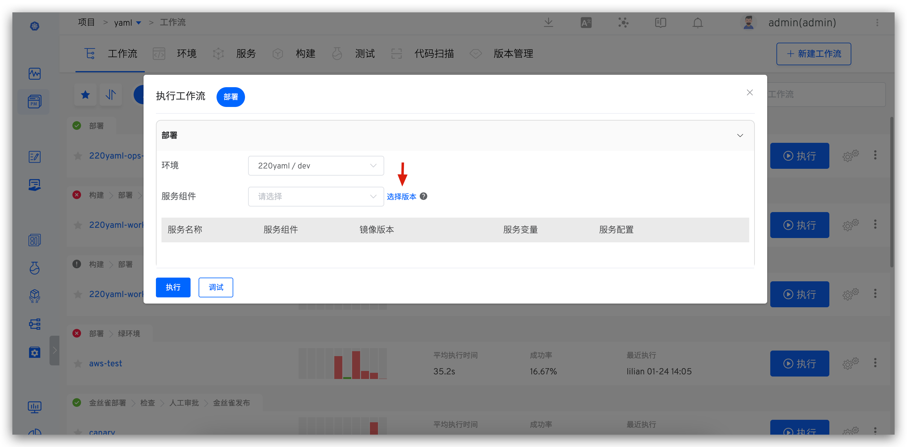
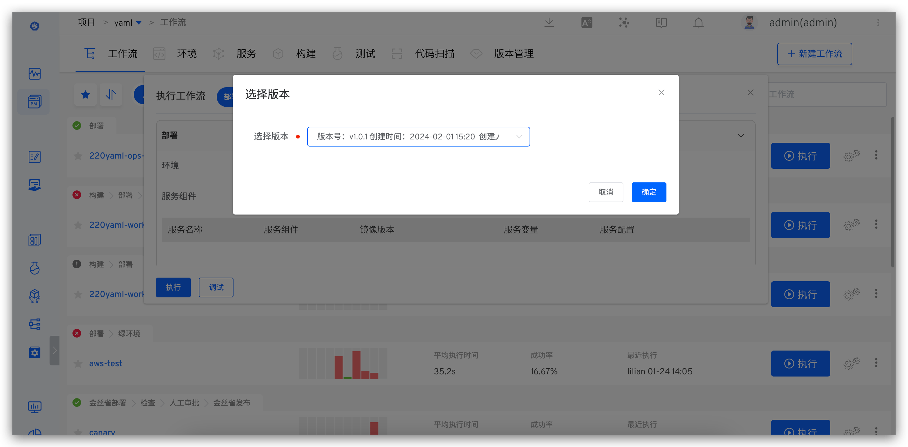


### 版本回溯

新建环境时可指定服务版本实现版本回溯：新建环境 -> 创建方式选择`回溯`并选择要回溯的版本，点击确定使用这个版本新建环境。


## K8s Helm Chart 项目

### 创建版本

- 进入 Helm 项目  -> `版本管理`，点击`创建版本`。

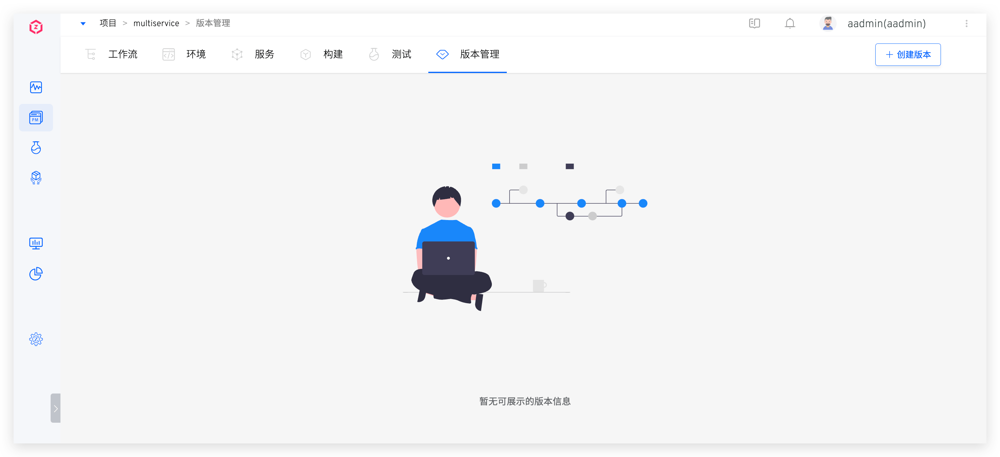

- 进入创建版本流程，第一步填写基本信息。


- 第二步选择环境和服务，并且对所选服务配置做少量修改，以满足线上生产环境服务配置需求。

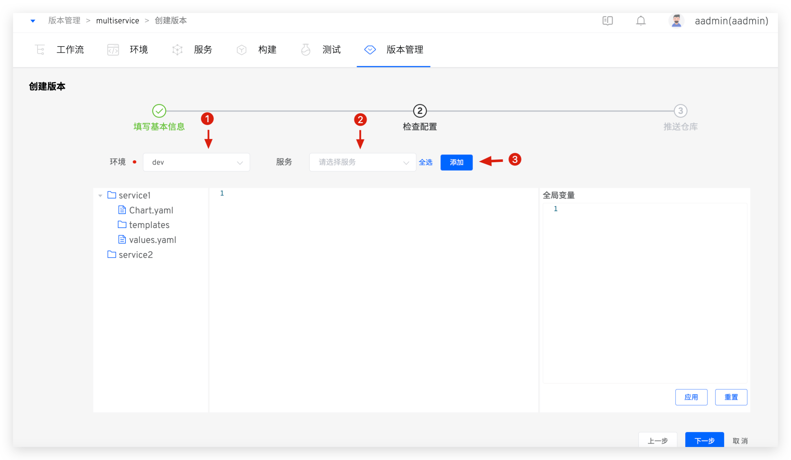

如果需要统一修改所有服务 values 文件中的变量值可以使用`全局变量`。如下图所示，填写全局变量，点击`应用`，所有服务 values 文件中的对应变量值统一被修改成`全局变量`中设置的变量值。


- 第三步选择交付物推送的仓库，并按需填写 Chart 版本号，配置镜像 Tag。
> Helm 仓库需事先集成，具体配置参考 [Helm 仓库](/cn/Zadig%20v2.2.0/settings/helm/)。<br>在配置镜像 Tag 时，若一个 Chart 中包括多个[服务组件](/cn/Zadig%20v2.2.0/env/overview/#什么是服务组件)，可使用`应用全部`来快速设置所有服务组件的镜像 Tag。

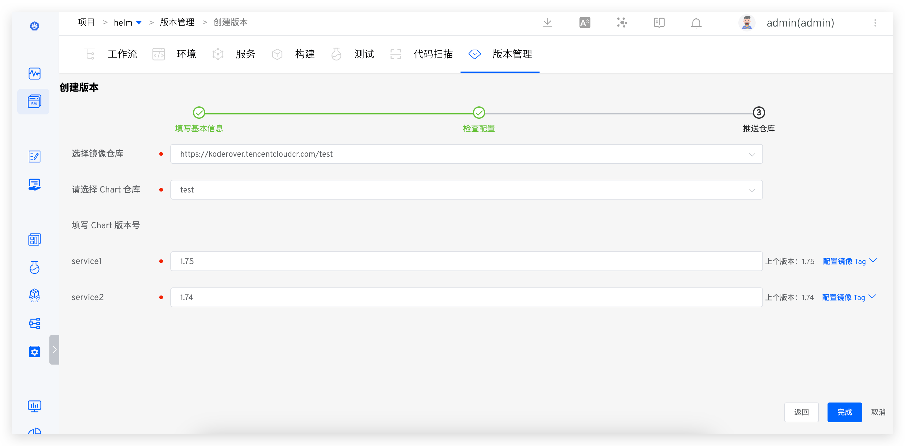

- 点击完成后，所选的服务配置（Chart）和镜像将被推送到对应仓库。

### 版本详情

- 点击版本可查看版本详情，包括可下载的完整 Chart 信息、镜像信息等等，如下图所示。


### 版本发布

- 执行工作流的「部署」任务，选择版本，将版本内包含的所有服务**镜像**部署到指定环境。


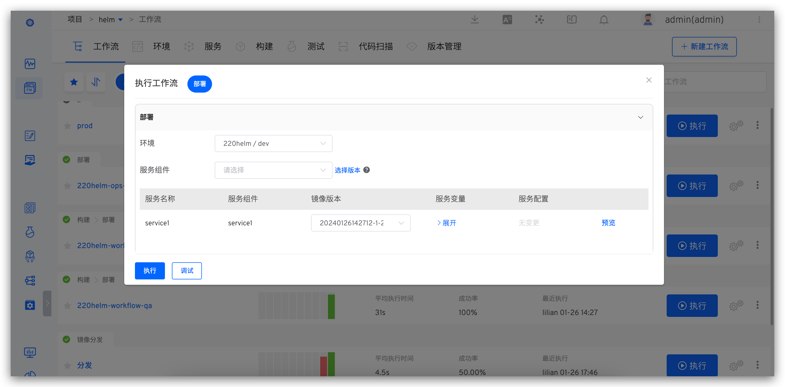


- 执行工作流的「Helm Chart 部署」任务，选择版本，将版本内包含的所有 Chart 部署到指定环境。

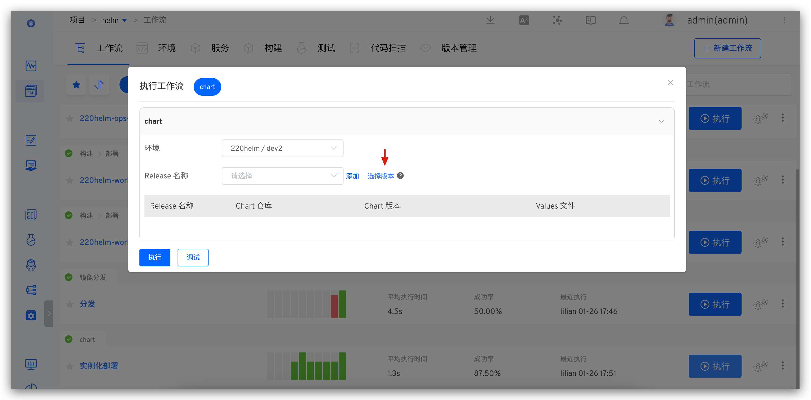


### Hook 外部系统

成功创建版本后，Zadig 支持自动 Hook 外部系统，外部系统接收请求后，可以结合自身情况自定义一些操作。具体配置方式如下：

1. 集成外部系统，具体集成方式参见[其他外部系统集成](/cn/Zadig%20v2.2.0/settings/others/)。
2. 在项目-版本管理中开启`Hook 配置`，如下图所示。

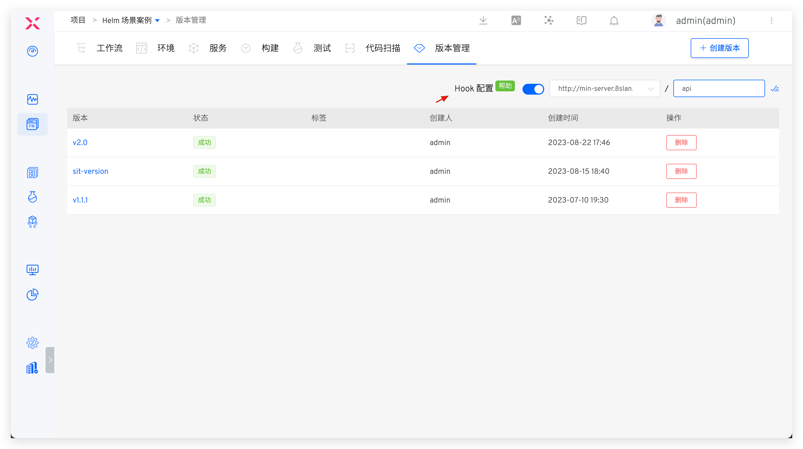

完成配置后，创建版本，成功推送镜像和 Chart 后自动 Hook 外部系统。具体 Payload 信息如下：

```json
{
  "project_name": "helm-test",
  "version": "v1.1",
  "status": "success",
  "error": "",
  "start_time": "1640249525",
  "end_time": "1640249825",
  "charts": [
    {
      "chart_name": "gss-1",
      "chart_version": "1.1",
      "chart_url": "https://technosophos.github.io/tscharts/gss-1-1.1.tgz",
      "images": [
        {
          "service_module": "go-sample-site",
          "image": "ccr.ccs.tencentyun.com/trial/go-sample-site:20211215150832-27-main"
        },
        {
          "service_module": "go-sample-site-2",
          "image": "ccr.ccs.tencentyun.com/trial/go-sample-site:20211215150832-27-main"
        }
      ]
    },
    {
      "chart_name": "gss-2",
      "chart_version": "1.2",
      "chart_url": "https://technosophos.github.io/tscharts/gss-1-1.2.tgz",
      "images": [
        {
          "service_module": "go-sample-site",
          "image": "ccr.ccs.tencentyun.com/trial/go-sample-site:20211215150832-27-main"
        },
        {
          "service_module": "go-sample-site-2",
          "image": "ccr.ccs.tencentyun.com/trial/go-sample-site:20211215150832-27-main"
        }
      ]
    }
  ]
}
```

**返回说明**
|参数名|类型|描述|
|---|---|---|
|`project_name`|string|项目名称|
|`version`|string|交付版本号|
|`status`|string|任务状态|
|`start_time`|string|Unix 时间戳格式的版本创建时间|
|`end_time`|string|Unix 时间戳格式的版本创建完成时间|
|`charts`|[][charts](#charts)|Chart 信息|

<h5 id="charts">Chart 参数说明</h5>

|参数名|类型|描述|
|---|---|---|
|`chart_name`|string|Chart 名称|
|`chart_version`|string|Chart 版本号|
|`chart_url`|string|Chart 下载链接|
|`images`|[][Image](#image)|镜像信息|

<h5 id="image">images 参数说明</h5>

|参数名|类型|描述|
|---|---|---|
|`service_module`|string|服务组件名称|
|`image`|string|镜像名称|
