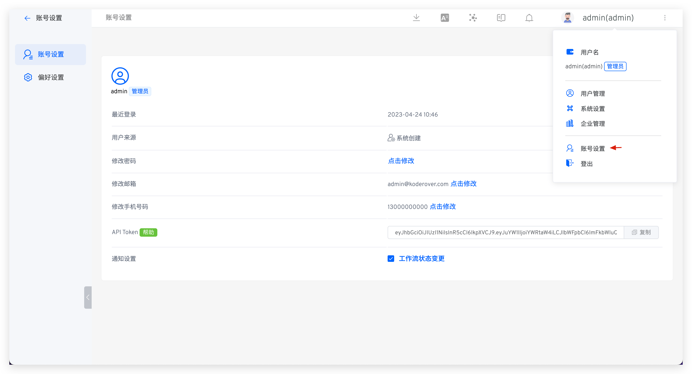
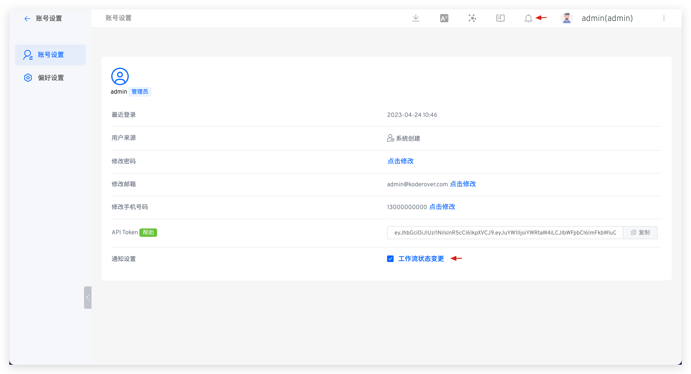

本文主要介绍 Zadig 账号设置功能，包括：

- 账号的基本信息
- 个人通知设置
- 系统偏好设置（工作流日志、环境日志、环境调试的背景颜色和字体颜色）

## 账号设置

点击头像 -> `账号设置`，可以修改账号的基本信息。

## 通知设置

目前会触发通知的事件：

- 环境：包括项目中环境的添加、删除、更新失败通知
- 系统配额：定时清理工作流产物通知
- 工作流：工作流创建、删除的通知

如果你开启了`工作流状态变更`，工作流任务的运行状态（包括：成功、失败、运行中），都将同步到通知系统中触发通知。

## 偏好设置

点击头像 -> `账号设置` -> `偏好设置`，设置背景颜色和字体颜色，如下图所示。

保存修改后，工作流日志、环境日志、环境调试背景颜色和字体颜色随之生效。

