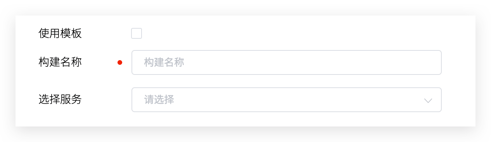

Zadig 构建支持拉取代码、编译代码、构建镜像/APK 包/Tar 包等、推送镜像、上传对象存储等操作，内置常见的构建环境及软件包，支持构建缓存。


- 支持为一个服务配置多个构建，在工作流配置中按需选择，更多细节请阅读[工作流-构建任务配置](/cn/Zadig%20v2.3/project/workflow-jobs/#构建任务)。
- 支持多个服务使用一份构建配置，更多细节请阅读[共享构建](/cn/Zadig%20v2.3/project/build/share/)。
- 支持修改构建交付物的生成规则，更多细节请阅读[构建交付物生成规则](/cn/Zadig%20v2.3/project/service/k8s/#策略配置)。

::: tip 准备工作
明确构建所需要的依赖，依赖项包括但不限于：
- 服务编译的代码依赖（比如依赖 Base 库，开源库等）
- 服务编译的环境依赖（比如 Go 版本、Node 版本、编译工具等）
- 服务编译的系统依赖（比如操作系统等）
:::

### 基本配置



参数说明：
- `构建名称`：自定义，有意义便于理解即可。
- `服务选择`：选择使用该构建配置的服务。

### 构建环境

配置构建过程运行时的环境，支持 Kubernetes 和主机两种基础设施。


#### 使用 Kubernetes

构建过程运行在 K8s Pod 中，可配置操作系统及软件包依赖。

- `操作系统`：平台默认提供 Ubuntu 18.04 / Ubuntu 20.04 作为基础构建系统，支持添加自定义镜像作为构建操作系统，参考文档 [构建镜像管理](/cn/Zadig%20v2.3/settings/custom-image/#步骤-1-生成构建镜像)。
- `依赖的软件包`：构建过程中需要用到的各类软件包工具，比如不同版本的 Java、Go、Govendor、Node、Bower、Yarn、Phantomjs 等等。

::: tip
1. 默认提供的 Ubuntu 系列构建系统中已支持以下工具/命令，可以在[软件包管理](/cn/Zadig%20v2.3/settings/app/)和构建脚本中直接使用。
    - build-essential / cmake / curl / docker / git
    - libfontconfig / libfreetype6-dev / libpcre3-dev / librrd-dev / libsasl2-dev
    - netcat-openbsd / pkg-config / python / tar / wget
2. 选择软件包时需要注意安装依赖关系，系统会按照选择的先后顺序进行安装，例如：Govendor 依赖 Go，那么请先选择 Go，再选择 Govendor。<br>
3. 平台已内置一些常见的软件包，如果有其他软件包或者版本需求，系统管理员可以在[软件包管理](/cn/Zadig%20v2.3/settings/app)中配置其安装脚本。
:::

#### 使用主机

在所选主机上执行构建步骤，构建所需的软件、工具等可提前在主机上安装就绪。

### 代码信息


参数说明：
- `代码源`：代码库所在的平台，支持的代码源请参考 [代码源信息](/cn/Zadig%20v2.3/settings/codehost/overview/#功能兼容列表)
- `代码库拥有者`：支持配置集成的代码源下的所有代码库拥有者
- `代码库名称`：代码库的名称。
- `默认分支`：执行工作流配置构建变量时，默认选取的分支，可在执行时修改。
- `Remote name`：指定远程代码仓库的名称，默认 `origin`
- `克隆目录名`：定义代码库被克隆后的目录名称，默认为代码库的名称
- `子模块`：同步 `submodule` 中配置的代码库
- `拉取指定 Commit`：开启后，执行工作流时支持选择指定 Commit 来执行
- `执行时显示`：默认开启，若设置为关闭，执行工作流时不显示该代码库选项，代码配置使用默认值

工作目录结构如下：

``` bash
├── $WORKSPACE         # 构建任务的根目录
    ├── repository 1   # 第一个代码库
    ├── repository 2   # 第二个代码库
        ├── code       # 第二个代码库中的代码
        └── ...
    └── ...
```

其中：
- `$WORKSPACE` 是 Zadig 系统构建模块内置的变量，关于其更详细的描述可阅：[系统内置环境变量](/cn/Zadig%20v2.3/project/build/#构建脚本)


### 构建变量

包括系统内置构建变量和用户自定义构建变量，可在构建脚本中直接使用。

> 提示：在 [构建脚本](#构建脚本) 中添加 `env` 命令可查看所有构建变量。


**内置构建变量**

内置变量及其描述说明如下：

|变量名称|描述|
|-------|---|
|`WORKSPACE`|当前工作流工作目录|
|`WORKFLOW`|执行构建的工作流标识|
|`PROJECT`|项目标识|
|`TASK_ID`|当前工作流任务的 ID，即任务序号|
|`IMAGE`|系统按照内置规则生成的镜像名称，用于容器服务的部署更新，可以在服务的[策略配置](/cn/Zadig%20v2.3/project/service/k8s/#策略配置)中修改其命名规则|
|`PKG_FILE`|系统按照内置规则生成的交付物文件名称，可修改其命名规则，可以在服务的[策略配置](/cn/Zadig%20v2.3/project/service/k8s/#策略配置)中修改其命名规则|
|`SERVICE_NAME`|构建的服务名称|
|`SERVICE_MODULE`|构建的服务组件名称|
|`TASK_URL`|构建任务的 URL|
|`CI`|值恒等于 true，可视需要使用，比如用于判断是 CI 脚本，还是其他脚本|
|`Zadig`|值恒等于 true，可视需要使用，比如用于判断是否在 Zadig 系统中执行|
|`REPONAME_<index>`|1. 获取指定 `<index>` 的代码库名称<br>2. 其中 `<index>` 为构建配置中代码的位置，初始值为 0<br>3. 下图例中，在构建脚本中使用 `$REPO_0` 即可获得第一个代码库的名称 `voting-app`|
|`REPO_<index>`|1. 获取指定 `<index>` 的代码库名称，并自动将名称中的中划线 `-` 替换为下划线 `_`<br>2. 其中 `<index>` 为构建配置中代码的位置，初始值为 0<br>3. 下图例中，在构建脚本中使用 `$REPO_0` 即可获得第一个代码库转化后的名称 `voting_app`|
|`<REPO>_PR`|1. 获取构建过程中指定 `<REPO>` 使用的 Pull Request 信息，使用时请将 `<REPO>` 替换为具体的代码库名称<br>2. 当 `<REPO>` 信息中含有中划线 `-` 时，需要将 `-` 替换为下划线 `_`<br>3. 下图例中希望获取 `voting-app` 库的 Pull Request 信息，使用 `$voting_app_PR` 或者 `eval PR=\${${REPO_0}_PR}` 即可<br>4. 若构建时指定了多个 PR，比如指定的 PR ID 为 1、2、3，则该变量的值为 `1,2,3` <br> 5. 当代码库为`其他`代码源时，不支持该变量|
|`<REPO>_BRANCH`|1. 获取构建过程中指定 `<REPO>` 使用的分支信息，使用时请将 `<REPO>` 替换为具体的代码库名称<br>2. 当 `<REPO>` 信息中含有中划线 `-` 时，需要将 `-` 替换为下划线 `_`<br>3. 下图例中希望获取 `voting-app` 库的分支信息，使用 `$voting_app_BRANCH` 或者 `eval BRANCH=\${${REPO_0}_BRANCH}`即可|
|`<REPO>_TAG`|1. 获取构建过程中指定 `<REPO>` 使用的 Tag 信息，使用时请将 `<REPO>` 替换为具体的代码库名称<br>2. 当 `<REPO>` 信息中含有中划线 `-` 时，需要将 `-` 替换为下划线 `_`<br>3. 下图例中希望获取 `voting-app` 库的 Tag 信息，使用 `$voting_app_TAG` 或者 `eval TAG=\${${REPO_0}_TAG}` 即可|
|`<REPO>_COMMIT_ID`|1. 获取构建过程中指定 `<REPO>` 使用的 Commit ID 信息，使用时请将 `<REPO>` 替换为具体的代码库名称<br>2. 当 `<REPO>` 信息中含有中划线 `-` 时，需要将 `-` 替换为下划线 `_`<br> 3. 下图例中希望获取 `voting-app` 库的 Commit ID 信息，使用 `$voting_app_COMMIT_ID` 或者 `eval COMMIT_ID=\${${REPO_0}_COMMIT_ID}` 即可<br> 4. 当代码库为`其他`代码源时，不支持该变量|
|`<REPO>_ORG`|1. 获取测试过程中指定 `<REPO>` 使用的组织/用户信息，使用时请将 `<REPO>` 替换为具体的代码库名称<br>2. 当 `<REPO>` 信息中含有中划线 `-` 时，需要将 `-` 替换为下划线 `_`<br> 3. 下图例中希望获取 `voting-app` 库的组织/用户信息，使用 `$voting_app_ORG` 或者 `eval ORG=\${${REPO_0}_ORG}` 即可|


**自定义构建变量**

说明：

- 支持使用字符串类型或者枚举类型的构建变量，自定义构建变量一旦创建后，其键值不可被修改。
- 可以设置字符串类型的变量为敏感信息，工作流任务的构建日志中不会输出敏感变量的值。
- 执行工作流任务时，可以对自定义构建变量的值进行修改，覆盖此处配置的默认值，如下图所示：


### 构建脚本

在构建脚本中声明代码的构建过程和实现。

> 可在构建脚本中使用[构建变量](#构建变量)


### 高级配置


说明：

- `策略配置`：配置构建服务的超时时间，若超过设置的时间阈值后构建仍未成功，则视为超时失败。
- `缓存配置`：开启缓存后，在工作流执行时会使用此处配置的缓存目录，目录配置可使用[构建变量](#构建变量)。
- `集群选择`：选择构建任务运行时所使用的集群资源，其中本地集群指 Zadig 系统所在的集群，关于集群的集成可参考[集群管理](/cn/Zadig%20v2.3/pages/cluster_manage/)。
- `操作系统规格`：配置资源规格用于执行构建任务。平台提供 高/中/低/最低 四种配置供选择。此外，还可以根据实际需要自定义，若需使用 GPU 资源，资源配置形式为 `vendorname.com/gpu:num`，更多信息请参考文档 [调度 GPU](https://kubernetes.io/zh-cn/docs/tasks/manage-gpus/scheduling-gpus/)。
- `调度策略`：选择集群调度策略，默认使用`随机调度`策略，集群调度策略管理请参考文档 [设置调度策略](/cn/Zadig%20v2.3/pages/cluster_manage/#设置调度策略)。
- `使用宿主机 Docker daemon`：开启后，构建执行过程中使用容器所在节点上的 Docker daemon 执行 docker 操作。
- `输出变量`：将构建中的环境变量输出，可实现工作流中不同任务之间的变量传递，参考文档 [变量传递](/cn/Zadig%20v2.3/project/common-workflow/#变量传递)。

### 更多构建步骤

在`添加步骤`中可按需添加更多的构建步骤。


**镜像构建**

> 按照配置的参数构建镜像，使用内置变量 `IMAGE` 作为构建出的镜像产物名称，并推送到镜像仓库。

参数说明：

- `构建上下文目录`: 执行 docker build 所在的目录。
- `Dockerfile 来源`: 包括`代码库`和`模板库`，模板库功能可参考 [Dockerfile 模板管理](/cn/Zadig%20v2.3/template/dockerfile/)。
- `Dockerfile 文件的绝对路径`: Dockerfile 来源于代码库时，指定执行 docker build 用到的 Dockerfile 路径。
- `模板选择`: Dockerfile 来源于模板库时，选择具体的 Dockerfile 模板。
- `构建参数`: 支持 docker build 的所有参数，比如：`--build-arg key1=value1 --build-arg key2=value2`。

上述参数中，除了 `Dockerfile 来源`和`模板选择`，其他的均可使用[变量](#构建变量)，但不支持两个变量套用的形式，比如 `${$REPO_0}_BRANCH`。

**二进制包存储**

配置构建出的二进制包产物的存储路径，一般用于主机项目。

**文件存储**

上传指定文件到对象存储中。上传后，文件将存储于对象存储对应存储桶的指定目录中，此处的目录可使用[变量](#构建变量)，但不支持两个变量套用的形式，比如 `${$REPO_0}_BRANCH`。

- 上传指定文件：配置指定文件路径，如上图中的`infra/result.xml`
- 上传目录下所有文件(不包括子目录)：配置指定文件目录，如上图中的`infra/examples/`。

**Shell 脚本执行**

新增 Shell 脚本执行步骤，用于执行构建后的一些操作。