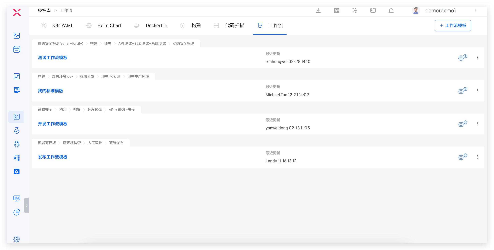
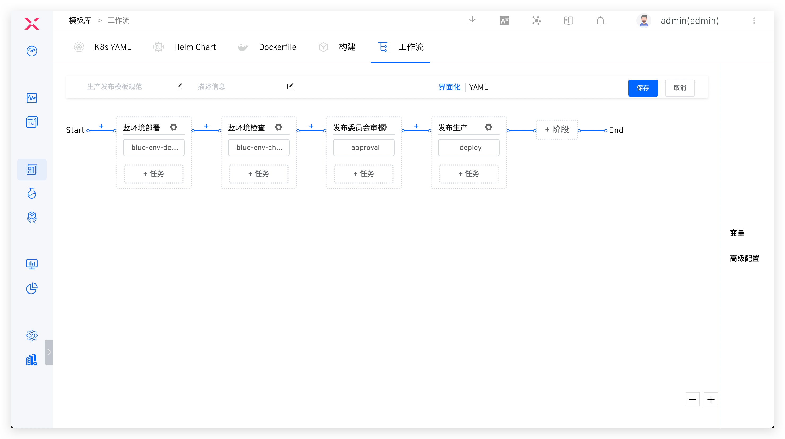
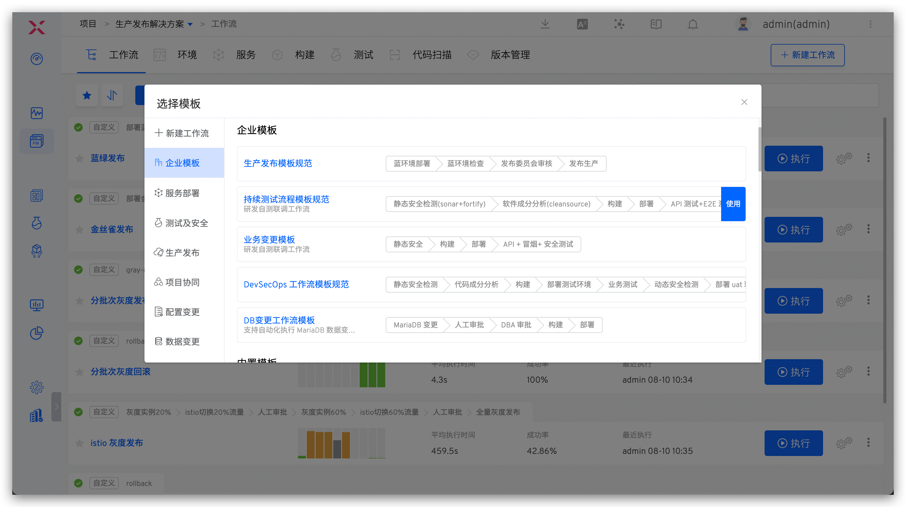

工作流模板能够让用户依据具体项目需求，设计出几套涵盖开发、测试及生产发布的流程，从而实现项目交付过程的规范化和标准化。

## 新建模板
### 模板库中新建
依次访问`资产管理` -> `模板库` -> `工作流`，点击 `+工作流模板`，填写模板名称和模板内容后保存即可。
> 工作流模板名称在整个系统内唯一。

### 将现有工作流保存为模板
编辑工作流，点击 `保存为模板` 并在弹出的窗口中定义模板名称，确定后即可将工作流保存为模板。

> 在保存为模板时，需注意模板名称的唯一性。

## 使用模板

新建工作流，可手动配置，或一键使用工作流模板。

其中企业模板即为用户创建的模板，此外，系统还提供大量内置模板，可根据实际需要选用，实现工作流的快速配置。

::: tip
内置模板在模板库中不可见，且不支持修改和删除。
:::
