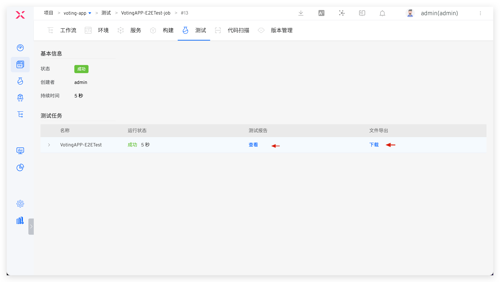

通过 Zadig 系统，可以和所有支持 `Amazon S3`[(Amazon Simple Storage Service)](https://docs.aws.amazon.com/zh_cn/AmazonS3/latest/userguide/Welcome.html)协议的第三方对象存储服务提供商进行对接，包括但不限于 Amazon、阿里云、腾讯云、华为云、七牛云等云厂商。

:::tip
配置对象存储，系统可以自动把工作流构建任务历史日志、构建工作空间缓存、测试任务历史日志、测试报告存储到对象存储空间中。
:::
## 添加对象存储

点击 `资源配置` -> `对象存储` -> `添加`，填写对象存储的配置信息后保存即可。支持在`项目指定范围中`指定对象存储可被哪些项目使用，其中`所有项目`包括对象存储添加后，后续新建的项目。

### 阿里云 OSS

参数说明：

- `提供商`：阿里云 OSS
- `接入点地址`：S3 服务入口地址，具体参阅服务商文档
- `AK`：服务商提供的 Access Key
- `SK`：服务商提供的 Secret Key
- `Bucket`：空间名称
- `存储相对路径`：文件在对象存储空间中的存储路径前缀
- `协议`：使用 HTTP 或者是 HTTPS 协议
- `默认使用`：是否为默认使用的对象配置，在使用对象存储时如果未明确指明，则系统会使用默认的对象存储

### 腾讯云 COS

参数说明：

- `提供商`：腾讯云 COS
- `接入点地址`：S3 服务入口地址，具体参阅服务商文档
- `AK`：服务商提供的 Access Key
- `SK`：服务商提供的 Secret Key
- `Bucket`：空间名称
- `存储相对路径`：文件在对象存储空间中的存储路径前缀
- `协议`：使用 HTTP 或者是 HTTPS 协议
- `默认使用`：是否为默认使用的对象配置，在使用对象存储时如果未明确指明，则系统会使用默认的对象存储

### 七牛云 Kodo

参数说明：

- `提供商`：七牛云 Kodo
- `接入点地址`：S3 服务入口地址，具体参阅服务商文档
- `AK`：服务商提供的 Access Key
- `SK`：服务商提供的 Secret Key
- `Bucket`：空间名称
- `存储相对路径`：文件在对象存储空间中的存储路径前缀
- `协议`：使用 HTTP 或者是 HTTPS 协议
- `默认使用`：是否为默认使用的对象配置，在使用对象存储时如果未明确指明，则系统会使用默认的对象存储

### 华为云 OBS

参数说明：

- `提供商`：华为云 OBS
- `接入点地址`：S3 服务入口地址，具体参阅服务商文档
- `AK`：服务商提供的 Access Key
- `SK`：服务商提供的 Secret Key
- `Bucket`：空间名称
- `存储相对路径`：文件在对象存储空间中的存储路径前缀
- `协议`：使用 HTTP 或者是 HTTPS 协议
- `默认使用`：是否为默认使用的对象配置，在使用对象存储时如果未明确指明，则系统会使用默认的对象存储

### Amazon S3

参数说明：

- `提供商`：Amazon S3
- `接入点地址`：S3 服务入口地址，具体参阅服务商文档
- `AK`：服务商提供的 Access Key
- `SK`：服务商提供的 Secret Key
- `Bucket`：空间名称
- `存储相对路径`：文件在对象存储空间中的存储路径前缀
- `协议`：使用 HTTP 或者是 HTTPS 协议
- `默认使用`：是否为默认使用的对象配置，在使用对象存储时如果未明确指明，则系统会使用默认的对象存储

### 自定义

参数说明：

- `提供商`：其他
- `接入点地址`：S3 服务入口地址
- `AK`：对象存储的 Access Key，用于鉴权
- `SK`：对象存储的 Secret Key，用于鉴权
- `Bucket`：空间名称
- `存储相对路径`：文件在对象存储空间中的存储路径前缀
- `协议`：使用 HTTP 或者是 HTTPS 协议
- `默认使用`：是否为默认使用的对象配置，在使用对象存储时如果未明确指明，则系统会使用默认的对象存储

## 对象存储的使用场景

<!-- ### 存储空间分发

> 通过配置对象存储，用户可以把构建过程产生的软件包通过工作流的分发步骤，分发到对象存储空间中。

编辑带有分发步骤的产品工作流，可以通过勾选 `存储空间分发` 将对应服务构建产生的软件包分发到存储空间，如下图所示。

 -->

### 运行日志

包括工作流运行日志、测试运行日志和代码扫描运行日志，会被自动上传到默认使用的对象存储中。

以工作流日志上传到腾讯云 COS 示例：在指定 Bucket 下检索工作流标识 > 工作流任务序号 > log 文件夹即可。

### 工作流构建缓存

在集群的缓存资源配置中选择对象存储作为缓存介质后，工作流的构建缓存将会被上传到默认对象存储中。集群缓存资源配置可参考文档：[缓存资源配置](/cn/Zadig%20v2.3/pages/cluster_manage/#缓存资源配置)。

### 测试报告和结果

在测试配置中配置测试报告路径以及测试结果导出文件，在测试任务执行完毕后，相关内容会被上传到默认对象存储中，可直接在 Zadig 中查看和下载。

### 文件存储

构建、测试、通用任务中可指定文件存储，将文件上传至指定的对象存储中，参考文档：[文件存储](/cn/Zadig%20v2.3/project/build/#更多构建步骤)。

### Helm Chart 版本

在 Helm Chart 项目中创建的版本将会被上传到默认对象存储中，可直接下载。创建 Helm Chart 版本可参考文档：[版本管理](/cn/Zadig%20v2.3/project/version/#k8s-helm-chart-项目)。

