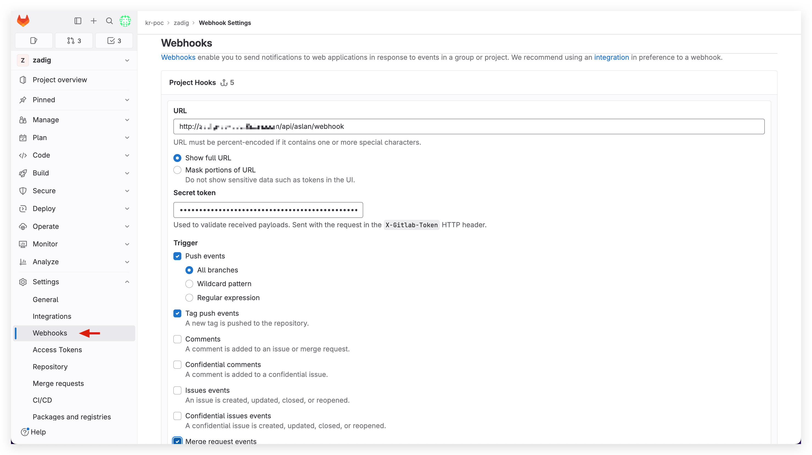
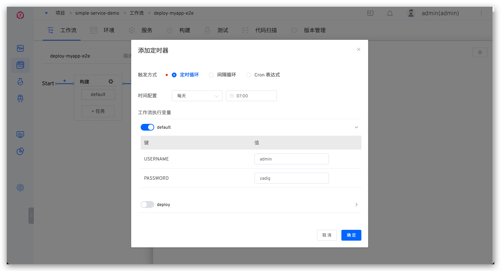
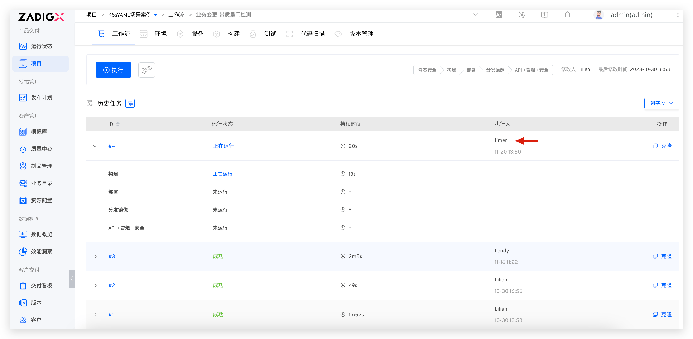
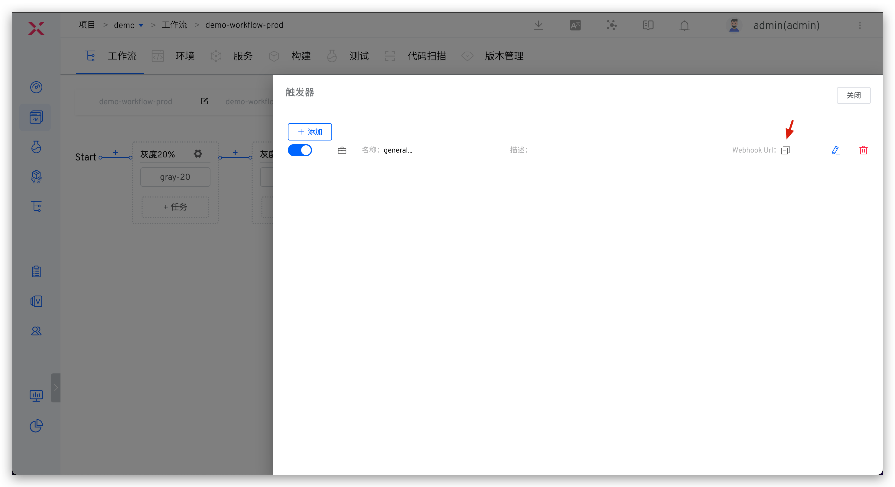

本文主要介绍 Zadig 工作流的触发，包括：
- 手动触发
- 触发器触发，支持以下 5 种触发器：
    - `Git 触发器`：代码变更后自动触发工作流
    - `定时器`：定时触发工作流
    - `JIRA 触发器`：JIRA 问题状态变更后自动触发工作流
    - `飞书项目触发器`：飞书项目状态变更后自动触发工作流
    - `通用触发器`：第三方系统通过 Webhook 自动触发工作流   
- 调用开发者 OpenAPI 触发

## 手动触发

### 工作流执行入口

**入口一：** 点击列表中工作流右侧对应的`执行`按钮，执行工作流。

**入口二：** 点击工作流操作中的`执行`按钮，执行工作流。

### 执行参数

说明：

- `区域 1`：选择执行的任务
- `区域 2`：根据不同的任务输入不同的执行参数

## Git 触发器

配置 Git 触发器后，当满足配置条件的代码发生变更时则可以自动触发工作流。

::: warning
代码源为`其他`类型时，不支持 Git 触发器。
:::

### 如何配置

代码托管平台通过 Webhook 的方式触发 Zadig 工作流，所以需要在对应仓库中配置相应的 Webhook，Zadig 提供两种配置 Webhook 的方式：
- 自动创建：在工作流中配置触发器参数即可，Zadig 会自动在对应代码库中创建 Webhook，适用于代码源集成账号对代码库有创建 Webhook 权限的场景。
- 手动创建：先在代码库中配置 Webhook，再在 Zadig 中配置触发器参数，适用于代码源集成账号对代码库没有创建 Webhook 权限的场景。

##### 自动创建 

点击工作流右侧的 `触发器`。

选择 `Git 触发器` -> 填写参数后保存即可。

参数说明：
- `工作流执行变量`：希望被 Webhook 触发执行的任务，以及任务中的具体配置
- 其他参数：请参考 [Git 触发器基本配置](/cn/Zadig%20v3.0/project/common-workflow/#git-触发器)中的描述

##### 手动创建

如果系统集成中的代码源集成账号对代码库没有创建 Webhook 权限，可以选择使用手动创建的方式来配置，操作步骤如下：

1. 点击`手动创建 Webhook` 切换到手动创建页面。

2. 访问代码库配置 Webhook，填写 Webhook URL、Secret Token、触发事件，以 GitLab 示例如下：

::: tip 不同代码源需要配置的触发事件
- GitHub 代码源：Branch or tag creation、Check runs、Pull requests、Pushes
- GitLab 代码源：Push events、Tag push events、Merge request events
- Gitee 代码源：Push、Tag Push、Pull Request
:::

3. 参考 [Git 触发器基本配置](/cn/Zadig%20v3.0/project/common-workflow/#git-触发器)，填写 Zadig 中的相关配置后保存即可。

### 代码变更触发效果

配置完成后，根据配置提交 pull request、merge request 或者 push 可触发工作流，以 GitLab 为例，在 merge request 中可以查看工作流的反馈信息，如下所示。

<!-- ### 进阶场景：Pull Request 独立测试环境

::: tip
1. 通过工作流触发器中配置基准环境和环境销毁策略实现 pull request 独立测试环境的持续交付过程，完成一段代码的全生命周期质量验证。
2. 支持的代码源请参考：[代码源信息](/cn/Zadig%20v3.0/settings/codehost/overview/#功能兼容列表)。
:::

Pull request 级持续交付分为以下步骤：
- 提交更新的 pull request 代码
- 根据选择的基准环境生成一个相同服务版本的临时环境
- 执行工作流更新该测试环境中的服务版本，以及针对该集成环境进行相关自动化测试验证
- 根据环境销毁策略对测试环境进行回收操作

具体配置如下图所示：

提交代码变更，在对应 pull request 下可看到关于独立环境的状态信息：

创建的独立环境效果如下：

 -->

## 定时器

### 如何配置

编辑工作流，点击右侧的 `触发器` -> 选择 `定时器`，通过配置定时器，可以实现周期性的运行工作流。支持定时循环、周期循环以及基于 Cron 表达式循环。

参数说明：

- 工作流执行变量：被触发执行的任务，以及任务中的具体配置
- 其他参数：参考[定时器配置](/cn/Zadig%20v3.0/project/common-workflow/#定时器)

### 使用效果

配置后，Zadig 根据配置的时间周期和工作流变量执行工作流。

## JIRA 触发器

可实现 JIRA 状态变更后自动触发 Zadig 工作流。

### 如何配置

#### 第一步：在工作流中添加 JIRA 触发器

编辑工作流，点击右侧的 `触发器` -> 选择 `JIRA 触发器`。

填写参数后保存触发器配置。

参数说明：
- `工作流执行变量`：希望被触发执行的任务，以及任务中的具体配置

复制 Webhook Url 后保存工作流。

#### 第二步：在 JIRA 中完成 Webhook 配置

访问 JIRA 系统 -> 点击右上角的 `设置` 图标 -> 点击 `System` -> 在左侧 `ADVANCED` 下找到 `Webhook`。

点击 `+ Create a Webhook` -> 填写 URL（即：第一步中保存的 Webhook Url）并配置触发事件。

::: tip 提示
目前支持基于 `Issue related events` 事件自动触发工作流
:::

### 使用效果

当满足条件的事件发生后会自动触发工作流执行，待工作流执行完成后，将会添加 Comment 到对应的 Issue 中。

## 飞书项目触发器

可实现飞书工作项状态变更后自动触发 Zadig 工作流。

### 如何配置

#### 第一步：在工作流中添加飞书项目触发器

编辑工作流，点击右侧的`触发器` -> 选择 `飞书项目触发器`。

填写参数后保存触发器配置。

参数说明：
- `工作流执行变量`：希望被触发执行的任务，以及任务中的具体配置

复制 Webhook Url 后保存工作流。

#### 第二步: 在飞书项目中完成 Webhook 配置

点击 `空间配置` -> `自动化` -> `新建规则`，进入规则创建。

根据需要选择规则，并在操作中将`操作类型`设为 WebHook -> 填写 URL（即：第一步中保存的 Webhook Url）后保存规则。

### 使用效果

当满足条件的事件发生后会自动触发工作流执行，待工作流执行完成后，将会添加 Comment 到对应的 Issue 中。

## 通用触发器

### 如何配置

点击右侧的 `触发器` -> 选择 `通用触发器` 即可配置实现第三方 Webhook 触发工作流。

参数说明：
- `工作流执行变量`：希望被触发执行的任务，以及任务中的具体配置

复制 Webhook Url，在第三方系统中完成添加。

## 调用开发者 OpenAPI 触发

通过调用 OpenAPI 来触发工作流，具体操作请参阅[执行工作流](/cn/Zadig%20v3.0/api/workflow/#执行工作流)。