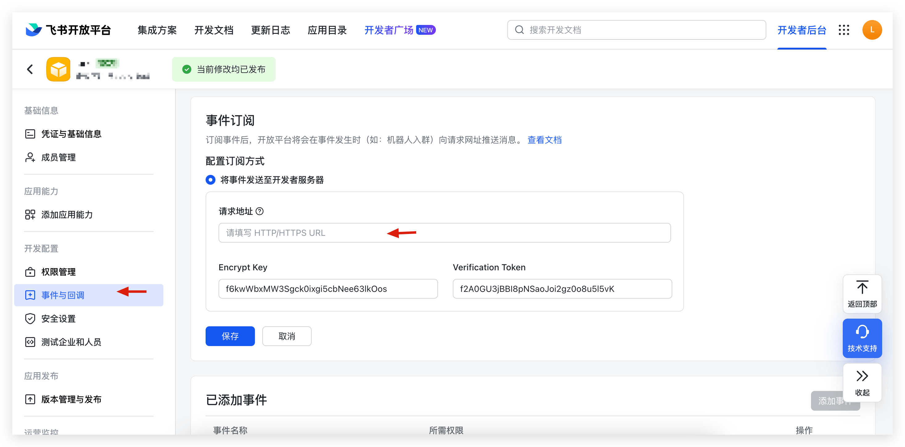
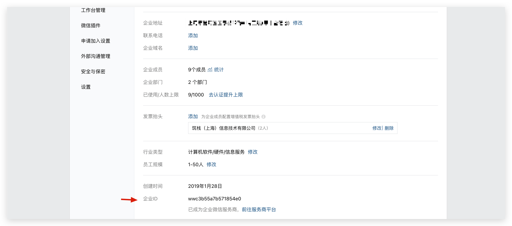
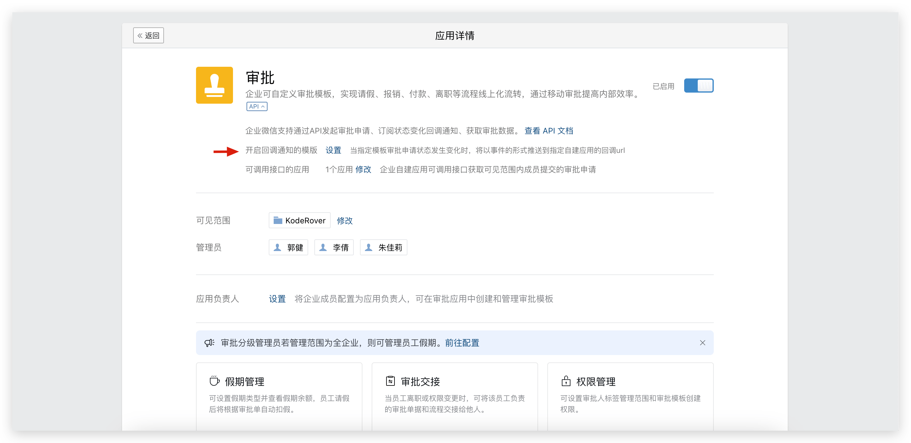
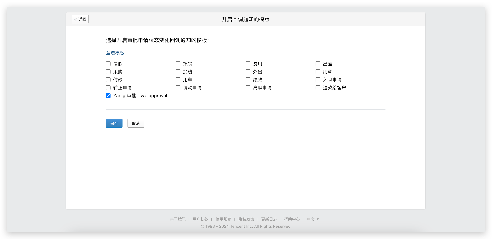

本文介绍在 Zadig 系统上集成审批应用，目前支持集成飞书应用、钉钉应用和企业微信应用。

## 飞书

::: tip
用户在飞书上审批完成后，飞书平台需回调审批状态到 Zadig 上，为保证飞书审批功能正常使用，请保证飞书平台可以访问 Zadig 域名。
:::

按照以下流程配置飞书审批：
1. 在飞书开发者平台创建应用并发布
2. 配置应用凭证信息到 Zadig 系统，获得应用推送事件消息的`请求地址`
3. 在飞书开发者平台配置`请求地址`

### 步骤 1：创建飞书应用
1. 访问[飞书开发者平台](https://open.feishu.cn/)，创建「企业自建应用」，如下图所示。

2. 在`权限管理` - `数据权限`中设置通讯录权限范围，并在 `API 权限`中开通审批应用需要的权限，如下图所示。

> Zadig 的工作流支持配置飞书审批，可选审批人和此处指定的通讯录范围有关。

需要的权限项如下：
- `approval:approval`
- `approval:approval.list:readonly`
- `approval:approval:readonly`
- `contact:user.id:readonly`
- `contact:contact.base:readonly`
- `contact:user.employee_id:readonly`

3. 创建应用版本，并申请发布。
> 应用发布过程需要的其他信息请自行配置，此处不详细赘述。

4. 获取 `App ID`、`App Secret` 和 `Encrypt Key`。

应用发布审批通过后，进行下一步配置。

### 步骤 2：集成审批系统

访问 Zadig，点击`系统设置`->`系统集成`->`审批系统`，添加飞书审批应用，如下图所示。

参数说明：
- `应用名称`：自定义，方便在 Zadig 系统中识别
- `APP ID`：在 步骤 1 中获取
- `APP Secret`：在 步骤 1 中获取
- `Encrypt Key`：在 步骤 1 中获取

填写完成后获取「请求地址」，并保存配置。

### 步骤 3：配置「请求地址」和「事件」

1. 配置请求地址。访问[飞书开发者平台](https://open.feishu.cn/)，填写请求地址，如下图所示。

2. 添加事件。点击「事件订阅」-> 「添加事件」，选择`审批任务状态变更`。

::: tip 提示
完成配置后需再次创建应用版本，并发布最新版本。
:::

## 钉钉

::: tip
用户在钉钉上审批完成后，钉钉平台需回调审批状态到 Zadig 上，为保证钉钉审批功能正常使用，请保证钉钉平台可以访问 Zadig 域名。
:::

按照以下流程配置钉钉审批：
1. 在钉钉开发者平台创建应用并发布
2. 配置应用凭证信息到 Zadig 系统，获得应用推送事件消息的`请求网址`
3. 在钉钉开发者平台配置`请求网址`

### 步骤 1：创建钉钉应用
1. 访问[钉钉开放平台](https://open-dev.dingtalk.com/fe/app#/corp/app)，创建应用，如下图所示。

2. 在权限管理中配置权限范围，并开通审批应用需要的权限，如下图所示。

> Zadig 的工作流支持配置钉钉审批，可选审批人和此处指定的权限范围有关。

需要的权限项如下：

- `snsapi_base`
- `qyapi_base`
- `Contact.User.Read`
- `qyapi_get_department_list`
- `qyapi_get_member`
- `qyapi_get_member_by_mobile`
- `Workflow.Form.Write`
- `Workflow.Form.Read`
- `Workflow.Instance.Read`
- `Workflow.Instance.Write`

3. 获取 `AppKey`、`AppSecret`、`aes_key` 和 `token` 信息。

`AppKey` 和 `AppSecret` 在`应用信息`中获取：

`aes_key` 和 `token` 在`事件与回调`中获取：

> 提示：保存 aes_key 等信息后请勿关闭当前页面，在 Zadig 中配置完毕后还需填写此处的请求网址。

### 步骤 2：集成审批系统

访问 Zadig，点击`系统设置`->`系统集成`->`审批系统`，添加钉钉审批应用，如下图所示。

参数说明：
- `应用名称`：自定义，方便在 Zadig 系统中识别
- `APPKey`：在 步骤 1 中获取
- `APPSecret`：在 步骤 1 中获取
- `aes_key`：在 步骤 1 中获取
- `token`：在 步骤 1 中获取

填写完成后复制「请求网址」，并保存配置。

### 步骤 3：配置「请求网址」和「事件」

1. 访问钉钉开放平台 - 应用功能 - 事件与回调，填写请求网址并保存。

2. 在审批事件中开启以下事件：

- `审批任务开始，结束，转交`
- `审批实例开始，结束`

## 企业微信

::: tip
用户在企业微信上审批完成后，企业微信需回调审批状态到 Zadig 上，为保证企业微信审批功能正常使用，请保证企业微信平台可以访问 Zadig 域名。
:::

### 步骤 1：创建应用
1. 访问[企业微信后台](https://work.weixin.qq.com/wework_admin/frame#apps)，创建应用，如下图所示。

2. 获得 `AgentID` 和 `Secret`。

3. 前往「我的企业」->「企业信息」，获取`企业 ID`。

4. 配置可信域名

5. 配置企业可信 IP

6. 前往「审批」应用，配置「可调用接口的应用」，勾选创建的应用。

### 步骤 2：集成审批系统

1. 访问  Zadig ，点击 `系统设置` -> `系统集成` -> `审批系统`，添加企业微信审批应用，填写 `企业 ID`、`AgentID`、`Secret`，获取回调地址，如下图所示。

2. 前往企业微信后台，在创建的应用中，配置「接收信息」URL 回调地址，并获得 `Token` 和 `EncodingAESKey`。

3. 在 Zadig 审批集成中填写 `Token` 和 `EncodingAESKey`，并保存。

4. 在企业微信后台，保存「接收信息」。

### 步骤 3：开启回调通知的模板

前往企业微信后台，「审批」应用，开启回调地址模板。

## 扩展阅读

### 在 Zadig 中使用飞书审批

参考文档：[飞书审批](/cn/Zadig%20v3.0/workflow/approval/#飞书审批)

### 在 Zadig 中使用钉钉审批

参考文档：[钉钉审批](/cn/Zadig%20v3.0/workflow/approval/#钉钉审批)

### 在 Zadig 中使用企业微信审批

参考文档：[钉钉审批](/cn/Zadig%20v3.0/workflow/approval/#企业微信审批)
