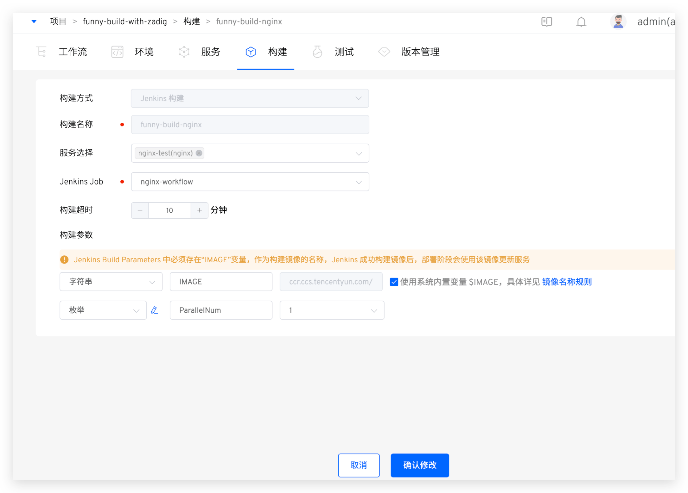

本文主要介绍 Zadig 构建模块中「Jenkins 构建」如何使用。如果服务的构建过程已经 Jenkins 上管理，那么 Zadig 产品工作流可以直接调用已有的 Jenkins Job 构建镜像并推送到镜像仓库，结合 Zadig 部署任务更新服务镜像。

关于`Zadig 构建`和 `Jenkins 构建` 二者的区别如下：

- Zadig 构建：在 Zadig 平台中定义服务的完整构建过程。
- Jenkins 构建：关于服务具体的构建过程在 Jenkins 中定义执行，Zadig 中提供入口触发具体的 Jenkins Job，并基于 Jenkins Job 的镜像产物对部署在 Zadig 中的服务进行更新。

### 前提
1. 需要先在 Zadig 系统中集成 Jenkins 服务器，详见 [Jenkins 集成](/cn/Zadig%20v3.1/settings/jenkins)。
2. 需要先在 Zadig 系统中集成镜像仓库，详见[镜像仓库管理](/cn/Zadig%20v3.1/settings/image-registry/)。
3. 要使用的 Jenkins Job 中需要配置 Build Parameters，包含 `IMAGE` 变量，作为构建出的镜像产物， 并将 `IMAGE` 推送至集成的镜像仓库中，示例如下：

### 如何配置

新建构建，构建来源选择 `Jenkins 构建`，填写相关参数保存即可。参数说明如下：
- `服务选择`：要构建的服务。
- `jenkins job`：从集成的 Jenkins Server 中按需选择 Jenkins Job。
- `构建超时`：超过设定的时间后，工作流执行构建仍未结束则视为构建超时。
- `构建参数`：Zadig 会自动解析出对应 Jenkins Job 中的参数项，参数值可在 Zadig 平台中做修改。说明如下：
    - `IMAGE` 参数：即为[前提](#前提)中的 `IMAGE` 变量，运行工作流时会传递给对应的 Jenkins Job 作为构建镜像产物名称。支持使用系统内置变量来为其赋值，参考[策略配置](/cn/Zadig%20v3.1/project/service/k8s/#策略配置)。
    - 枚举类型的参数：可修改枚举类型参数的可选值。注意：可选值需要在 Jenkins Job 中支持。以下图中的 Jenkins Job 参数配置为例，则此处可在 Zadig 中修改枚举参数 `ParallelNum` 的可选值为 1,2,3,4。

### 使用效果

执行 Zadig 产品工作流，可以触发 Jenkins 任务的执行并将 Jenkins 任务中产生的镜像部署到环境中。