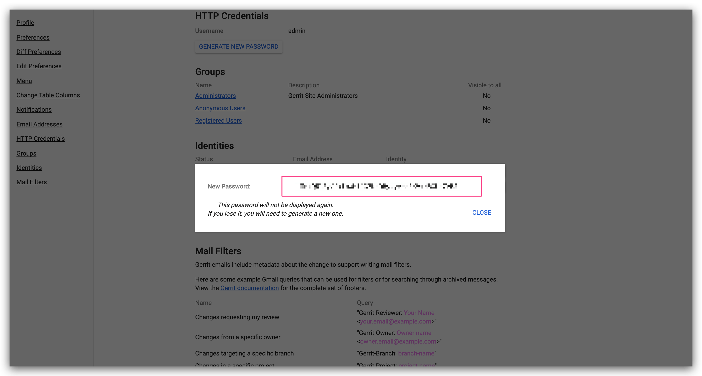

本文主要介绍在 Zadig 上如何集成 Gerrit 代码源。

> 目前 Zadig 系统采用 Basic Auth 的方式从 Gerrit 获取代码以及调用 Gerrit 的 API

如需配置 Gerrit 支持，可以按照以下流程配置：

- 登录 Gerrit（建议使用专用账号）, 进入设置页面，获取用户名和密码
- 在 Zadig 配置页面输入 Gerrit 地址、用户名和密码，保存完成

### 步骤 1：获取 Gerrit 的用户名和密码

Gerrit 管理员可以通过点击 Gerrit 右上角的 `Settings` 按钮，进入设置页面。找到 HTTP 密码 `HTTP Credentials` 配置区域，点击
生成新密码 `GENERATE NEW PASSWORD`，并复制新生成的密码。

### 步骤 2：将配置填入 Zadig

切换到 Zadig 系统，管理员依次点击 `系统设置` -> `系统集成` -> `代码源` -> 点击添加按钮。

依次填入如下已知信息：

- `代码源`：此处选择 `Gerrit`
- `代码源标识`：自定义，方便在 Zadig 系统中快速识别出该代码源，该信息在整个系统内唯一
- `Gerrit 服务 URL`： Gerrit 地址，比如 https://gerrit.example.com
- `用户名`：Gerrit 用户名
- `密码`： 上一个步骤中复制的密码

信息确认无误后点击 `确定`，至此 Gerrit 集成完毕。