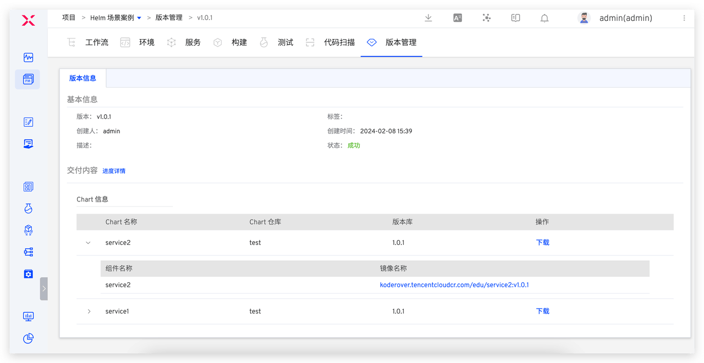

本文将探讨如何通过 Zadig 平台实现高效的版本管理和版本发布，为团队提供稳定、高效的交付流程。

## 核心交付流程概述

1. 工程师完成代码编写后，将代码部署到开发环境，进行自测和联调。
2. 在测试环境对已提交的功能进行集成测试和系统测试，以验证版本的质量和有效性。
3. 完成所有验证后，进行生产环境版本发布。

在这一过程中，通常由测试工程师确认版本的有效性和质量。因此，可以由测试工程师直接完成版本打包，然后将其交给发布工程师或研发负责人进行生产环境发布。
接下来，我们将分别介绍在 Zadig 的 K8s YAML 项目和 Helm Chart 项目中，如何创建完整的版本，并进行生产环境发布的具体操作步骤。

## K8s YAML 项目发布场景

### 步骤 1：创建版本

- 进入 K8s YAML 项目 -> `版本管理`，点击`创建版本`，进入创建版本流程。

- 第一步：填写版本基本信息，包括版本名称、版本标签、版本描述。

- 第二步：选择环境和服务，对服务配置进行预览确认。

- 第三步：选择镜像仓库，并按需填写配置镜像版本。

- 点击完成后，所选的服务镜像将被推送到对应仓库。
- 在版本管理列表中点击版本可以查看具体交付信息，包括创建该版本的工作流任务、交付的镜像信息、包信息、服务配置及启动顺序等等。

### 步骤 2：发布版本

- 执行生产发布工作流，在「部署」任务中选择版本，将版本内包含的所有服务镜像更新到指定环境。

> 生产发布工作流由管理员事先配置，包含「部署」、「测试」、「人工审批」等步骤。 
> 若部署任务中开启「服务配置」变更，支持「服务过滤」选项，开启后，仅部署环境中已存在的服务

## K8s Helm Chart 项目发布场景

### 步骤 1：创建版本

- 进入 Helm Chart 项目 -> `版本管理`，点击`创建版本`，进入创建版本流程。

- 第一步：填写版本基本信息，包括版本名称、版本标签、版本描述。

- 第二步：选择环境和服务，并且对所选服务配置做少量修改，以满足线上生产环境服务配置需求。

如果需要统一修改所有服务 values 文件中的变量值可以使用`全局变量`。如下图所示，填写全局变量，点击`应用`，所有服务 values 文件中的对应变量值统一被修改成`全局变量`中设置的变量值。

- 第三步：选择交付物推送的仓库，并按需填写 Chart 版本号，配置镜像版本。

- 点击完成后，所选的服务配置（Chart）和镜像将被推送到对应仓库。
- 点击版本可查看版本详情，包括可下载的完整 Chart 信息、镜像信息等等，如下图所示。

### 步骤 2：发布版本

- 执行生产发布工作流，在「Helm Chart 部署」任务中选择版本，将版本内包含的所有 Chart 更新到指定环境。

> 生产发布工作流由管理员事先配置，包含「Helm Chart 部署」、「测试」、「人工审批」等步骤。

总的来说，Zadig 为版本管理和发布过程提供了高效的解决方案。通过版本创建和工作流版本发布功能，提升了发布过程的透明度和可控性。工程师可以在 Zadig 平台上轻松创建版本，并通过平台快速查看版本详情和执行发布任务，有效地管理产品的版本发布。这种集成式的版本管理和发布流程不仅提高了团队的工作效率，还有助于降低发布过程中的风险，确保产品交付的稳定性和质量。

