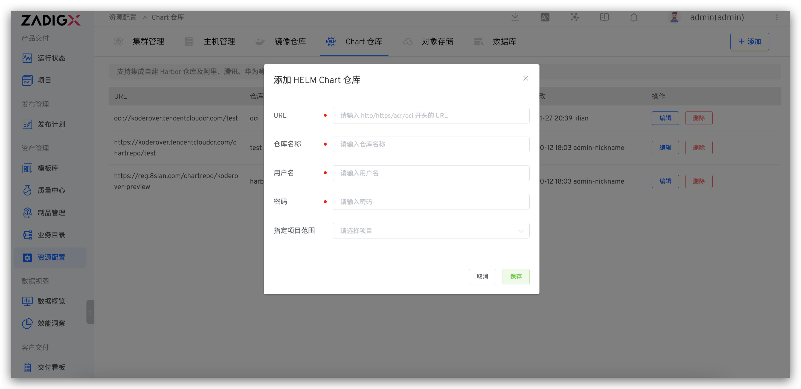

本文介绍如何在 Zadig 系统上集成 Chart 仓库。

## 如何集成

访问 `资源配置` -> `Chart 仓库` -> `添加`，填写 Chart 仓库配置信息后保存。

字段说明：

- `URL`： 仓库访问地址。支持 http、https、acr、oci 协议。
- `仓库名称`：仓库名称
- `用户名`：仓库用户名
- `密码`：仓库密码
- `指定项目范围`：指定 Chart 仓库可被哪些项目使用，其中`所有项目`包括 Chart 仓库添加后，后续新建的项目

## 使用 Chart 仓库

1. 从 Chart 仓库中导入 Chart 配置，快速新建服务，参考文档 [从 Chart 仓库同步服务](/cn/Zadig%20v3.2/project/service/helm/chart/#从-chart-仓库同步服务)。
2. 将 Chart 仓库中的 Chart 配置添加到生产环境中，快速实例化部署，参考文档 [添加服务](/cn/Zadig%20v3.2/project/env/release/#添加服务)。
3. 将验证通过的 Chart 上传到 Chart 仓库中，可用于版本交付，参考文档 [版本管理](/cn/Zadig%20v3.2/project/version/#创建版本-2)。
