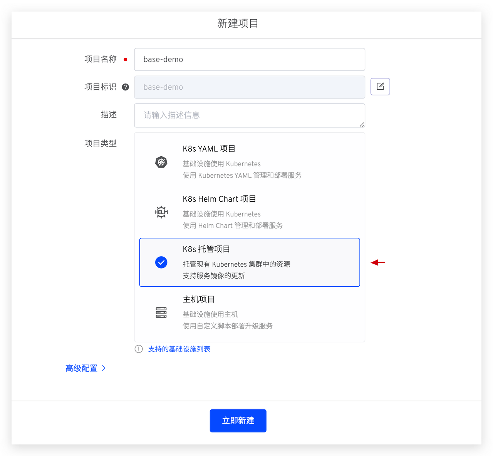
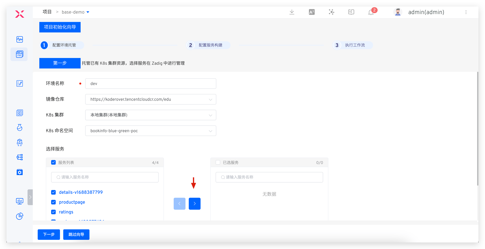
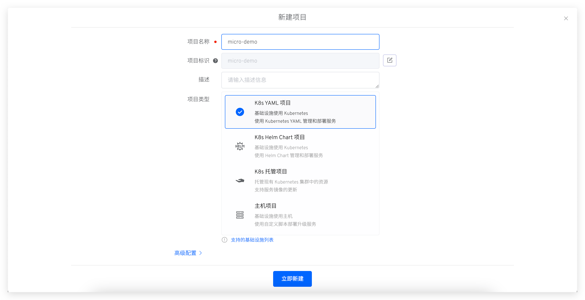
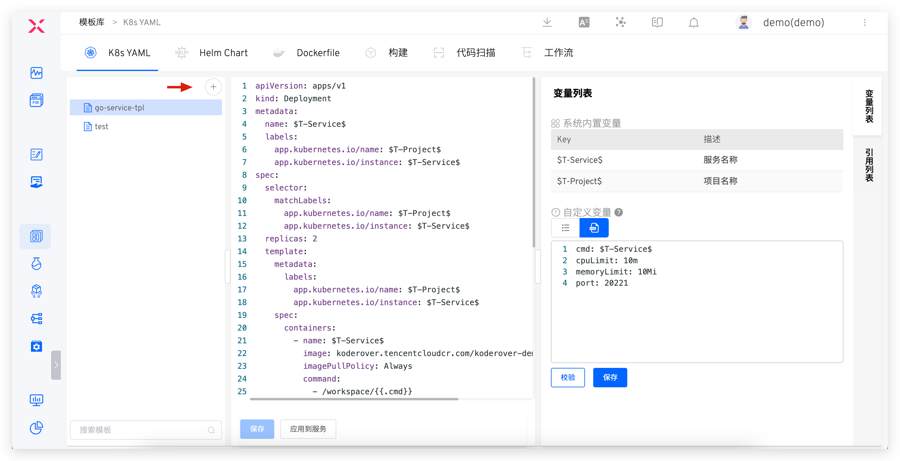
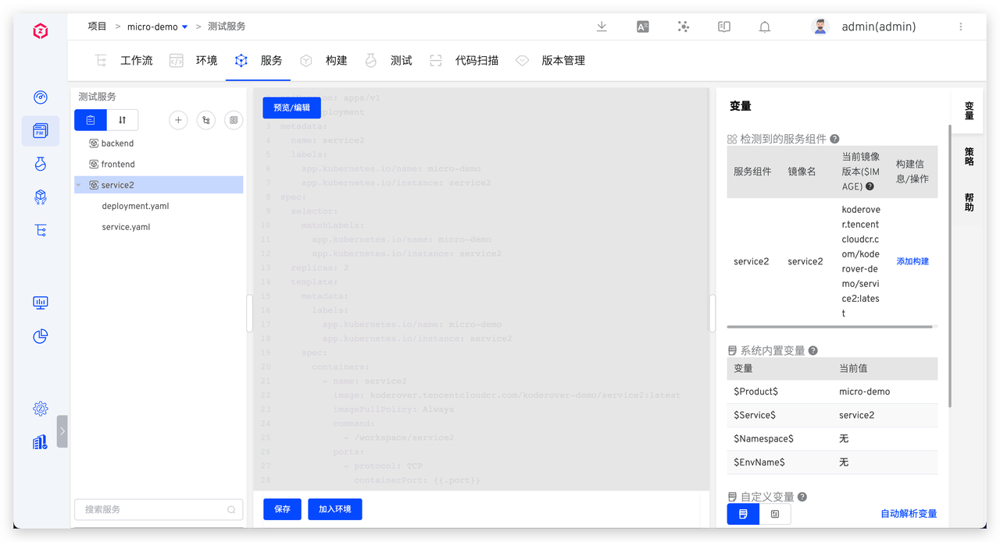
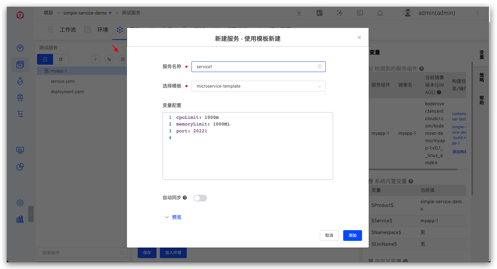
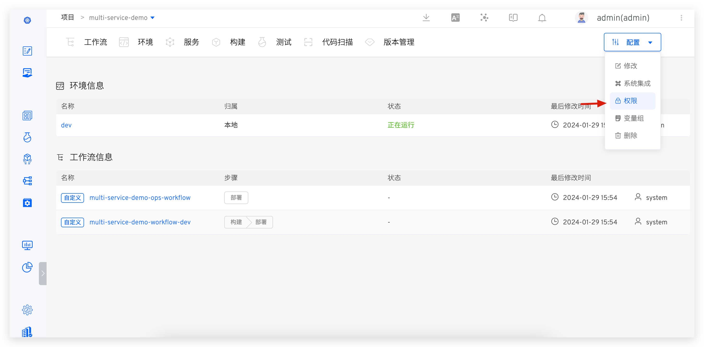
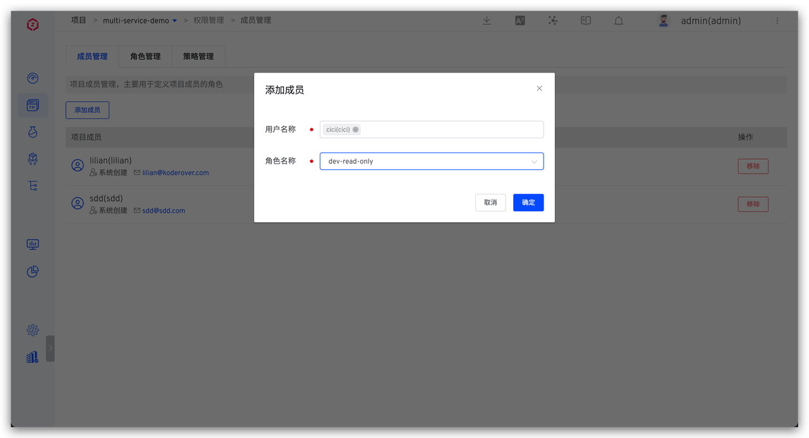
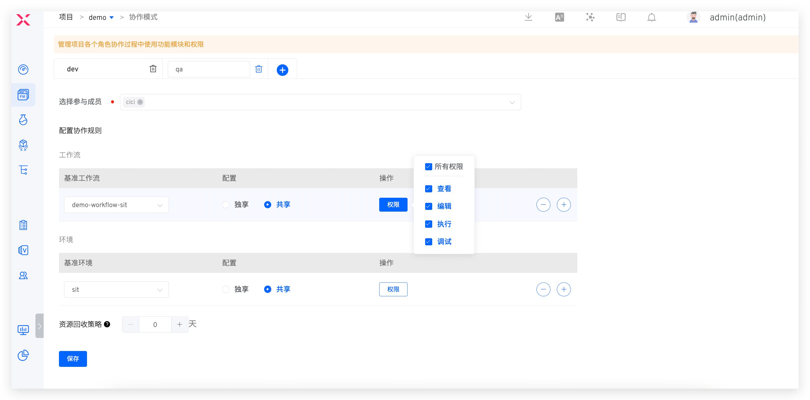

## 概述
在 Zadig 中，[项目](/cn/Zadig%20v3.3/quick-start/concepts/#项目)是核心的业务管理单元，通常用于独立可自治的团队或产品线。每个项目包括工作流、环境、服务、构建、测试、代码扫描和版本等资源。本手册涵盖了 Zadig 项目中的主要运维操作，包括项目接入，标准模板管理，服务与环境配置，工作流配置，权限和协作管理等。通过本手册，您将能够快速了解和使用 Zadig，提高配置和管理效率，快速支持研发流程。

## 项目接入方式

Zadig 支持三种项目接入方式：现有项目托管、现有项目导入和新项目接入。

- 现有项目托管：适用于已有服务配置未经 Zadig 管理的项目
- 现有项目导入：适用于已有服务配置通过 Git 仓库或其他存储介质管理的项目
- 新项目接入：适用于需要搭建工程体系的新项目

### 现有项目托管

1. 新建项目 -> 选择托管项目。

2. 配置托管环境，从指定集群、指定命名空间中选择服务导入。

3. 配置服务构建，参考文档：[构建](/cn/Zadig%20v3.3/project/build)。

4. 执行工作流，部署更新指定环境中的服务。

::: tip
若后续需要在 Zadig 上管理服务配置，可以通过切换项目类型来实现，参考文档：[切换项目类型](/cn/Zadig%20v3.3/project/host-k8s-resources/#托管项目切换-k8s-yaml-项目)。
:::

### 现有项目导入

就配置文件的两种形式（YAML / Helm Chart）分别介绍接入步骤。

#### YAML 形式

1. 新建项目，选择 K8s YAML 项目。

2. 新建服务：从代码库中同步服务配置，参考文档：[新建服务](/cn/Zadig%20v3.3/project/service/k8s/#新建服务)。

3. 为服务添加构建：选择服务 -> 变量 -> 添加构建，配置服务构建脚本

4. 新建环境：选择已有命名空间新建环境（比如：dev/sit/uat/prod 环境），参考文档：[新建环境](/cn/Zadig%20v3.3/project/env/k8s/#新建环境)。

5. 执行工作流：进入项目 -> 工作流，运行工作流更新指定环境的服务。

#### Helm Chart 形式

1. 新建项目，选择 K8s Helm Chart 项目。

2. 新建服务：从代码库中同步服务配置，参考文档：[新建服务](/cn/Zadig%20v3.3/project/service/helm/chart/#从代码库同步服务)。

3. 为服务添加构建：选择服务 -> 变量 -> 添加构建，配置服务构建脚本

4. 新建环境：选择已有命名空间新建环境（比如：dev/sit/uat/prod  环境），参考文档：[新建环境](/cn/Zadig%20v3.3/project/env/k8s/#新建环境)。

5. 执行工作流：进入项目 -> 工作流，执行工作流更新指定环境的服务。工作流的更多功能可参考文档：[工作流](/cn/Zadig%20v3.3/project/common-workflow/)。

### 新项目接入

就配置文件的两种形式（YAML / Helm Chart）分别介绍接入步骤。

#### YAML 形式

1. 新建项目：选择 K8s YAML 项目。

2. 新建服务：使用模板新建服务，参考文档：[新建服务](/cn/Zadig%20v3.3//project/service/k8s/#使用模板新建服务)。

3. 新建环境：选择服务新建 dev/sit/uat/prod 环境。

4. 配置构建：使用构建模板配置构建脚本，参考文档：[构建](/cn/Zadig%20v3.3/project/build)。

5. 配置工作流：配置测试和生产环境对应工作流，参考文档：[工作流](/cn/Zadig%20v3.3/project/common-workflow/)。

#### Helm Chart 形式

1. 新建项目：选择 K8s Helm Chart 类型项目。

2. 新建服务：使用模板新建服务，参考文档：[新建服务](/cn/Zadig%20v3.3/project/service/helm/chart/#使用模板新建单个服务)。

3. 新建环境：选择服务新建 dev/sit/uat/prod 环境。

4. 配置构建：使用构建模板配置构建脚本，参考文档：[构建](/cn/Zadig%20v3.3/project/build/#zadig-构建)。

5. 配置工作流：配置测试环境和生产环境对应工作流，参考文档：[工作流](/cn/Zadig%20v3.3/project/common-workflow/)。

## 标准模板管理

通过 Zadig 模板库，运维团队可以实现统一的应用交付标准，规范化发布流程，并沉淀符合企业自身特色的标准化模板。这为研发和运维部门提供高效的工程化协作基础，快速应对业务迭代的需求，确保系统的稳定性和可扩展性。模板库提供了多种类型的模板，包括服务模板、构建模板、Dockerfile 模板和工作流模板等。

### 服务模板

::: tip 适用场景
多个服务的配置文件内容结构同构，只是具体配置不同。比如：不同服务的端口号/副本数/数据库连接地址等不同。将服务的配置抽象成通用的 K8s YAML/Helm Chart 模板，支持用户在通用模板上创建多个服务。
:::

就服务配置的不同组织形式（K8s YAML/Helm Chart）分别介绍。

#### K8s YAML 模板

准备工作：将多个服务的配置抽象成 K8s YAML 模板，以下为 multi-service-demo 项目的相关配置供参考。更多使用姿势可参考文档：[K8s YAML 模板](/cn/Zadig%20v3.3//template/k8s_yaml/)、[使用模板新建服务](/cn/Zadig%20v3.3/project/service/k8s/#使用模板新建服务)。
- 三个微服务的 K8s YAML 配置：[service1](https://github.com/koderover/zadig/tree/main/examples/multi-service-demo/k8s-yaml/service1)、[service2](https://github.com/koderover/zadig/tree/main/examples/multi-service-demo/k8s-yaml/service2)、[service3](https://github.com/koderover/zadig/tree/main/examples/multi-service-demo/k8s-yaml/service3)
- 对上述三个服务配置抽象的模板：[K8s YAML 模板](https://github.com/koderover/zadig/blob/main/examples/multi-service-demo/k8s-yaml/template.yaml)。
1. 新建模板：访问模板库 -> K8s YAML -> 创建模板，输入模板内容后保存。

2. 配置自定义变量：按需配置变量默认值。

3. 使用模板新建服务。

4. 模板内容变更同步更新服务配置：服务配置中开启自动同步，模板内容变更后，应用到服务

#### Helm Chart 模板

准备工作：将多个服务的 Helm Chart 配置抽象成 Helm Chart 模板，以下为 multi-service-demo 项目的相关配置供参考。更多使用姿势可参考文档：[Helm Chart 模板](/cn/Zadig%20v3.3/template/helm_chart/)、[使用模板新建服务](/cn/Zadig%20v3.3/project/service/helm/chart/#使用模板新建单个服务)。
- 三个微服务的 Helm Chart 配置：[service1](https://github.com/koderover/zadig/tree/main/examples/multi-service-demo/full-charts/service1)、[service2](https://github.com/koderover/zadig/tree/main/examples/multi-service-demo/full-charts/service2)、[service3](https://github.com/koderover/zadig/tree/main/examples/multi-service-demo/full-charts/service3)。
- 对上述三个服务 Helm Chart 配置抽象的模板：[Helm Chart 模板](https://github.com/koderover/zadig/tree/main/examples/multi-service-demo/general-chart)。
1. 新建模板：访问模板库 -> K8s YAML -> 创建模板，输入模板内容后保存。

2. 配置自定义变量：按需配置变量默认值后保存。

3. 使用模板新建服务：进入  K8s Helm Chart 项目 -> 服务 -> 使用模板新建，填写参数后导入即可。

4. 模板内容变更同步更新服务配置：服务配置中开启自动同步，模板内容变更后，应用到服务。

### Dockerfile 模板

准备工作：将多个服务的镜像构建配置抽象为 Dockerfile 模板，以下为 multi-service-demo 项目的相关配置供参考。更多使用姿势可参考文档：[Dockerfile 模板](/template/dockerfile/)、[构建配置](/cn/Zadig%20v3.3/project/build/#更多构建步骤)。
- 三个微服务的源码：[服务源码](https://github.com/koderover/zadig/tree/main/examples/multi-service-demo/src)。
- 上述三个服务的工程编译文件：[Makefile](https://github.com/koderover/zadig/blob/main/examples/multi-service-demo/Makefile)。
- 对上述三个服务的镜像构建配置进行抽象：[Dockerfile 模板](https://github.com/koderover/zadig/blob/main/examples/multi-service-demo/Dockerfile)。
1. 新建模板：访问模板库 -> Dockerfile 模板 -> 创建模板，输入模板内容后保存。

2. 使用 Dockerfile 模板为服务配置构建。

### 构建模板

::: tip 适用场景
多个服务的构建配置同构（比如相同技术栈的多个服务代码分别在单独的代码库中维护，构建所依赖的软件包相同、构建脚本同构，只有代码信息有区别...）使用 Zadig 构建模板来提升配置构建的效率，具体可参考文档：[构建模板](/cn/Zadig%20v3.3/template/build/)。
:::

1. 新建构建模板：访问模板库 -> 构建 -> 创建模板，配置完毕后保存。

2. 使用构建模板：使用模板配置构建，分别配置多个服务构建所需的代码信息。对于多个服务使用同一构建模板的情况，可使用批量录入快速配置，参考文档：[批量录入](/cn/Zadig%20v3.3/project/build/#批量录入)。

### 工作流模板

根据项目流程抽象工作流模板，基于模板快速创建工作流，具体参考文档：[工作流模板](/cn/Zadig%20v3.3/template/workflow/)。

## 服务及环境配置

### 上线测试服务

第 1 步：配置测试服务
1. 基于 K8s  YAML 模板，新建业务服务，参考文档：[服务](/cn/Zadig%20v3.3/project/service/k8s/#使用模板新建服务)。

2. 基于构建模板，为服务配置构建，参考文档：[构建](/cn/Zadig%20v3.3/project/build/template/)。

::: tip 优化建议：
|    建议项   |                说明                           |                    参考文档              |
|:----------- | :-------------------------------------------- |:-----------------------------------------|
| 构建过程提速 | 1. 把常用构建的依赖工具打进去  2. 自定义缓存目录| 1. [自定义构建镜像](/cn/Zadig%20v3.3/settings/custom-image/)  2. [配置构建缓存](/cn/Zadig%20v3.3/project/build/#高级配置) |
| 减少维护负担 | 1. 多个服务构建相似，配置一份构建脚本，减少维护成本  2. 规范并统一服务构建物料的管理方式，减少维护和管理负担| 1. [共享构建脚本](/cn/Zadig%20v3.3/project/build/#Zadig-共享构建)  2. [使用构建模板](/cn/Zadig%20v3.3/project/build/template/) |
:::

第 2 步：添加到环境，参考文档：[K8s YAML 环境](/cn/Zadig%20v3.3/project/env/k8s/#基本操作)。

第 3 步：添加服务到对应工作流，在工作流中添加服务组件及其对应构建。

### 下线测试服务

1. 删除服务定义，参考文档：[删除服务](/cn/Zadig%20v3.3/project/service/k8s/#删除服务)。

2. 从环境中删除服务，参考文档：[K8s YAML 环境](/cn/Zadig%20v3.3/project/env/k8s/#删除服务)。

### 新建测试环境

进入项目 -> 环境 -> 新建环境 -> 测试环境，填写参数后新建。
- K8s YAML 项目，参考文档：[新建 K8s YAML 环境](/cn/Zadig%20v3.3/project/env/k8s/#新建环境)。
- K8s Helm Chart 项目，参考文档：[新建 Helm Chart 环境](/cn/Zadig%20v3.3/project/env/helm/chart/#新建环境)。

提供部分最佳实践供参考：
1. 使用一套服务配置创建多套测试环境 ，参考文档：[配置多套集成环境](/cn/Zadig%20v3.3/env/multi-env/)。
2. 不同环境使用不同结构的 deployment，可使用变量能力，参考文档：[K8s YAML 服务](/cn/Zadig%20v3.3/project/service/k8s/#变量配置)。
3. 不同业务线可以使用不同的 K8s 集群资源，新增集群配置参考：[集群管理](/cn/Zadig%20v3.3/pages/cluster_manage/)。
4. 环境配置管理，参考文档：[环境配置](/cn/Zadig%20v3.3/project/env/k8s/#环境配置)。

### 上线生产服务

第 1 步：配置生产服务，参考文档：[生产服务](/cn/Zadig%20v3.3/project/service/k8s/prod/#新建)。

第 2 步：配置生产环境，参考文档：[K8s YAML 生产环境](/cn/Zadig%20v3.3/project/env/release/)。

第 3 步：配置工作流，添加部署任务，参考文档：[工作流](/cn/Zadig%20v3.3/project/workflow-jobs/#部署任务)。

### 下线生产服务

::: tip 友好提醒
鉴于生产服务的严肃性，下线操作有一定的风险，请确保服务下线不会带来影响后再操作。
:::

参考文档：[下线服务](/cn/Zadig%20v3.3/project/workflow-jobs/#下线服务)。

### 新建生产环境

参考文档：[生产环境](/cn/Zadig%20v3.3/project/env/release/#新建环境)。

## 工作流配置

具体配置参考[工作流](/cn/Zadig%20v3.3/project/workflow-overview/)

## 权限管理

Zadig 用户权限由系统权限和项目权限组成，通过配置用户的系统角色、项目角色和项目内的协作模式来管理其权限。用户权限是所有赋予其权限项的并集。具体机制如下图所示：

### 配置操作

首先了解一下配置用户项目权限的基本操作。

#### 项目角色配置

访问项目配置 -> 权限，配置角色和项目成员即可，可参考文档：[权限配置](/cn/Zadig%20v3.3/project/permission/#权限配置)。

#### 协作模式配置

访问权限管理 -> 协作模式，配置协作成员以及工作流、环境资源的权限即可，具体配置过程参考：[协作模式](/cn/Zadig%20v3.3/project/permission/#协作模式)。

### 配置示例

下面以不同的角色为例，具体说明如何配置对应角色的权限项。
#### 项目管理员

权限描述：拥有项目中任何操作的权限

具体配置：授予项目角色 `project-admin`

#### 研发工程师
权限描述：
- 构建、测试服务、代码扫描、版本管理模块所有操作权限
- dev 工作流所有操作权限
- dev、sit 环境所有操作权限

具体配置：
- 创建并授予项目角色`dev`，配置权限项如下图：

- 创建并加入协作模式`dev`，配置工作流和环境相关权限，具体如下图：

#### 测试工程师
权限描述：
- 测试模块所有操作权限
- sit 工作流所有操作权限
- sit 环境所有操作权限

具体配置：
- 创建并授予项目角色`qa`，配置权限项如下图：

- 创建并加入协作模式`qa`，配置工作流和环境相关权限，具体如下图：

#### 发布工程师
权限描述：
- 生产服务、生产环境、版本管理所有操作权限
- prod、uat 工作流所有操作权限
- uat 环境所有操作权限

具体配置：

- 创建并授予项目角色`sre`，配置权限项如下图：

- 创建并加入协作模式`sre`，配置工作流和环境相关权限，具体如下图：

