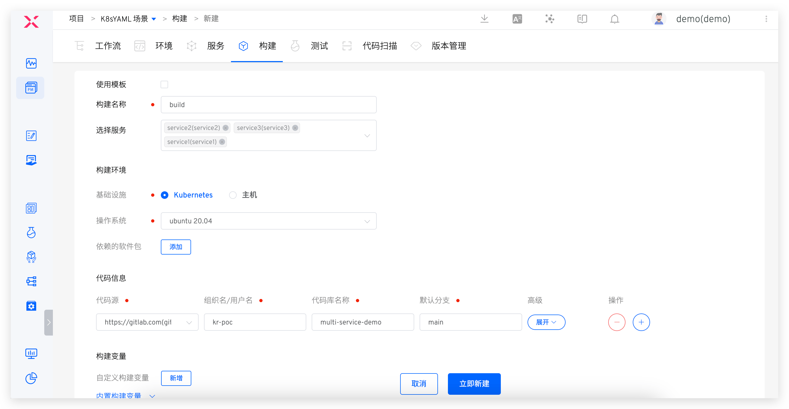
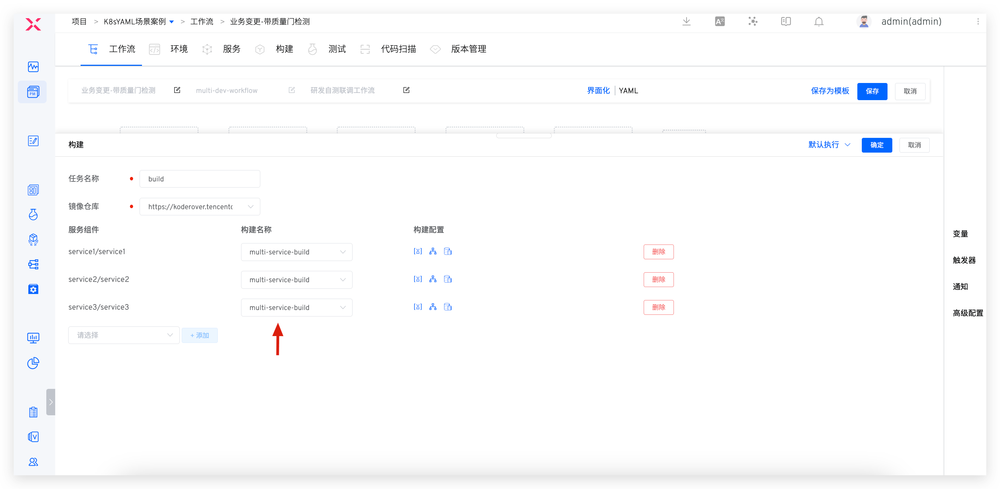

本文主要介绍如何实现多个服务共享一份构建配置，大大降低构建脚本的管理和维护负担。

## 配置构建

以 [multi-service-demo](https://github.com/koderover/zadig/tree/main/examples/multi-service-demo) 为例，该项目包括 3 个 Golang 服务 service1/service2/service3，和构建相关的目录结构说明如下：

``` bash
├── Dockerfile # 定义 3 个服务的 Dockerfile
├── Makefile   # 定义 3 个服务的编译
├── src        # 3 个服务的源代码
   ├── service1
   ├── service2
   └── service3
```

### 步骤 1：创建构建
创建 Zadig 构建，`服务选择`中选择多个服务，按需配置构建环境、代码信息、通用构建脚本等，利用系统提供变量实现构建的共享，本示例中的构建脚本如下：

```bash
cd zadig/examples/multi-service-demo
make build-$SERVICE
docker build -t $IMAGE -f Dockerfile --build-arg service=$SERVICE .
docker push $IMAGE
```


### 步骤 2：关联服务

- 创建构建配置时指定多个服务，或者创建构建完毕后修改构建，在`服务选择`中选择多个服务。



- 也可以在为服务配置构建时，按需选择复用已有的构建配置实现构建共享。


## 配置工作流

编辑工作流的「构建」任务，选择服务和对应的构建，即可实现多个服务共享同一构建。

