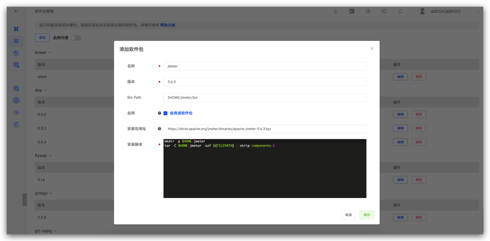
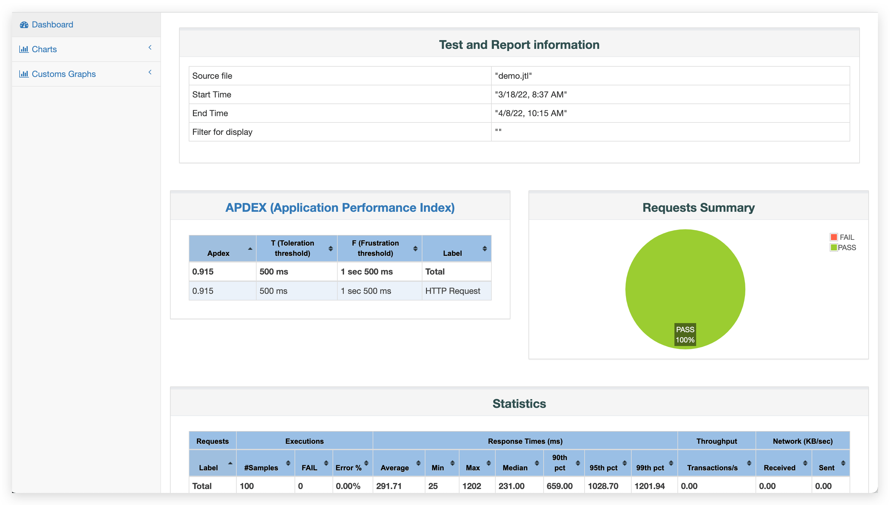
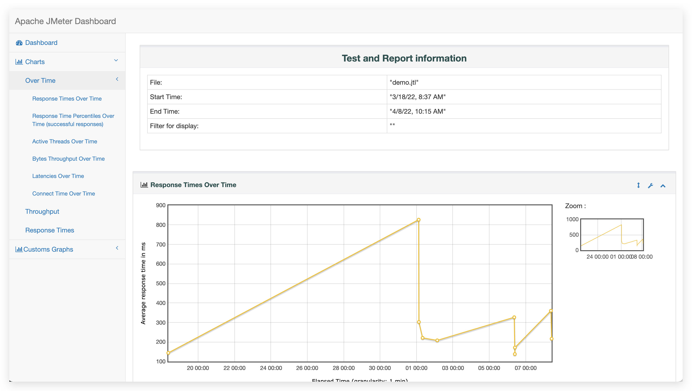
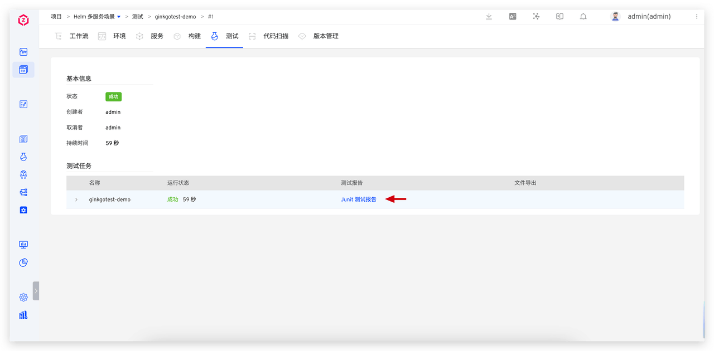
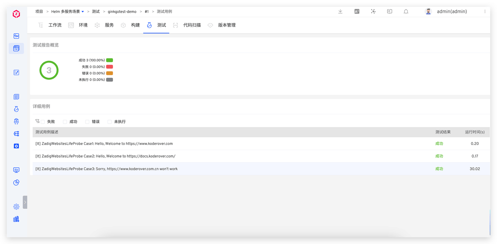
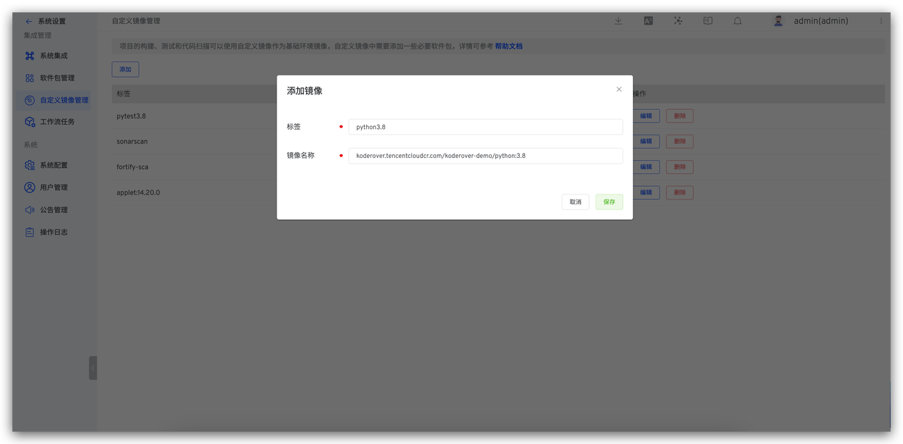
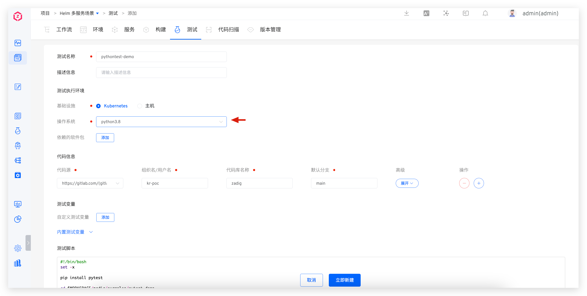
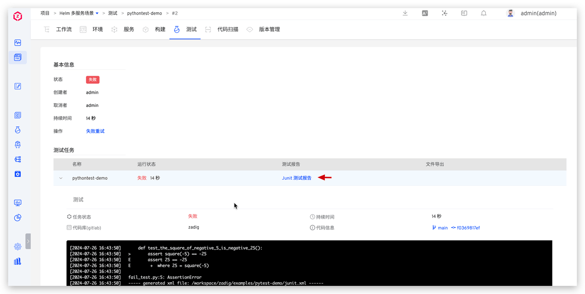

Zadig 几乎支持市面上所有测试工具和框架，下面介绍几种主流测试框架在 Zadig 中的应用实践，包括自动化测试用例的管理、自动化测试的执行，测试报告的分析等，并结合 Zadig 的环境能力实现测试左移，赋能其他角色也参与到质量建设中来，有效降低问题发现和修复成本。

## JMeter

> 关于 JMeter 的更多信息可点击[链接](https://github.com/apache/jmeter)查看。

### 组织自动化测试代码

根据实际测试业务和功能，编写自动化测试代码并组织在代码仓库中。本实践中将使用 JMeter 对 KodeRover 官网进行一个简单的压测，自动化测试源码可点击[链接](https://github.com/koderover/zadig/tree/main/examples/jMeter-demo)查看。

### 配置 JMeter 软件包

Zadig 系统有内置的 JMeter 应用可直接使用，如果内置版本无法满足自动化测试诉求，可参考[软件包管理](/cn/Zadig%20v3.3/settings/app/)按需新增。本例以 JMeter 5.4.3 版本示例如下。

系统管理员登录 Zadig -> 访问系统设置 -> 集成管理 -> 软件包管理，添加 JMeter：



参数说明：
- 名称：jMeter
- 版本：5.6.3
- Bin Path：$HOME/jmeter/bin
- 安装包地址：https://dlcdn.apache.org/jmeter/binaries/apache-jmeter-5.6.3.tgz
- 安装脚本：
```bash
mkdir -p $HOME/jmeter
tar -C $HOME/jmeter -xzf ${FILEPATH} --strip-components=1
```


### 配置自动化测试

进入项目的测试模块，点击`新建测试`，完成测试配置。


本例配置说明如下：
- 操作系统：ubuntu 20.04
- 依赖的软件包：jMeter 5.6.3 和 java 1.12.0.1
- 代码信息：选择已集成代码库（自动化测试源码所在的代码库）
- 测试脚本：
``` bash
#!/bin/bash
set -ex
cd zadig/examples/jMeter-demo/
jmeter -n -t demo.jmx -l demo.jtl # run test
if [ -e reports ]; then
    rm -rf reports
fi
jmeter -g demo.jtl -o reports # generate reports
```
- 高级配置：配置测试结果导出以便在测试执行完毕后下载测试报告进行分析。填写测试报告目录，本例中为 `$WORKSPACE/zadig/examples/jMeter-demo/reports`

### 执行自动化测试

配置完毕后，执行自动化测试。


### 分析测试报告

暂不支持在平台直接浏览测试报告，待自动化测试运行完毕后，点击`下载`将测试报告下载到本地。


解读下载的测试报告，查看本次压力测试的结果，分析性能瓶颈。




## Ginkgo

> 关于 Ginkgo 的更多信息可点击[链接](https://github.com/onsi/ginkgo)查看。

### 组织自动化测试代码

根据实际测试业务和功能，编写自动化测试代码并组织在代码仓库中。本实践中将对 KodeRover 官网及文档站的可用性进行自动化检测，自动化测试源码可点击[链接](https://github.com/koderover/zadig/tree/main/examples/test-demo/test)查看。

### 配置依赖的软件包

Zadig 系统有内置的 Ginkgo 应用及 Go 应用可直接使用，如果内置版本无法满足自动化测试诉求，可参考[软件包管理](/cn/Zadig%20v3.3/settings/app/)按需新增。本例依赖 Go 1.16 以及 Ginkgo 2.0.0，配置示例如下。

系统管理员登录 Zadig -> 访问系统设置 -> 集成管理 -> 软件包管理，分别添加 Go 和 Ginkgo：


Go 参数说明：
- 名称：go
- 版本：1.16.13
- Bin Path：$HOME/go/bin
- 安装包地址：https://go.dev/dl/go1.16.13.linux-amd64.tar.gz
- 安装脚本：

```bash
tar -C $HOME -xzf ${FILEPATH}
```

Ginkgo 参数说明：
- 名称：ginkgo
- 版本：2.0.0
- Bin Path：$HOME/ginkgo
- 安装包地址：http://resource.koderover.com/ginkgo-v2.0.0-Linux.tar.gz
- 安装脚本：
```bash
mkdir -p $HOME/ginkgo
tar -C $HOME/ginkgo -xvf ${FILEPATH}
chmod +x $HOME/ginkgo/ginkgo
```

### 配置自动化测试

进入项目的测试模块，点击`新建测试`，完成测试配置。


本例配置说明如下：
- 操作系统： ubuntu 20.04
- 依赖的软件包：go 1.16.13 和 ginkgo 2.0.0  
- 代码信息：选择已集成代码库（自动化测试源码所在的代码库）
- 测试脚本：

``` bash
#!/bin/bash
set -ex

export GOPROXY=https://goproxy.cn,direct
cd zadig/examples/test-demo/test
ginkgo -v --junit-report=out.xml # 运行测试用例并产出 Junit XML 格式的测试报告
```

- Junit 报告所在目录：`$WORKSPACE/zadig/examples/test-demo/test`

### 执行自动化测试

配置完毕后，执行自动化测试。


### 分析测试报告

待自动化测试运行完毕后点击查看测试报告，可查看每一条用例的执行详情，快速过滤失败的用例重点分析。




## Pytest
> 关于 Pytest 的更多信息可点击[链接](https://github.com/pytest-dev/pytest)查看。

### 组织自动化测试代码

根据实际测试业务和功能，编写自动化测试代码并组织在代码仓库中。本实践中将使用 Pytest 进行数学运算测试，自动化测试源码可点击[链接](https://github.com/koderover/zadig/tree/main/examples/pytest-demo/)查看。

### 配置 Python 自定义镜像
执行 Pytest 环境中需事先安装 Python，在 Zadig 中配置自定义镜像，参考[自定义镜像管理](/cn/Zadig%20v3.3/settings/custom-image/)。

Python 3.8 自定义镜像 Dockerfile 参考：

``` Dockerfile
FROM python:3.8-slim

RUN apt-get clean && apt-get update && DEBIAN_FRONTEND=noninteractive apt-get install -y curl git tzdata

# 修改时区
RUN ln -sf /usr/share/zoneinfo/Asia/Shanghai /etc/localtime

# 安装 docker client
RUN curl -fsSL "http://resources.koderover.com/docker-cli-v19.03.2.tar.gz" -o docker.tgz &&\
    tar -xvzf docker.tgz &&\
    mv docker/* /usr/local/bin
```

将上述 Dockerfile 打成镜像后，在 Zadig 「自定义镜像」中完成配置。


### 配置自动化测试




进入 Zadig 的具体项目，完成自动化测试的配置，说明如下：
- 测试执行环境：`python3.8`
- 代码信息：配置执行测试相关代码库
- 测试脚本：配置运行自动化测试的脚本，本例中测试脚本如下：
``` bash
#!/bin/bash
set -x

pip install pytest-html

cd $WORKSPACE/zadig/examples/pytest-demo
pytest --junitxml=./junit.xml --html=./report.html # 执行测试并生成 jUnit xml 测试报告和 HTML 测试报告
```
- Junit 报告所在目录：$WORKSPACE/zadig/examples/pytest-demo

### 执行自动化测试

配置完毕后，执行自动化测试。


### 分析测试报告

待自动化测试运行完毕后点击查看测试报告，可查看每一条用例的执行详情，快速过滤失败的用例重点分析。



