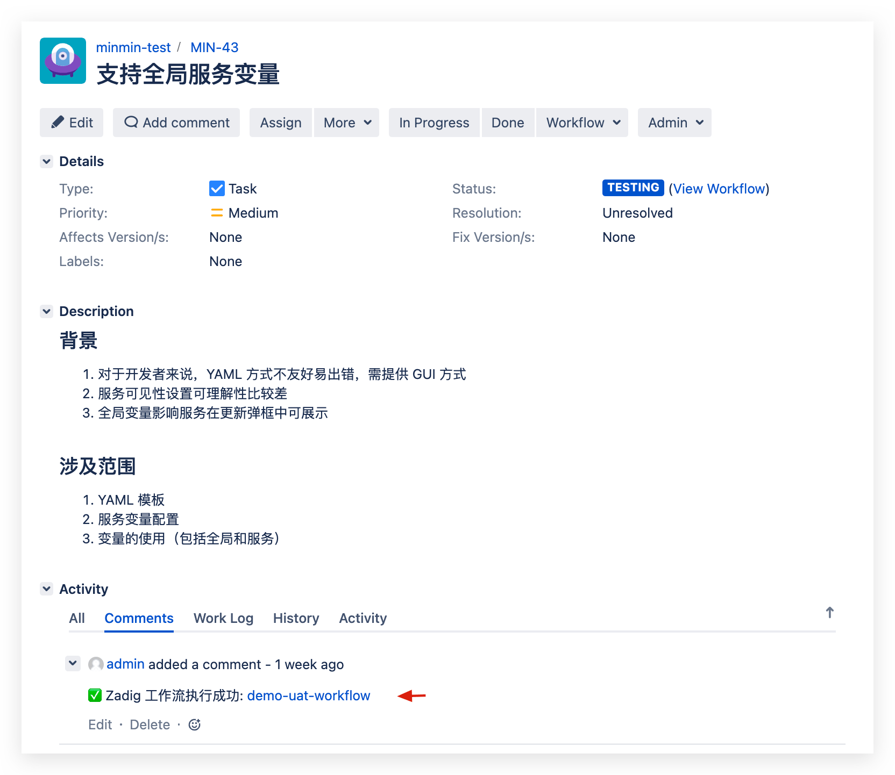
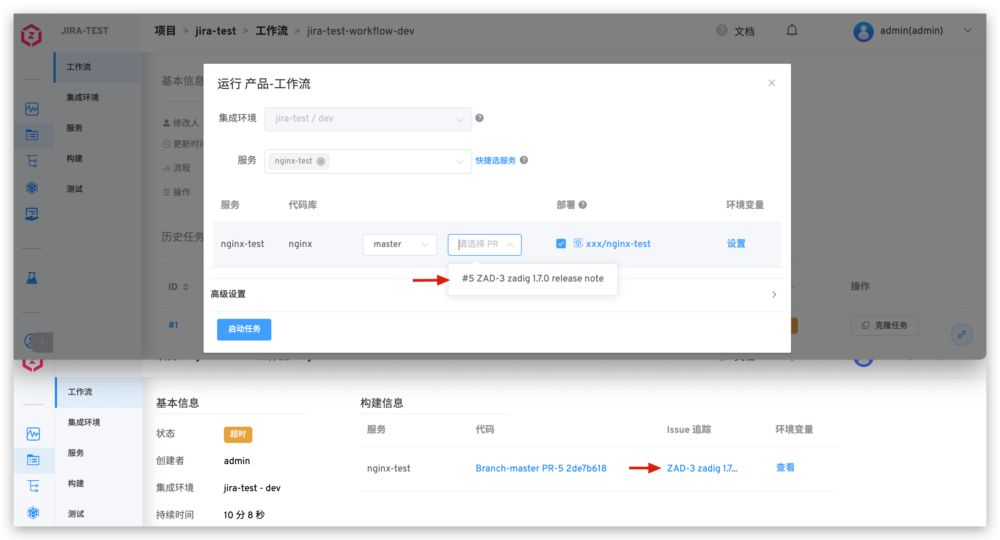

本文介绍如何在 Zadig 系统上集成项目管理系统 Jira，实现 Zadig + Jira 的双向互联。

## 如何配置

点击`系统设置` -> `集成管理`  -> `项目管理`-> 点击添加。

参数说明：
- `系统类型`：选择 Jira
- `访问地址`：企业 Jira 地址
- `系统标识`：自定义，方便在 Zadig 系统中快速识别，系统标识信息需唯一
- `用户名`：可以查看读 Issue 权限的用户
- `鉴权方式`：可选 `密码/API Token` 或 `Access Token`
- `密码/Token`：用户名对应的密码或对应的 Token（使用 `密码/API Token` 方式鉴权时填写）
- `Access Token`：用于鉴权的 Access Token（使用 `Access Token` 方式鉴权时填写）
::: tip
SaaS 版本可以使用 Atlassian 账户的 API Token 来鉴权，私有化部署可以使用密码或 Access Token 来鉴权。
:::

信息确认无误后保存。

## 使用场景

### 通过工作流自动变更 Issue

支持在工作流中编排 Jira 项目管理任务，通过 Zadig 的工作流一键自动修改指定的 Issue 状态，具体配置可参考文档：[JIRA 问题状态变更](/cn/Zadig%20v3.3/project/workflow-jobs/#jira-问题状态变更)。

### 通过 Jira 事件自动触发工作流

工作流中配置 Jira 触发器后，可实现 Jira Issue 变更后自动触发 Zadig 工作流，工作流执行完毕后会将执行信息评论在对应 Issue 下方，实现 Zadig + Jira 的双向追踪，具体配置可参考文档：[Jira 触发器](/cn/Zadig%20v3.3/project/common-workflow/#jira-触发器)。

<!-- ### 在 Zadig 中追踪 Issue

> 支持在产品工作流中追踪 Jira Issue。

Jira Issue 任务研发完毕后，在提交代码变更时关联 Issue ID 信息便可以实现在 Zadig 中追踪 Issue。支持的代码源请参考文档：[代码源信息](/cn/Zadig%20v3.3/settings/codehost/overview/#功能兼容列表)。

在代码中关联 Issue ID 的 2 种方式：

- 在 Pull Request 的标题中填写 Jira Issue ID
- 在 Commit Message 中填写 Jira Issue ID

以 Pull Request 为例示范：#5 号 Pull Request 的标题中带上 Jira 的 Issue ID，图例中为 `ZAD-3`。

> 代码变更关联多个 Issue 时将 Issue ID 用空格分开即可。

运行产品工作流，选择上述 #5 号 Pull Request，待工作流运行完毕，构建信息部分会展示 Jira Issue 信息，可链接跳转至 Jira Issue，实现工作流和 Issue 的联动。

 -->
