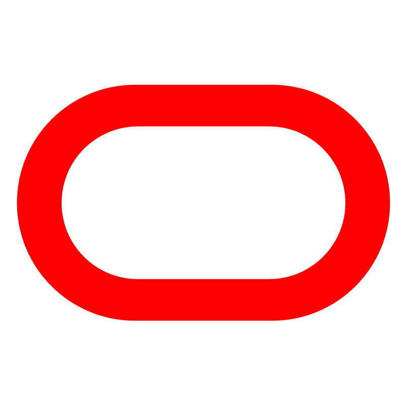

本文主要介绍 Zadig 的兼容列表。

## Kubernetes 集群

通过 Zadig 系统，可以集成使用云厂商提供的 Kubernetes 集群或自建集群，包括但不限于：

> Kubernetes 集群版本需要满足：v1.16 - v1.30

- </img> 阿里云 ACK 
- </img> 华为云 CCE
- </img> 腾讯云 TKE
- </img> 腾讯云 TKE Serverless
- </img> Amazon EKS
- </img> 微软云 AKS
- </img>谷歌云 GKE
- </img>Oracle OKE
- 标准 Kubernetes 集群

## 镜像仓库
通过 Zadig 系统，可以集成云厂商提供的标准镜像仓库或者自建镜像仓库，包括但不限于：
-  </img>阿里云 ACR（个人版）
-  </img>阿里云 ACR（企业版）
-  </img>华为云 SWR
-  </img>腾讯云 TCR（个人版）
-  </img>腾讯云 TCR（企业版)
-  </img>AWS ECR
-  </img>微软云 ACR
-  </img>谷歌云 AR
-  </img>[DockerHub](https://hub.docker.com/)
-  [Harbor](https://goharbor.io/)
-  [JFrog](https://jfrog.com/)
-  Nexus
-  其他自建镜像仓库

## Helm Chart 仓库
通过 Zadig 系统，可以集成云厂商提供的标准 Helm Chart 仓库或者自建 Helm Chart 仓库，包括但不限于：
-  </img>阿里云 ACR
-  </img>微软云 Azure Container Registry
-  </img>腾讯云 TCR
-  [Harbor](https://goharbor.io/)
-  其他自建 Helm Chart 仓库

## 对象存储
通过 Zadig 系统，可以对所有支持 Amazon S3(Amazon Simple Storage Service)协议的对象存储服务提供商进行对接，包括但不限于：

-  阿里云 OSS
-  腾讯云 COS
-  七牛云 KODO
-  </img>华为云 OBS
- </img> Amazon S3
- </img>谷歌云 Cloud Storage
- </img>火山引擎